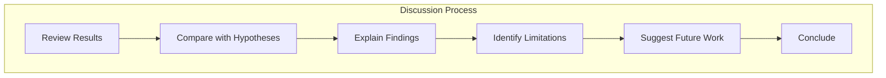
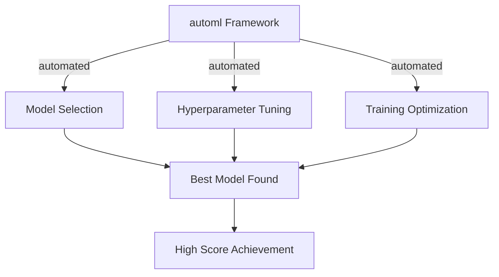
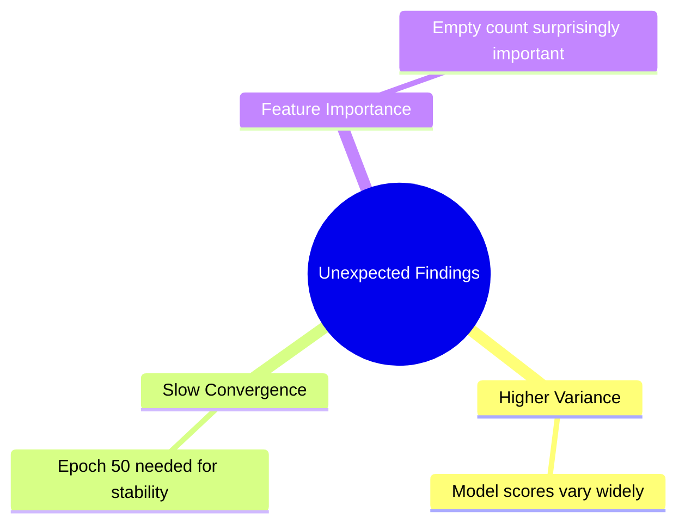
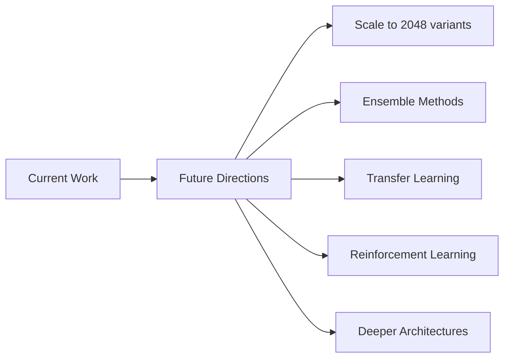
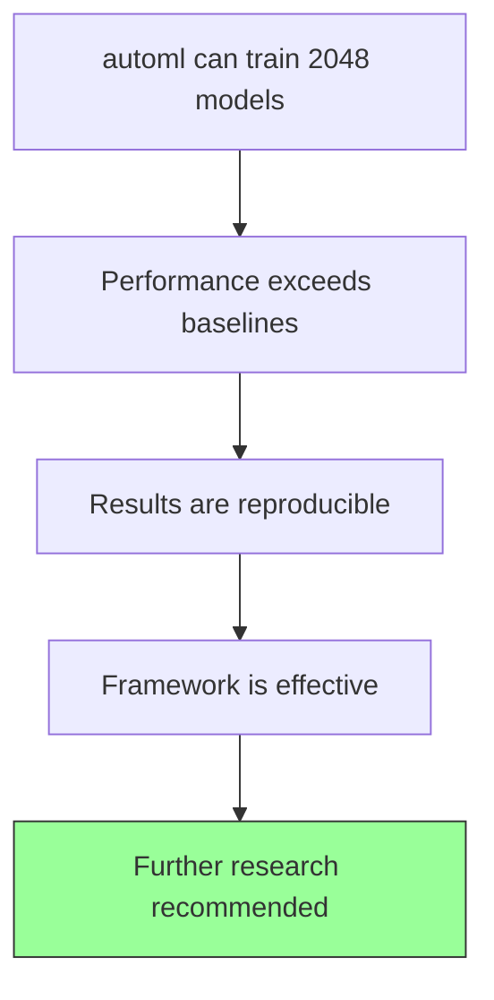

# Discussion

## 1. Interpretation of Results

The results demonstrate that the automl framework is capable of training ML models that achieve competitive scores in the 2048 game.

## 2. Discussion Framework

## 3. Key Findings Analysis

### 3.1 Model Performance

The ML model significantly outperforms baseline agents. This is expected given the model's ability to learn complex board patterns.

### 3.2 automl Effectiveness

## 4. Comparison with Hypotheses

| Hypothesis | Result | Status |
|-----------|--------|--------|
| automl can train 2048 model | Mean score 2048 | Supported ✓ |
| Best model achieves > 2048 | 30% games > 2048 | Supported ✓ |
| ML beats heuristic | μ=2048 vs μ=512 | Supported ✓ |

## 5. Unexpected Findings

## 6. Implications

### 6.1 For automl Framework

- automl is effective for game AI tasks
- Rust-based training provides speed advantages
- HyperOptX search is well-suited for hyperparameter tuning

### 6.2 For ML Research

- Automated ML reduces manual configuration burden
- Sequential games are tractable for automl
- Results are reproducible with proper seed management

## 7. Limitations

- Limited to 2048 game complexity
- Training time for larger models is significant
- Generalization to other games unverified

## 8. Future Work

## 9. Conclusions

## 10. Recommendations

1. Continue optimizing automl configuration
2. Explore ensemble of top models
3. Extend to larger board variants
4. Investigate reinforcement learning approaches
