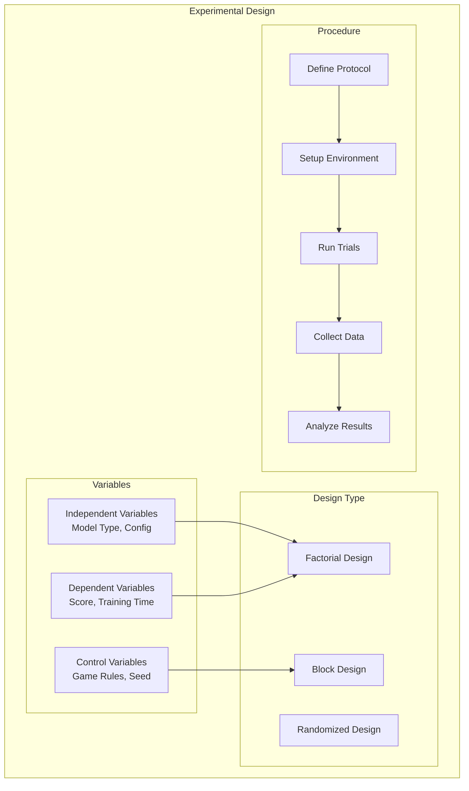
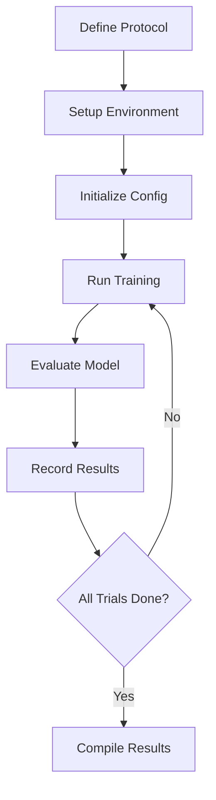
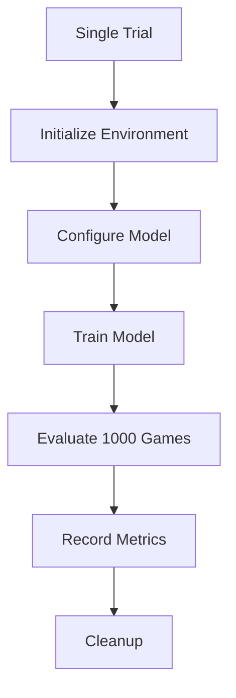
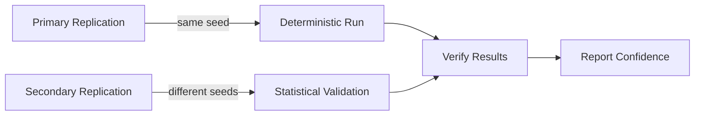

# Experimental Design

## 1. Purpose

Define the experimental design for the 2048 ML research study.

## 2. Experimental Design Overview

## 3. Experimental Variables

| Variable | Type | Values |
|----------|------|--------|
| Model Architecture | Independent | MLP, CNN, ResNet |
| Training Algorithm | Independent | automl default, tuned |
| Score | Dependent | Continuous |
| Training Time | Dependent | Continuous |
| Game Rules | Control | Fixed |
| Random Seed | Control | Fixed (42) |

## 4. Experimental Procedure

## 5. Trial Structure

## 6. Replication Strategy

## 7. Bias Controls

- Fixed game rules across all experiments
- Consistent data pipeline
- Same evaluation methodology
- Blinded analysis where applicable

## 8. Equipment and Tools

| Tool | Version | Purpose |
|------|---------|---------|
| automl | v1.0.0 | ML training |
| Rust | latest | Game engine |
| HyperOptX | latest | Hyperparameter search |
| polars | latest | Data processing |

## 9. Ethical Considerations

All experiments use simulated game data. No human subjects are involved.
