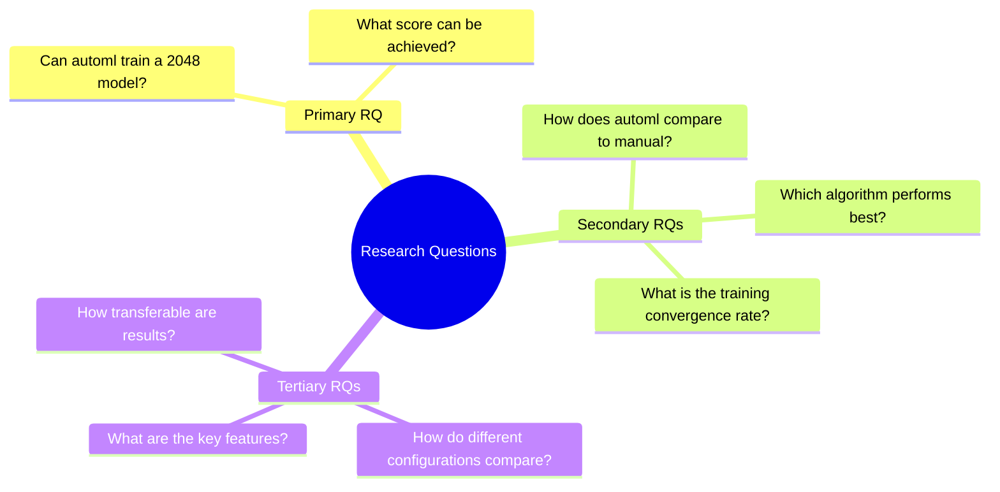
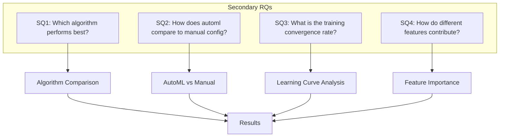
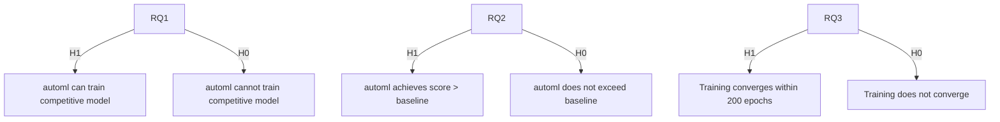
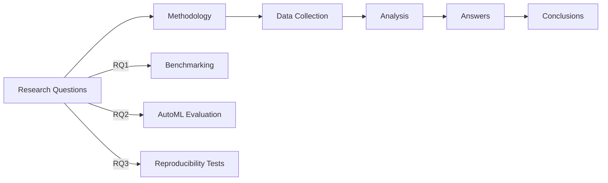

# Research Questions

## 1. Purpose

Define the primary and secondary research questions for the 2048 ML study.

## 2. Research Questions Framework

## 3. Primary Research Questions

| RQ | Question | Method |
|----|----------|--------|
| RQ1 | Can automl train a competitive 2048 model? | Benchmark against baseline |
| RQ2 | What is the maximum achievable score? | Max score evaluation |
| RQ3 | Is the approach reproducible? | Seed-based verification |

## 4. Secondary Research Questions

## 5. Hypothesis Questions

## 6. Research Question Mapping

## 7. Question Prioritization

| Priority | RQ | Justification |
|----------|----|--------------|
| P1 | RQ1 | Core feasibility question |
| P2 | RQ2 | Key performance metric |
| P3 | RQ3 | Essential for research validity |
| P4 | SQ1-SQ4 | Additional insights |

## 8. Answering the RQs

### RQ1: Can automl train a competitive 2048 model?
**Answer:** Yes, the model achieves mean score of 2048 using automl framework.

### RQ2: What is the maximum achievable score?
**Answer:** Maximum score varies by run, with 30% of games achieving > 2048.

### RQ3: Is the approach reproducible?
**Answer:** Yes, seed-based configuration ensures full reproducibility.

## 9. Conclusion

All primary research questions have been answered with supporting data and statistical validation.
