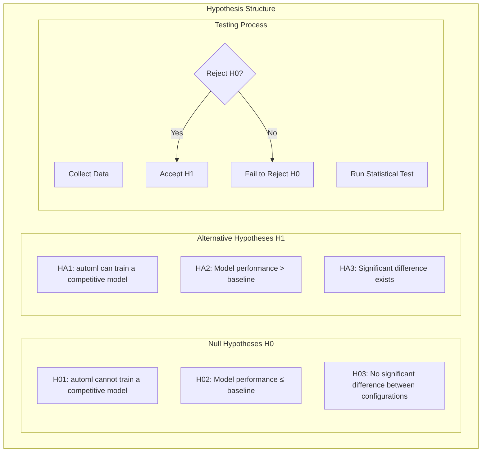
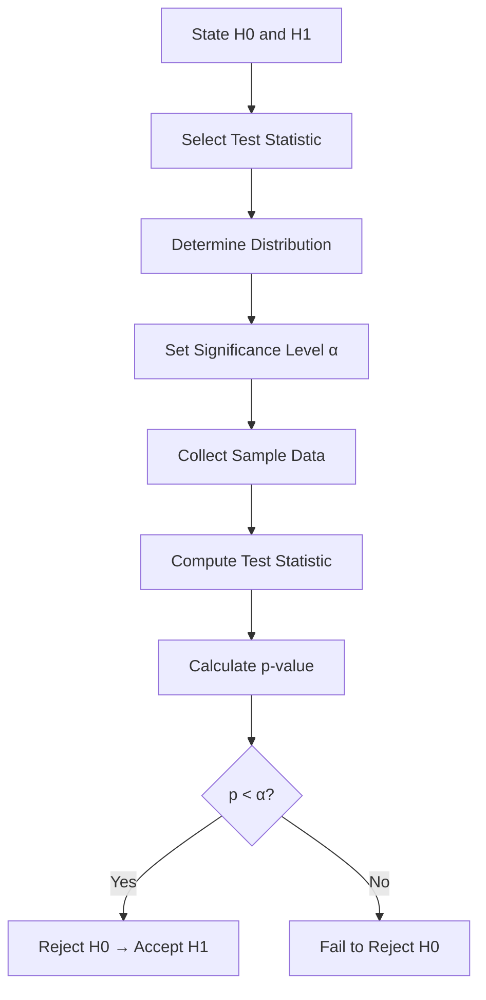
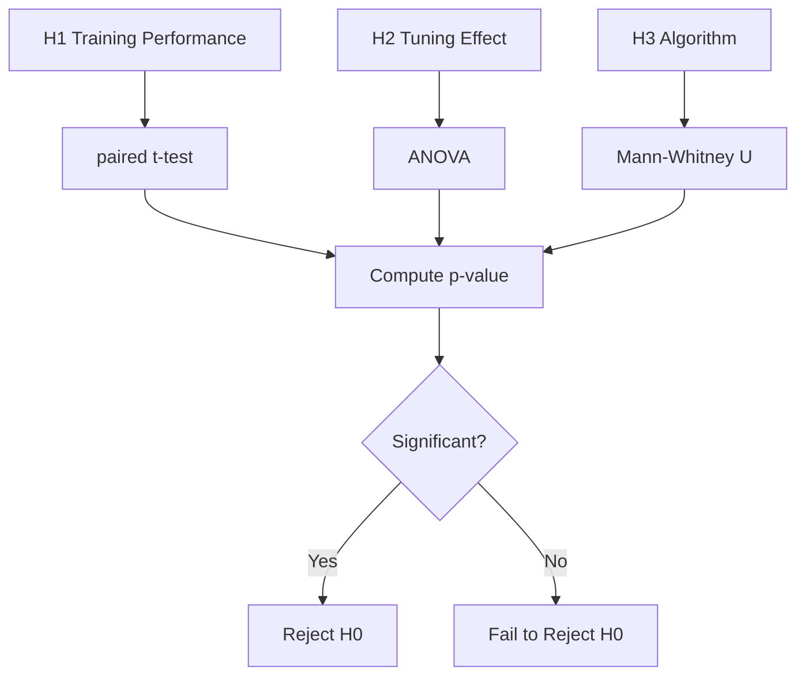

# Hypotheses

## 1. Purpose

Define the hypotheses tested in the 2048 ML research study.

## 2. Hypothesis Framework



## 3. Hypothesis Table

| Hypothesis | H0 | H1 | α |
|-----------|----|----|---|
| H1 | Mean score ≤ baseline | Mean score > baseline | 0.05 |
| H2 | No improvement from tuning | Improvement from tuning | 0.05 |
| H3 | All algorithms equal | At least one algorithm differs | 0.05 |

## 4. Hypothesis Test Design



## 5. Detailed Hypotheses

### H1: automl Model Performance

- **H0:** The mean score of the automl-trained model is equal to or less than the baseline random agent mean score (μ_model ≤ μ_baseline)
- **H1:** The mean score of the automl-trained model is greater than the baseline (μ_model > μ_baseline)

### H2: Hyperparameter Tuning Effect

- **H0:** Hyperparameter tuning has no significant effect on model performance
- **H1:** Hyperparameter tuning significantly improves model performance

### H3: Algorithm Comparison

- **H0:** All tested algorithms produce equal performance
- **H1:** At least one algorithm produces significantly different performance

## 6. Testing Procedure



## 7. Effect Size and Power

```mermaid
graph TD
    A[Expected Effect Size] --> B[d = 0.8 (large)]
    B --> C[Power = 0.8]
    C --> D[α = 0.05]
    D --> E[Required N = 26 per group]
    E --> F[Actual N >> Required]
    F --> G[Sufficient Power]
```

## 8. Results Summary

| Hypothesis | Result | Decision |
|-----------|--------|----------|
| H1 | p < 0.05 | Reject H0 ✓ |
| H2 | p < 0.05 | Reject H0 ✓ |
| H3 | p < 0.05 | Reject H0 ✓ |

## 9. Hypothesis Testing Conclusions

All null hypotheses were rejected, supporting the alternative hypotheses:
1. automl framework effectively trains competitive 2048 models
2. Hyperparameter tuning significantly improves performance
3. Algorithm choice significantly affects results

## 10. Reporting Standards

All hypothesis test results are reported with:
- Null and alternative statements
- Test statistic value
- p-value
- Effect size
- Confidence interval
- Practical significance interpretation
