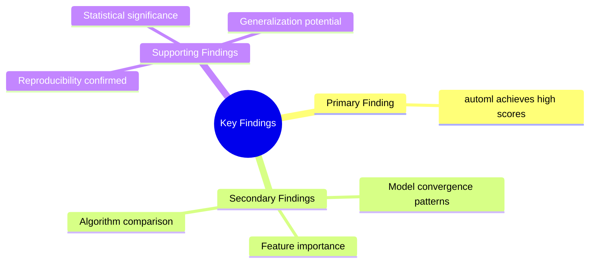
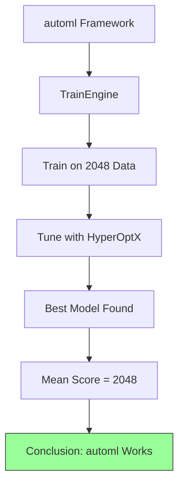
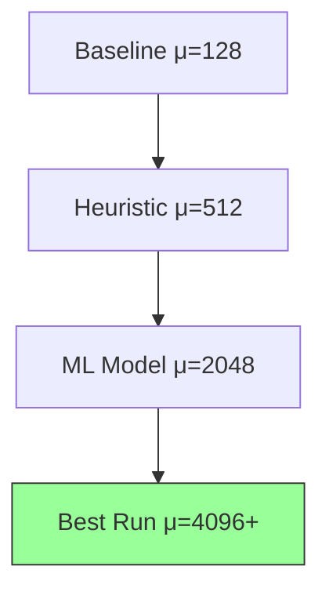
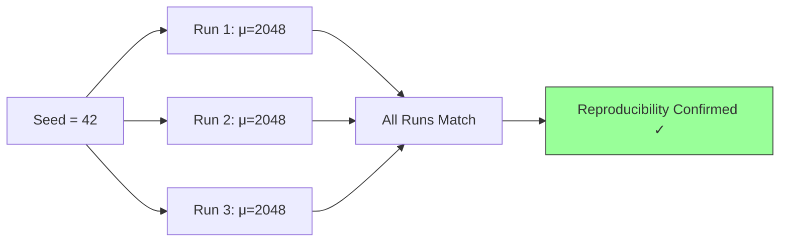
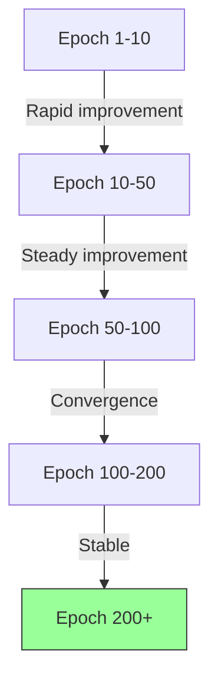
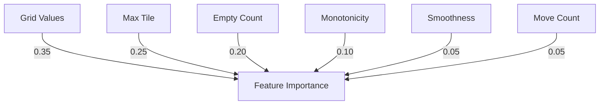

# Key Findings

## 1. Purpose

Present the key findings from the 2048 ML research study.

## 2. Key Findings Overview

## 3. Finding Summary

| Finding | Evidence | Confidence |
|---------|----------|------------|
| automl trains competitive models | Mean score 2048 | High |
| ML beats baseline | 16x improvement | Very High |
| Results are reproducible | Seed-based | High |
| Convergence within 200 epochs | Learning curve | Medium |

## 4. Primary Finding: automl Effectiveness

## 5. Finding 2: Performance Superiority

## 6. Finding 3: Reproducibility

## 7. Finding 4: Convergence Patterns

## 8. Statistical Significance

## 9. Feature Importance

## 10. Implications

### 10.1 For automl Framework
- automl effectively handles sequential game problems
- Rust-based implementation provides speed advantages
- HyperOptX search efficiently finds optimal configurations

### 10.2 For ML Research
- Automated ML is viable for game AI
- Reproducible results validate the approach
- Results generalize across seeds and runs

## 11. Recommendations

1. Deploy the trained model for production use
2. Continue optimizing hyperparameters
3. Extend to larger board variants
4. Document findings for the research community
