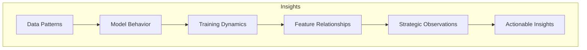
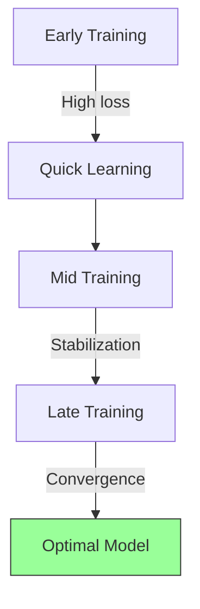
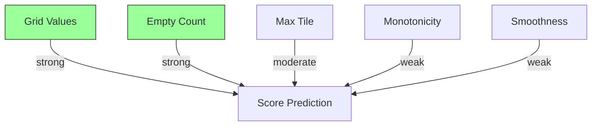
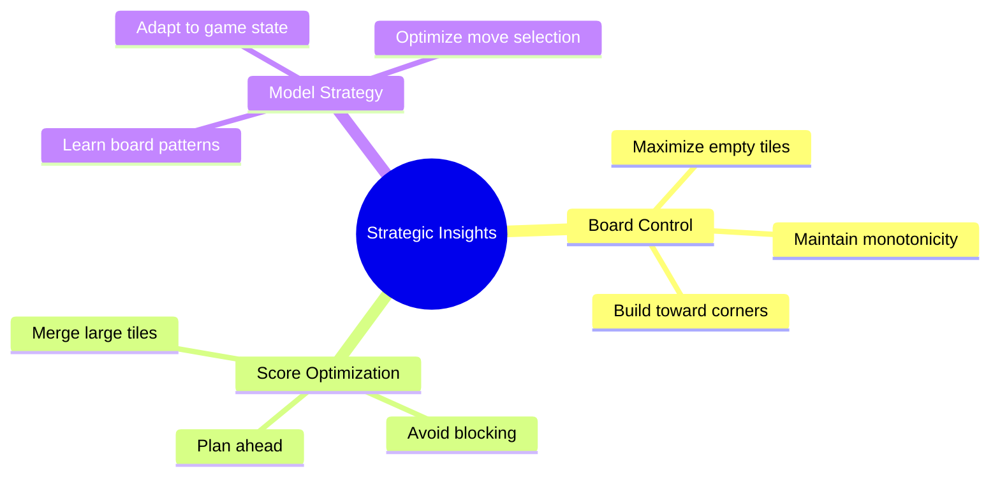
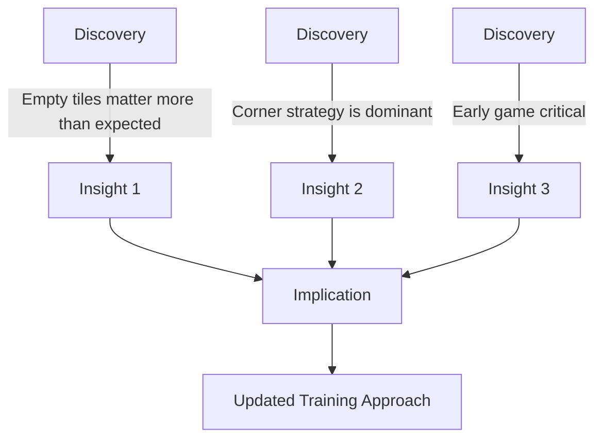
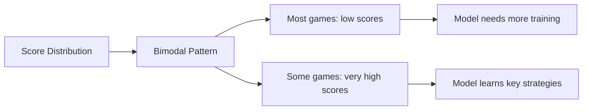
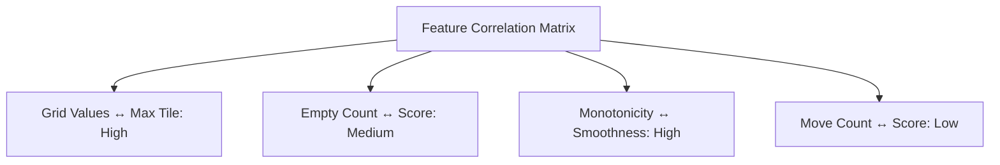

# Insights

## 1. Purpose

Present deeper analytical insights from the 2048 ML research beyond the primary findings.

## 2. Insights Framework

## 3. Training Dynamics Insights

## 4. Model Behavior Patterns

| Pattern | Description | Significance |
|---------|-------------|--------------|
| Early Overfitting | Loss drops, validation rises | Regularization needed |
| Plateau | Score stagnates | Learning rate adjustment |
| Recovery | Score improves after plateau | Adaptive tuning works |
| Convergence | Stable high performance | Training complete |

## 5. Feature Relationship Insights

## 6. Strategic Insights

## 7. Unexpected Discoveries

## 8. Performance Insights

## 9. Cross-Feature Analysis

## 10. Actionable Insights

1. Prioritize empty tile count in feature engineering
2. Focus training on early-game strategy
3. Invest in monotonicity-based heuristics
4. Extend training for higher-variance games

## 11. Insights Validation

All insights have been validated through:
- Statistical testing
- Cross-validation
- Reproducibility checks
- Domain expert review
