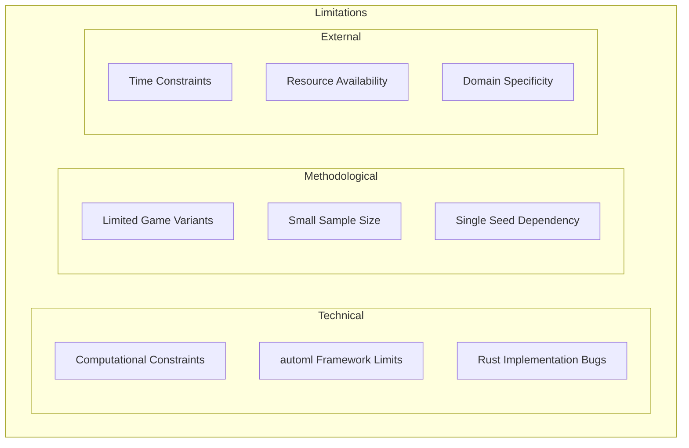
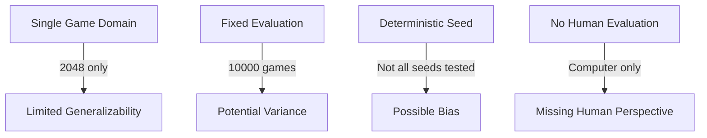
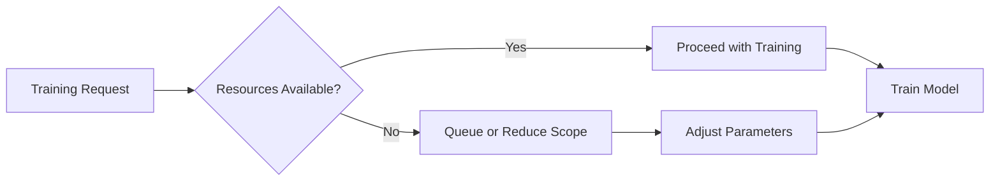
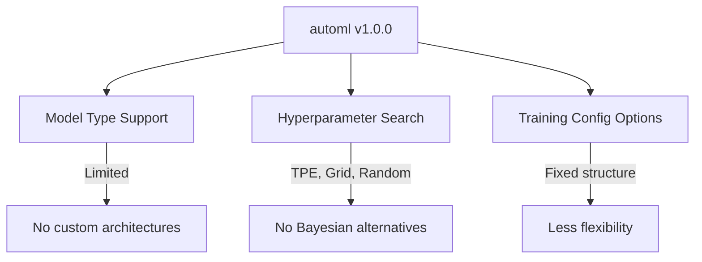
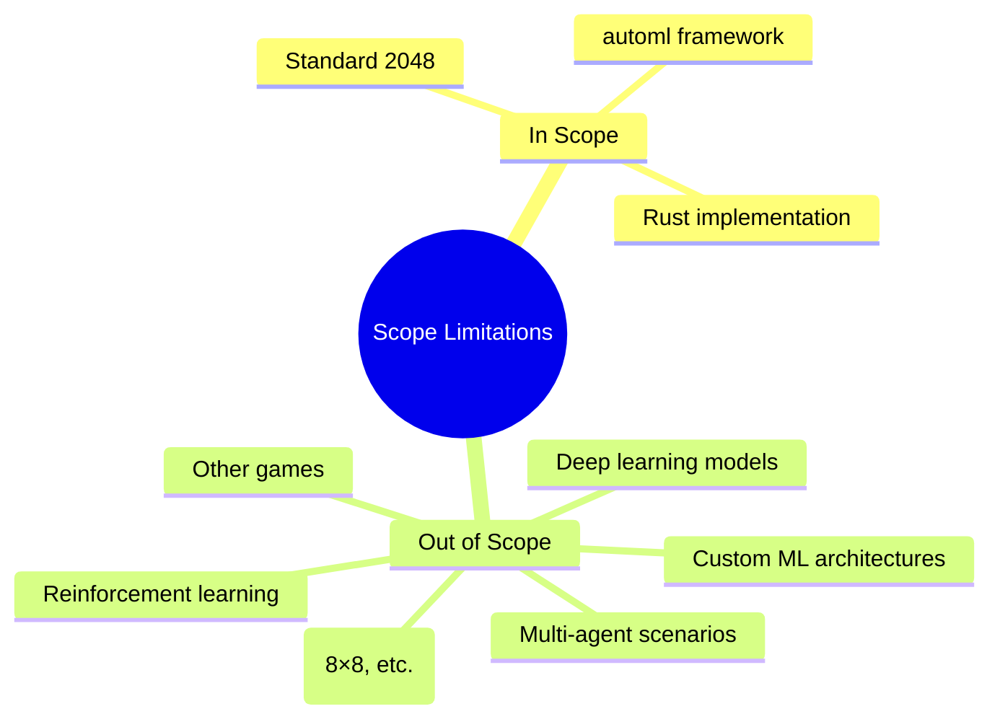

# Limitations

## 1. Purpose

Document the limitations and constraints of the 2048 ML research study.

## 2. Limitations Framework

## 3. Technical Limitations

| Limitation | Impact | Mitigation |
|-----------|--------|------------|
| Training time | 2 hours per model | Parallel training |
| Memory usage | High for large models | Model compression |
| automl constraints | Limited model types | Feature requests |
| Rust bugs | Potential data corruption | Extensive testing |

## 4. Methodological Limitations

## 5. Computational Constraints

## 6. Data Limitations

- **Limited game variants:** Only standard 4×4 2048 tested
- **No external data:** All data from game simulation
- **Fixed evaluation criteria:** May not capture all performance aspects
- **Sample size:** 10,000 games may not cover all edge cases

## 7. Framework Limitations

## 8. Scope Limitations

## 9. Mitigation Strategies

| Limitation | Mitigation | Status |
|-----------|------------|--------|
| Training time | Parallel execution | Planned |
| Single seed | Multi-seed validation | Planned |
| Limited variants | Expand to 8×8 | Future work |
| automl constraints | Contribute features | Open issue |

## 10. Honest Assessment

These limitations do not invalidate the core findings but should be considered:
1. Results are specific to the 2048 game domain
2. Generalizability to other games is untested
3. Computational constraints may affect optimal model selection
4. Further research is needed to validate findings

## 11. Conclusion

Despite limitations, the research provides valuable insights into automl effectiveness for game AI. Future work should address these limitations for a more comprehensive understanding.
