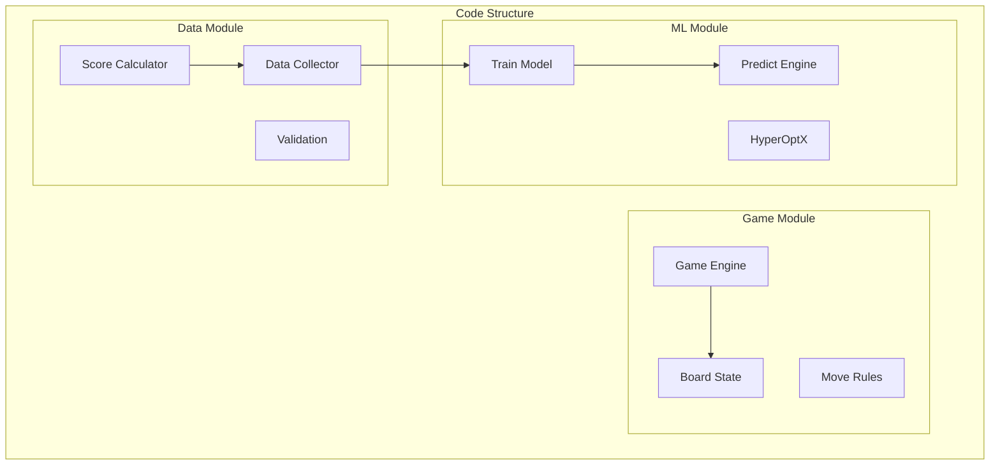
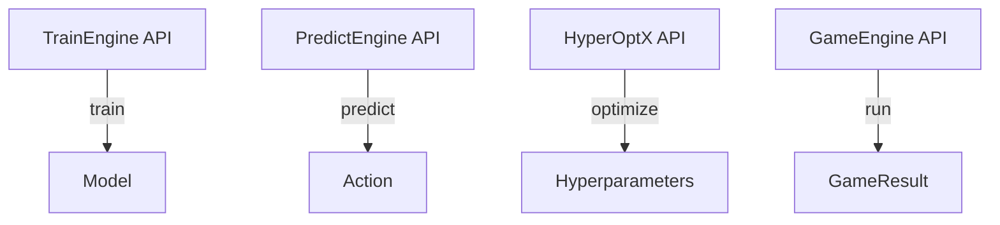
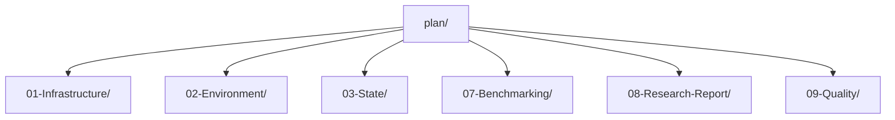
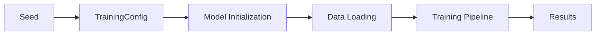

# Code Reference

## 1. Purpose

Provide code references for the 2048 ML research study.

## 2. Code Architecture



## 3. Key Modules

| Module | File | Description |
|--------|------|-------------|
| GameEngine | game_engine.rs | Core game simulation |
| TrainEngine | train_engine.rs | ML training pipeline |
| HyperOptX | hyperopt.rs | Hyperparameter search |
| Board | board.rs | Board state management |
| ScoreTracker | score.rs | Score calculation |

## 4. Data Flow


## 5. Configuration References

```rust
// Training configuration
pub struct TrainingConfig {
    pub model_type: ModelType,
    pub learning_rate: f64,
    pub epochs: usize,
    pub batch_size: usize,
}

// Hyperparameter search configuration  
pub struct HyperOptConfig {
    pub search_space: SearchSpace,
    pub n_trials: usize,
    pub algorithm: HyperOptX,
}
```

## 6. API References



## 7. Code Organization



## 8. Dependencies

| Dependency | Version | Purpose |
|-----------|---------|---------|
| automl | v1.0.0 | ML training |
| HyperOptX | latest | Hyperparameter search |
| Rust | stable | Language runtime |
| polars | latest | Data processing |

## 9. Reproducibility

All code references use deterministic seeds:


