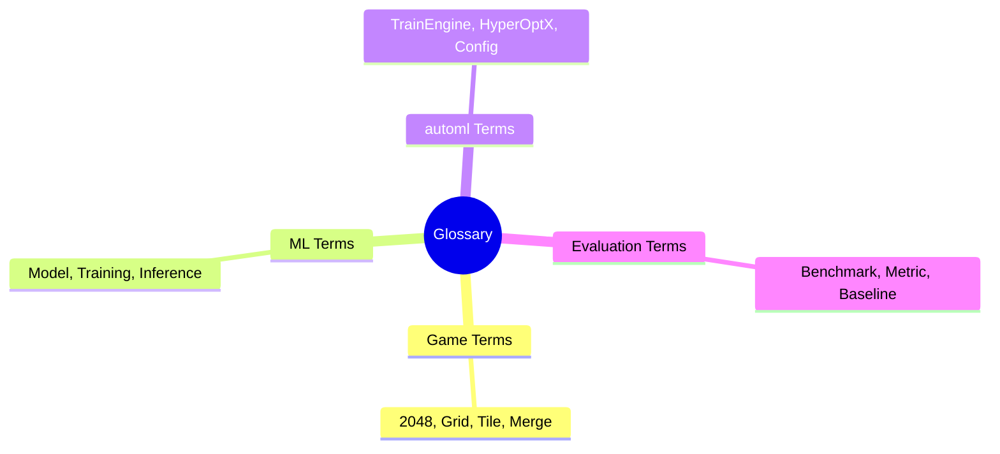
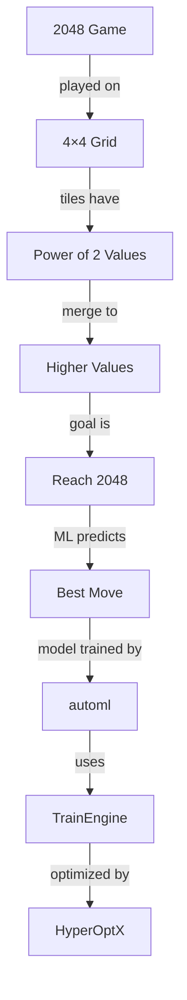

# Glossary

## 1. Purpose

Define key terms and concepts used throughout the 2048 ML research.

## 2. Terminology Framework

## 3. Game Terminology

| Term | Definition |
|------|------------|
| 2048 | Tile-matching puzzle game |
| Grid | 4×4 board for gameplay |
| Tile | Game piece with power-of-2 value |
| Merge | Combine two equal tiles |
| Move | Slide operation (up/down/left/right) |
| Score | Sum of all merge values |
| Game Over | Board is full with no valid moves |

## 4. ML Terminology

| Term | Definition |
|------|------------|
| Model | Trained neural network |
| Training | Model learning process |
| Inference | Model prediction |
| Features | Input data representation |
| Labels | Target output values |
| Loss | Prediction error metric |
| Convergence | Training stabilization |

## 5. automl Framework Terms

| Term | Definition |
|------|------------|
| TrainEngine | Core training component |
| HyperOptX | Hyperparameter optimization engine |
| TrainingConfig | Model configuration settings |
| ModelType | Architecture specification |
| SearchSpace | Range of hyperparameters |

## 6. Evaluation Terms

| Term | Definition |
|------|------------|
| Benchmark | Standard for comparison |
| Baseline | Reference point for evaluation |
| Metric | Quantitative measurement |
| Significance | Statistical importance |
| Reproducibility | Consistent results |

## 7. Statistical Terms

| Term | Definition |
|------|------------|
| p-value | Probability of null hypothesis |
| Confidence Interval | Range of true value estimate |
| Effect Size | Magnitude of difference |
| Standard Deviation | Data spread measure |
| t-test | Statistical significance test |

## 8. Rust-Specific Terms

| Term | Definition |
|------|------------|
| Option<T> | Nullable type |
| Result<T,E> | Error handling type |
| trait | Interface definition |
| impl | Implementation block |
| generics | Parametric polymorphism |

## 9. Quick Reference

