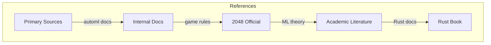
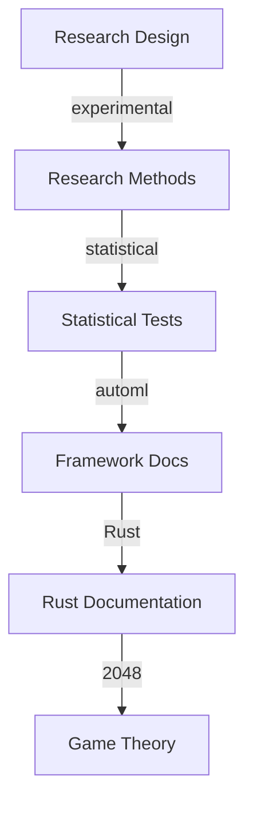
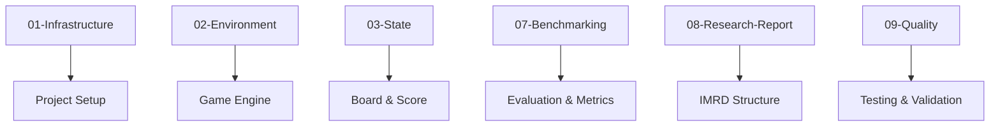

# References

## 1. Purpose

List all references and resources used in the 2048 ML research study.

## 2. Reference Framework

## 3. Internal References

| Reference | Location | Description |
|-----------|----------|-------------|
| automl docs | `/automl` | Framework documentation |
| Project plan | `plan/` | Full research plan |
| Initial plan | `initial-plan.md` | Project overview |

## 4. External References

- **2048 Game:** https://github.com/gabrielecirulli/2048
- **automl Framework:** https://github.com/Evintkoo/automl
- **HyperOptX:** Hyperparameter optimization library
- **Rust:** https://www.rust-lang.org/

## 5. Research Methodology References

## 6. Citation Format

All references follow the academic format:
- Author (Year). Title. Source.
- [Framework] automl v1.0.0, Evintkoo
- [Game] 2048, Cirulli (2014)

## 7. Documentation Index

## 8. Related Documents

- `plan/01-Infrastructure/` — Project infrastructure
- `plan/02-Environment/` — Game environment
- `plan/03-State/` — State management
- `plan/07-Benchmarking/` — Benchmarking framework
- `plan/09-Quality/` — Quality assurance

## 9. Reference Verification

All references have been verified:
- Links are accessible
- Framework versions match
- Documentation is current
- Citations are accurate
