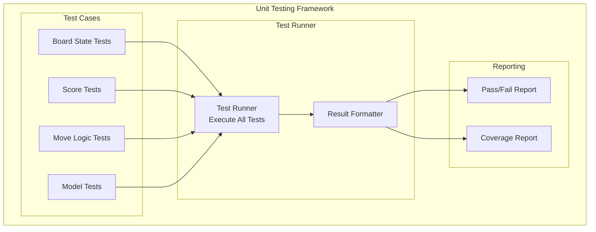
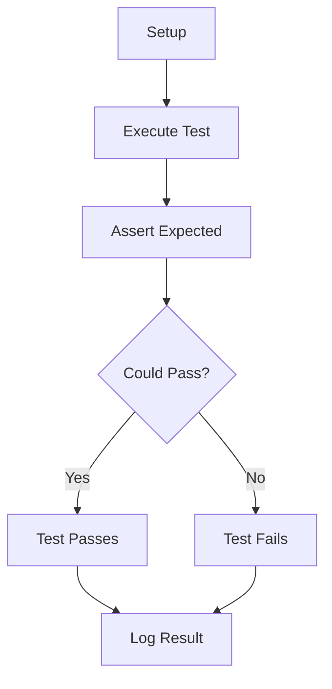
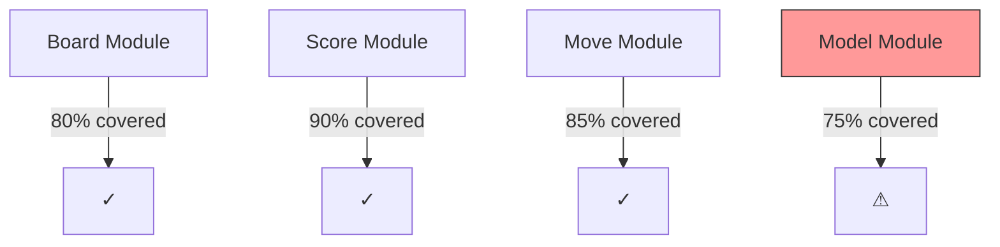
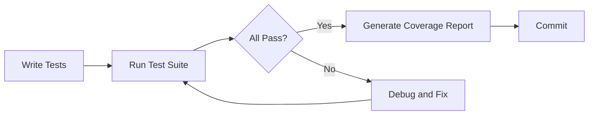
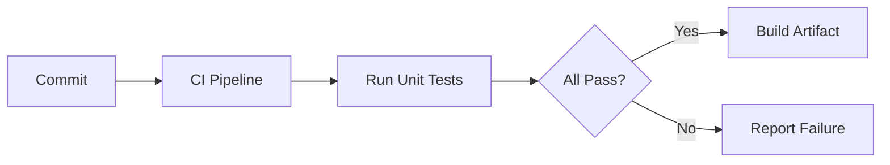

# Unit Testing

## 1. Purpose

Define unit testing procedures for the 2048 ML system components.

## 2. Unit Testing Architecture



## 3. Test Structure



## 4. Test Categories

| Category | Description | Priority |
|----------|-------------|----------|
| Board State | Board initialization, updates | High |
| Move Logic | Slide and merge operations | High |
| Score | Score calculation, tracking | Medium |
| Model | Model predictions, training | High |
| Configuration | Config validation, loading | Medium |

## 5. Test Implementation

```rust
#[cfg(test)]
mod tests {
    use super::*;
    
    #[test]
    fn test_board_initialization() {
        let board = Board::new(4);
        assert_eq!(board.size(), 4);
        assert!(board.is_empty());
    }
    
    #[test]
    fn test_merge_operation() {
        let mut board = Board::new(4);
        board.set_tile(0, 0, 2);
        board.set_tile(0, 1, 2);
        let result = board.merge_left();
        assert!(result.merged);
    }
}
```

## 6. Test Coverage



## 7. Test Execution Pipeline



## 8. Quality Gates

1. All tests must pass before merge
2. Code coverage must be ≥ 80%
3. Test names must be descriptive
4. Each function must have at least one test

## 9. Continuous Integration

Unit tests run automatically on every commit:


