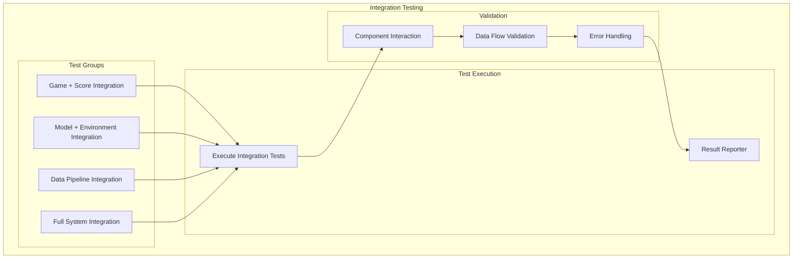
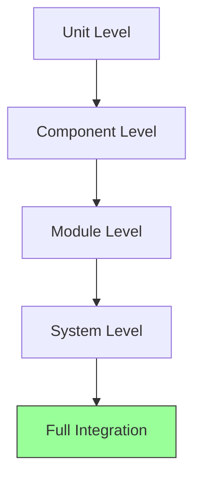
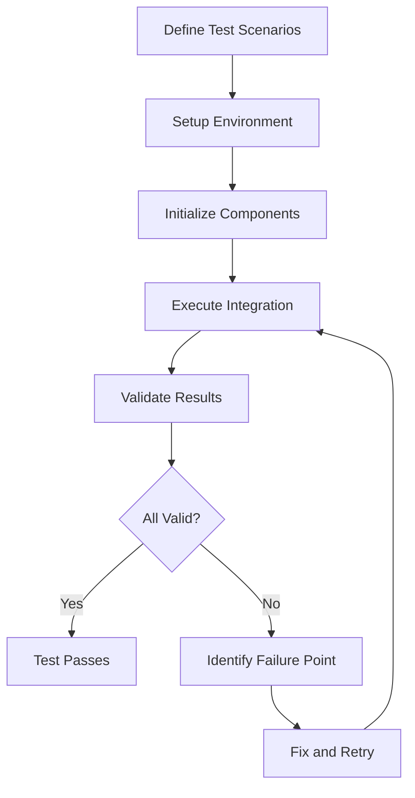
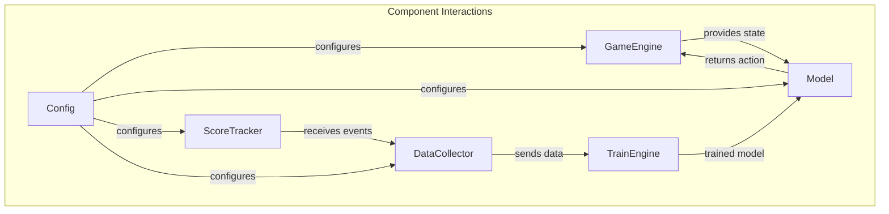
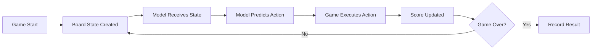
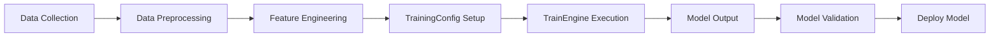
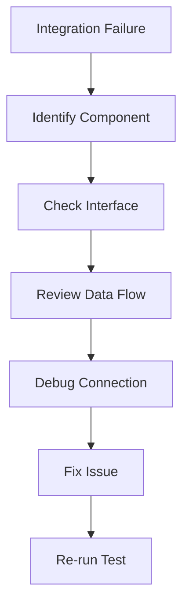

# Integration Testing

## 1. Purpose

Define integration testing procedures to verify component interactions in the 2048 ML system.

## 2. Integration Testing Architecture



## 3. Integration Levels



## 4. Integration Test Matrix

| Test | Components | Expected Result |
|------|-----------|-----------------|
| Game + Score | GameEngine + ScoreTracker | Score updates correctly |
| Model + Game | Model + GameEngine | Valid moves predicted |
| Data + Model | Data Collector + TrainEngine | Training data flows correctly |
| Config + All | Config + All modules | All modules initialize |

## 5. Integration Testing Pipeline



## 6. Component Interaction Map



## 7. Test Scenarios

### 7.1 Game-to-Model Integration



### 7.2 Training Pipeline Integration



## 8. Integration Test Results

```rust
pub struct IntegrationTestResult {
    pub test_name: String,
    pub components: Vec<String>,
    pub passed: bool,
    pub execution_time: u64,
    pub error_details: Option<String>,
    pub timestamp: DateTime<Utc>,
}
```

## 9. Failure Analysis



## 10. Reporting

Each integration test run produces:
- Component interaction map
- Pass/fail status per integration point
- Performance timing data
- Failure root cause analysis
