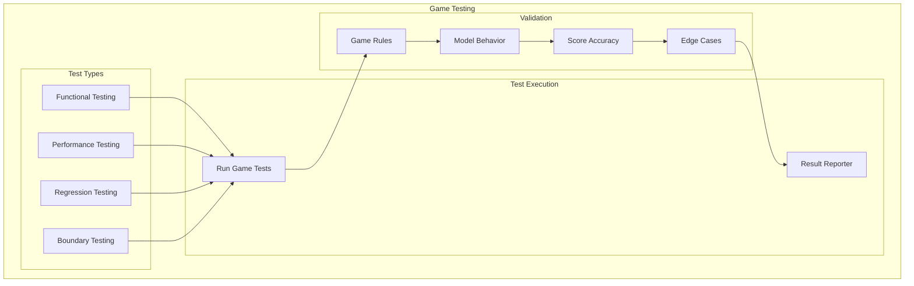
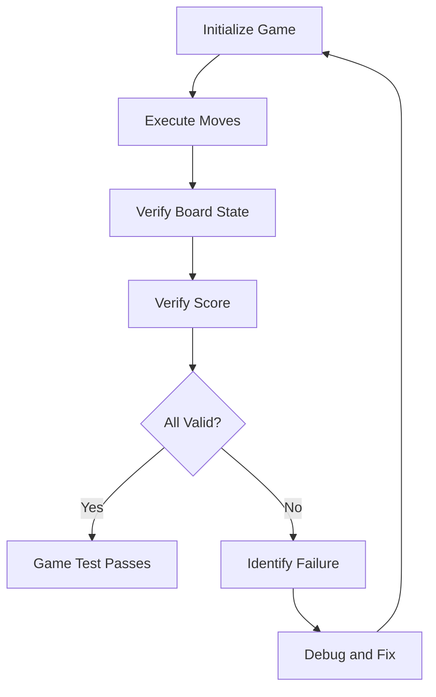
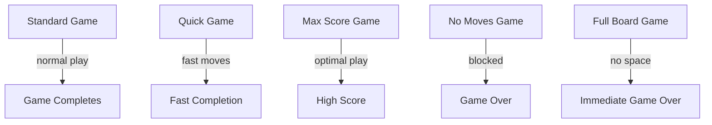
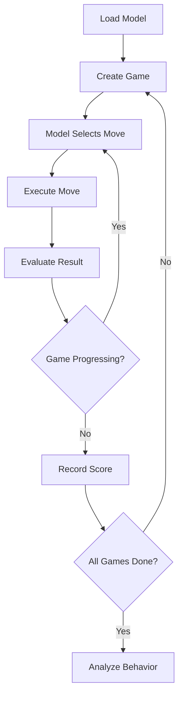
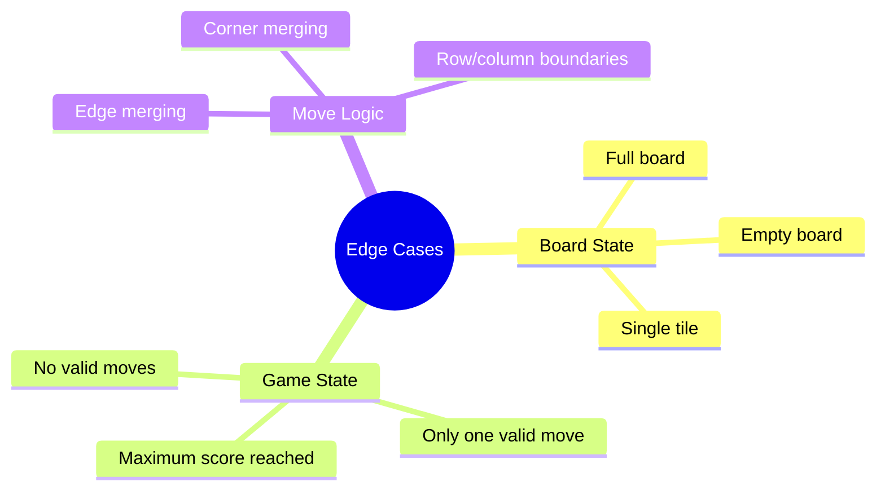
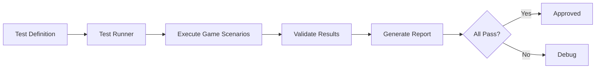

# Game Testing

## 1. Purpose

Define game testing procedures for validating the 2048 game engine and ML model integration.

## 2. Game Testing Framework



## 3. Game Test Categories

| Category | Description | Examples |
|----------|-------------|----------|
| Functional | Game mechanics work | Move execution, merge logic |
| Performance | Game speed | Games per second, latency |
| Regression | No broken features | Existing features still work |
| Boundary | Edge cases | Full board, no moves, max score |

## 4. Functional Testing Pipeline



## 5. Game Scenario Tests



## 6. Model Behavior Testing



## 7. Edge Case Testing



## 8. Game Testing Metrics

```rust
pub struct GameTestMetrics {
    pub n_games_tested: usize,
    pub rules_passed: usize,
    pub rules_failed: usize,
    pub edge_cases_covered: usize,
    pub edge_cases_passed: usize,
    pub avg_game_duration_ms: u64,
    pub model_move_validity: f64,    // % of valid moves
    pub score_accuracy: f64,         // % of correct scores
}
```

## 9. Test Automation



## 10. Reporting

Each game testing session produces:
- Pass/fail status per test category
- Edge case coverage report
- Model behavior analysis
- Performance metrics
- Regression detection
