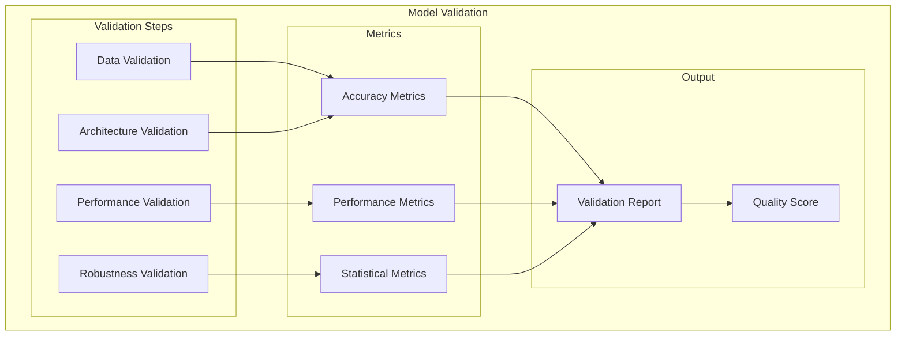
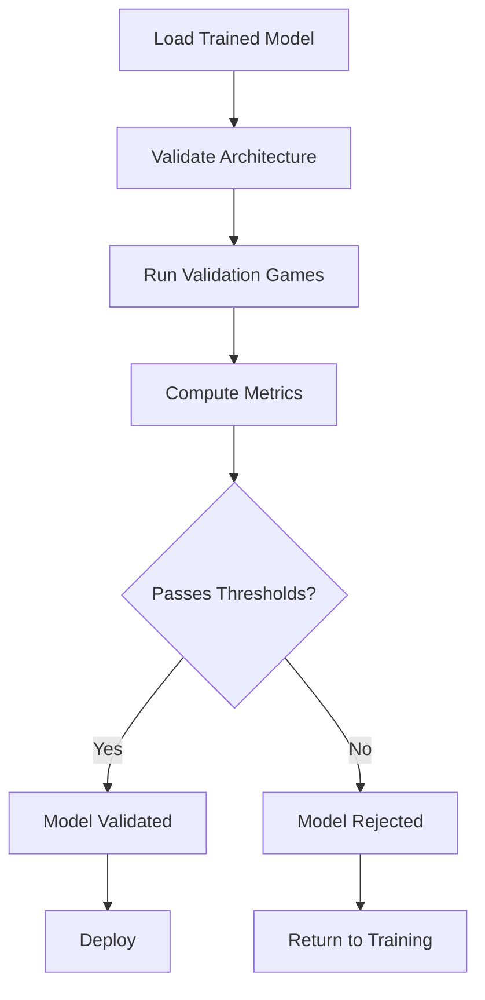
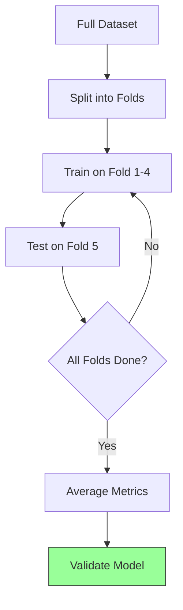
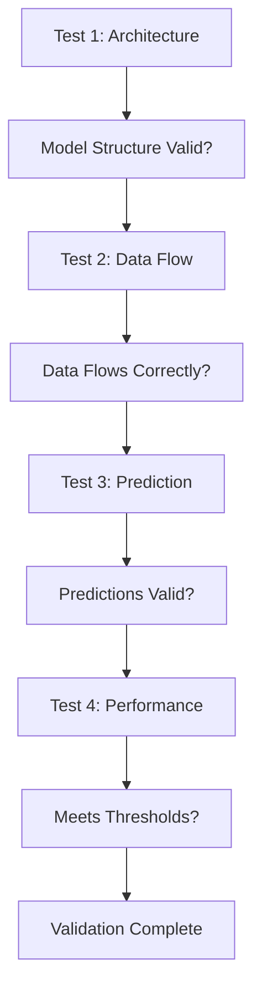
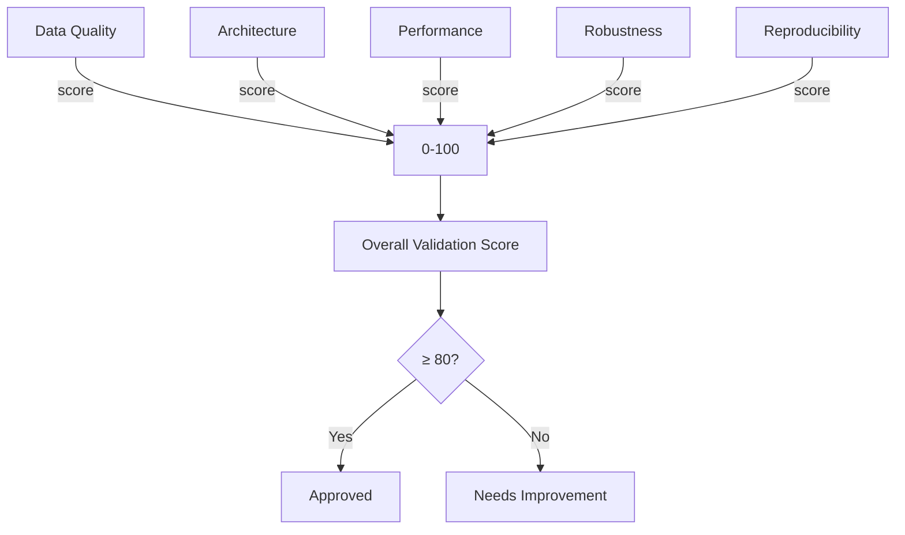
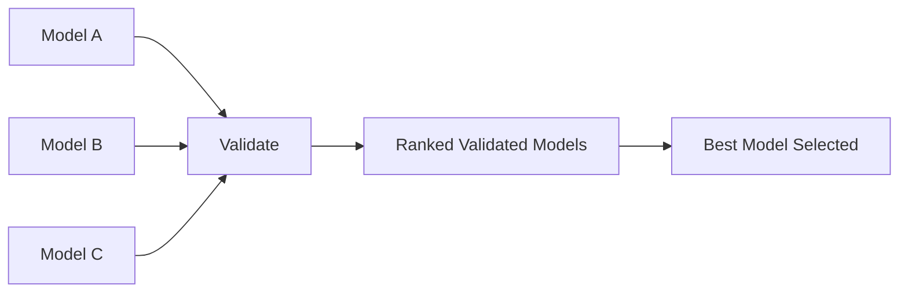
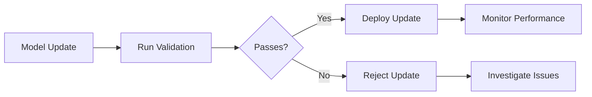

# Model Validation

## 1. Purpose

Define model validation procedures for the 2048 ML system.

## 2. Model Validation Framework

## 3. Validation Pipeline

## 4. Validation Metrics

| Metric | Threshold | Method |
|--------|-----------|--------|
| Move Accuracy | ≥ 55% | Classification accuracy |
| Score Mean | ≥ 1024 | Statistical evaluation |
| Convergence | ≤ 200 epochs | Training analysis |
| Robustness | Std Dev ≤ 512 | Variance analysis |

## 5. Cross-Validation

## 6. Model Validation Tests

## 7. Validation Scoring

## 8. Model Comparison Validation

## 9. Validation Artifacts

All validation artifacts are stored:
- Model checkpoints
- Validation metrics
- Test configurations
- Results summaries

## 10. Continuous Validation

