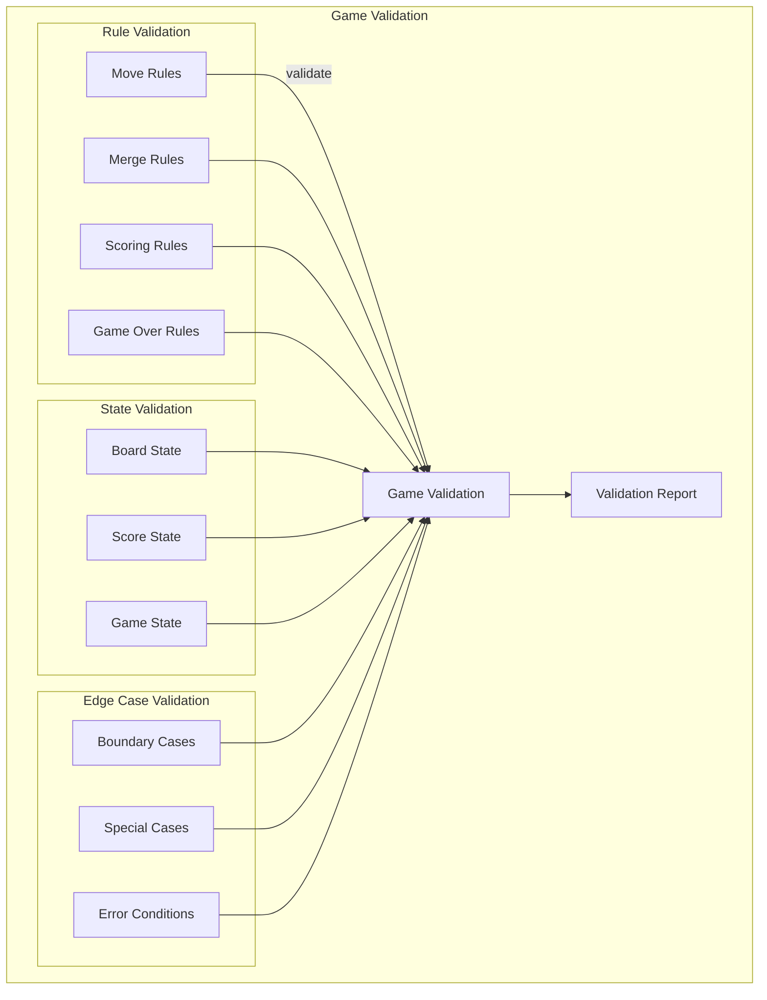
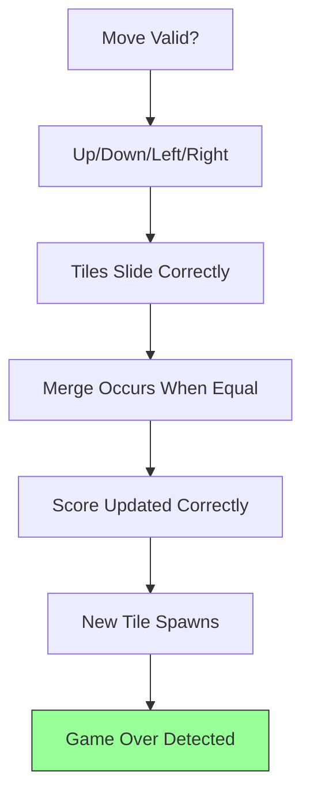
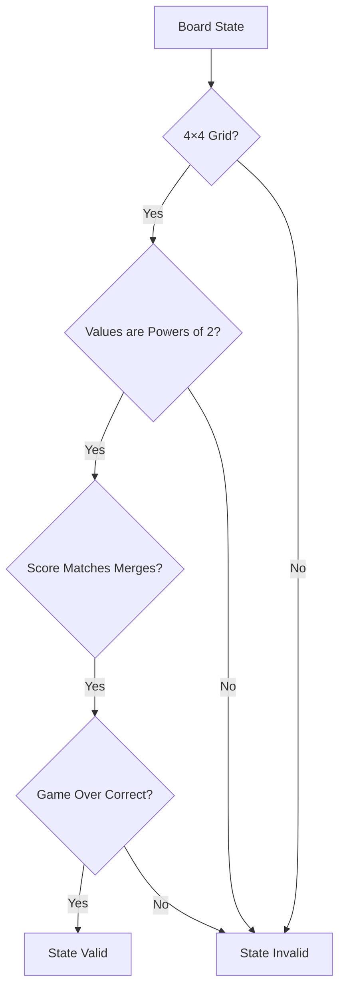
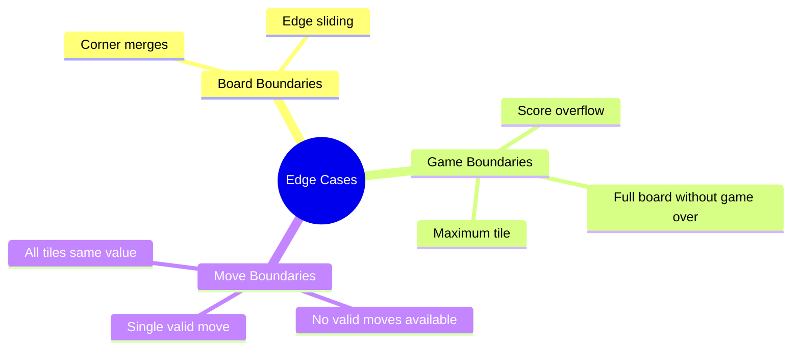
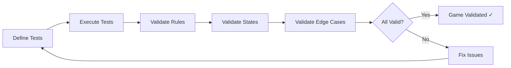
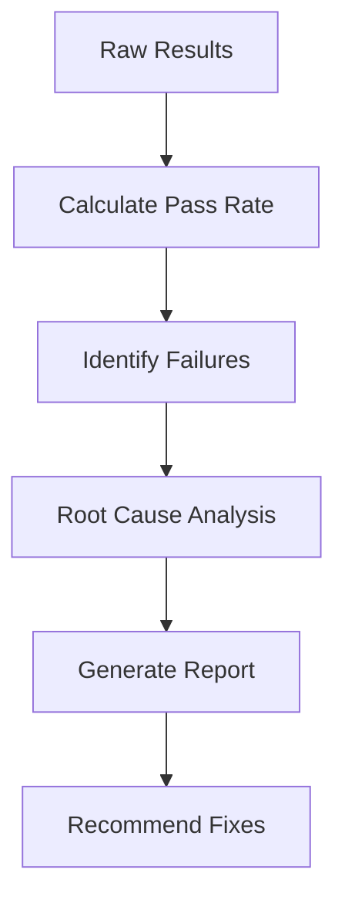

# Game Validation

## 1. Purpose

Define game validation procedures to ensure the 2048 game engine and rules are correct.

## 2. Game Validation Framework



## 3. Game Rule Validation



## 4. Validation Test Matrix

| Rule | Test Case | Expected Result |
|------|-----------|----------------|
| Merge | Two 2 tiles merge | One 4 tile |
| Score | 2+2 merge | Score += 4 |
| Game Over | Full board, no moves | Game Over |
| Spawn | Empty cell available | New tile appears |

## 5. Game State Validation



## 6. Edge Case Validation



## 7. Validation Pipeline



## 8. Validation Metrics

```rust
pub struct GameValidationResult {
    pub rules_passed: usize,
    pub rules_failed: usize,
    pub edge_cases_passed: usize,
    pub edge_cases_failed: usize,
    pub overall_score: f64,
    pub validation_date: DateTime<Utc>,
}
```

## 9. Validation Reporting



## 10. Continuous Validation

Game validation runs automatically:
- On every code change
- Before each release
- After each configuration update
- As part of CI pipeline
