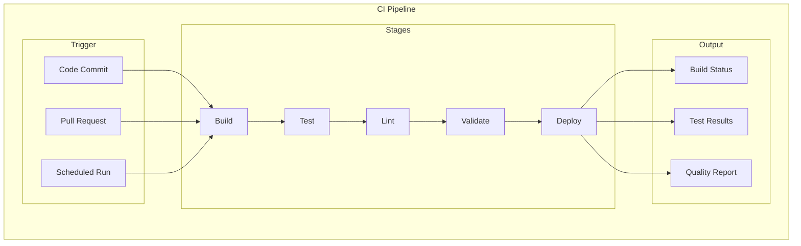
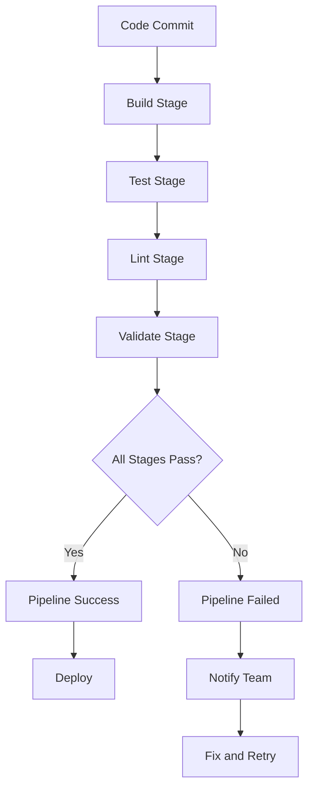
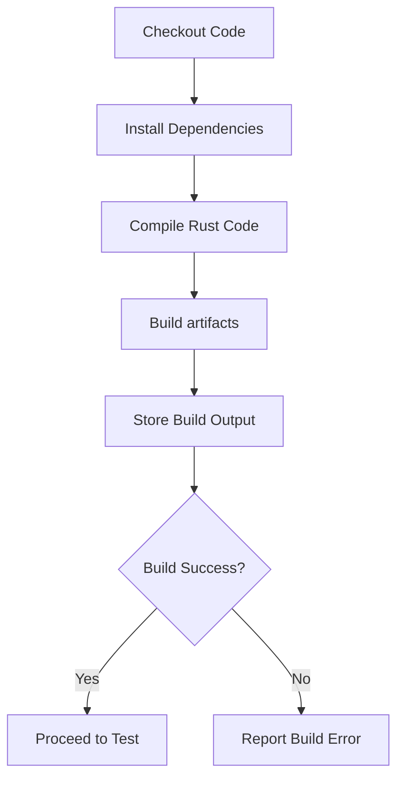
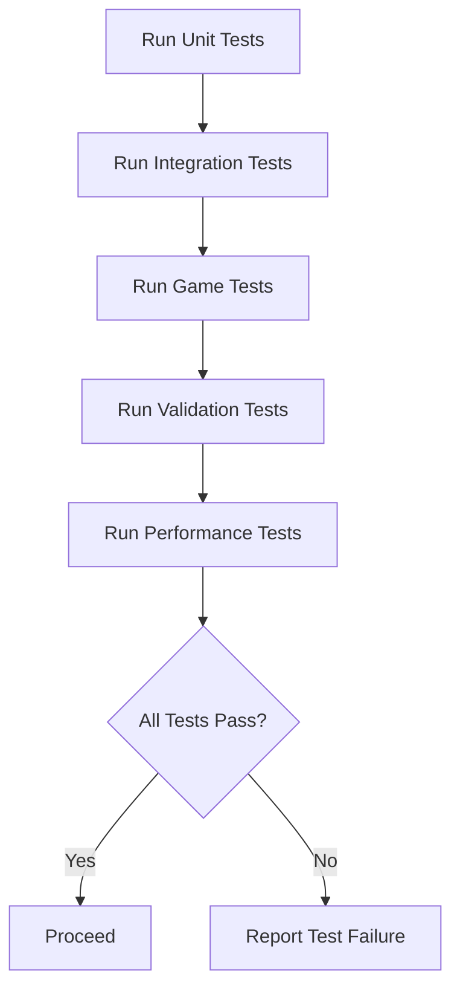
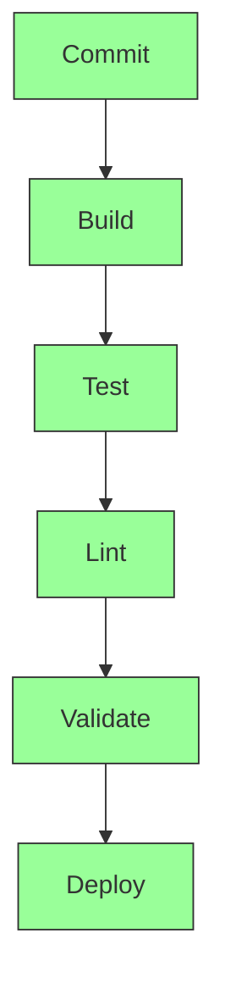
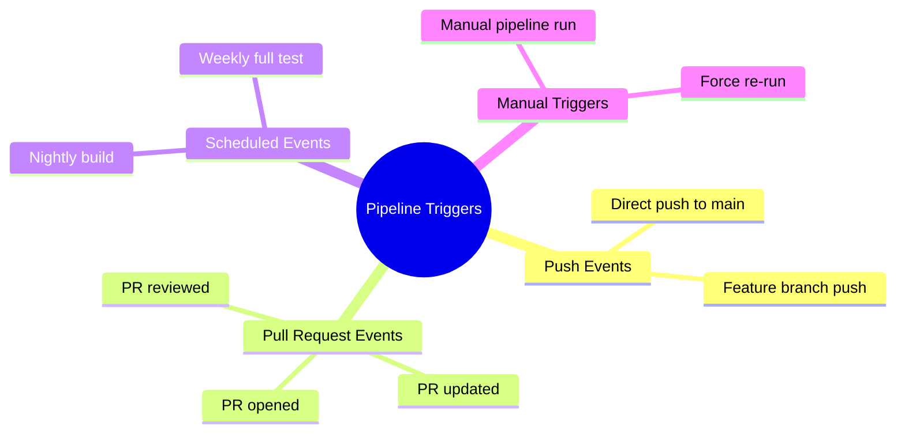

# CI Pipeline

## 1. Purpose

Define the continuous integration pipeline for the 2048 ML system.

## 2. CI Pipeline Architecture



## 3. Pipeline Stages



## 4. Stage Details

| Stage | Command | Duration | Failure Action |
|-------|---------|----------|----------------|
| Build | cargo build | 2 min | Block pipeline |
| Test | cargo test | 5 min | Block pipeline |
| Lint | cargo clippy | 1 min | Warning only |
| Validate | Custom scripts | 3 min | Block pipeline |
| Deploy | Automated deploy | 1 min | Manual approval |

## 5. Build Stage



## 6. Test Stage



## 7. Pipeline Visualization



## 8. Pipeline Triggers



## 9. Pipeline Configuration

```rust
pub struct CIPipelineConfig {
    pub stages: Vec<Stage>,
    pub timeout_seconds: u64,
    pub retry_count: usize,
    pub notifications: Vec<Notification>,
    pub branches: Vec<String>,
    pub triggers: Vec<Trigger>,
}
```

## 10. Pipeline Reporting

Each pipeline run produces:
- Build status dashboard
- Test coverage report
- Performance metrics
- Code quality scores
- Deployment status
