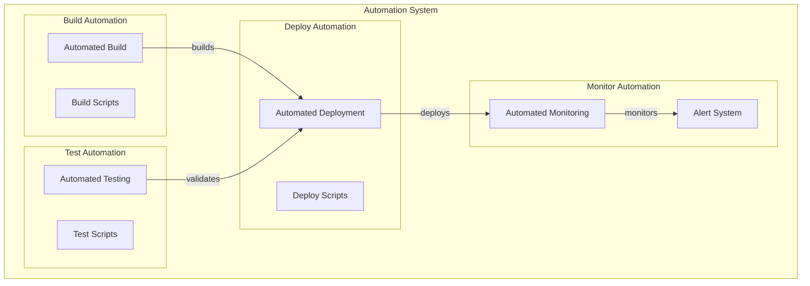
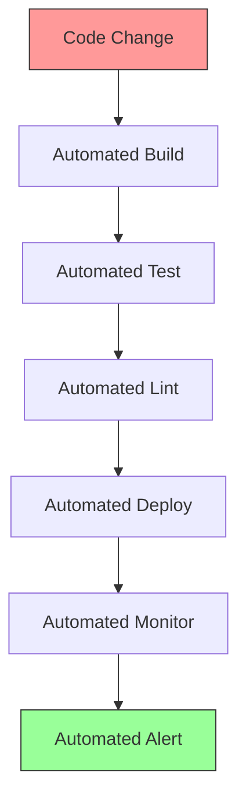
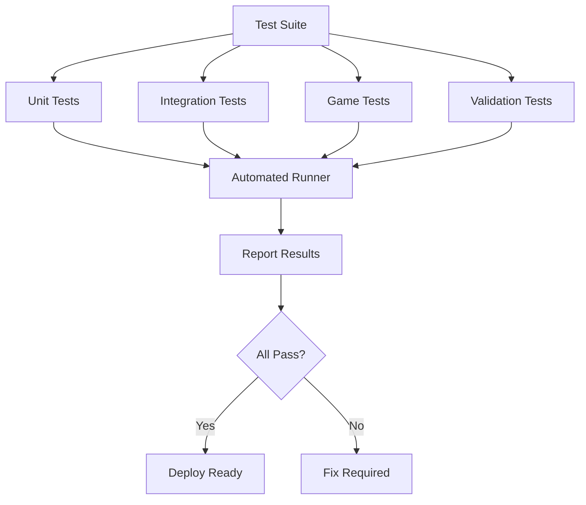
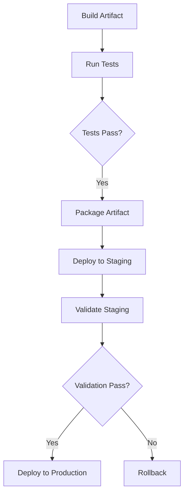
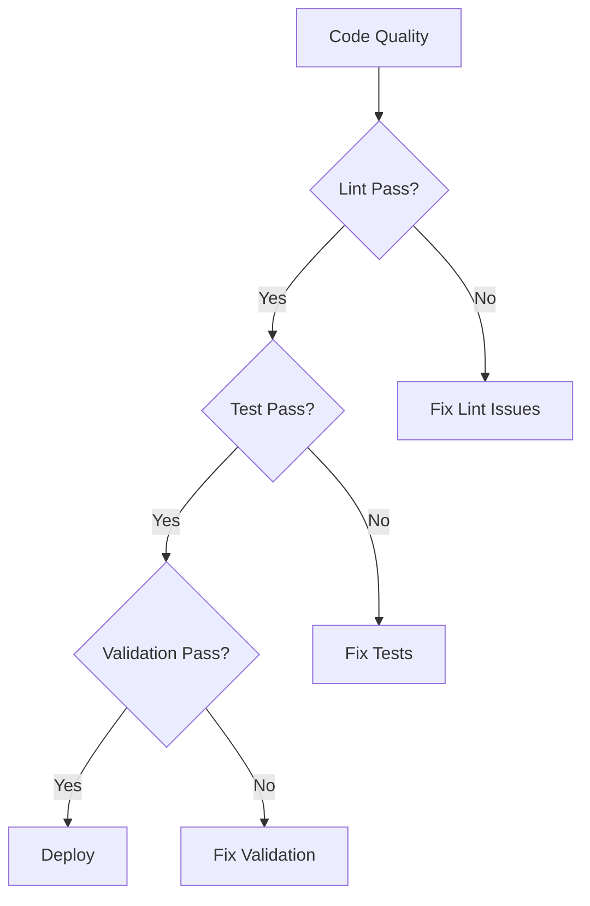
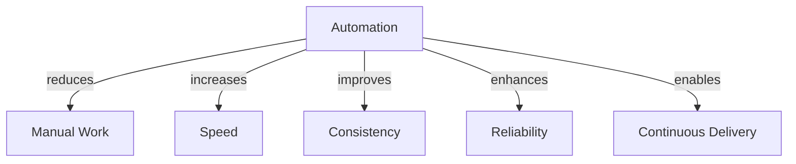
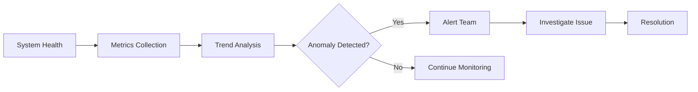

# Automation

## 1. Purpose

Define automation procedures for the 2048 ML system development workflow.

## 2. Automation Architecture



## 3. Automation Pipeline



## 4. Automation Categories

| Category | Tool | Purpose | Frequency |
|----------|------|---------|-----------|
| Build | cargo | Compile code | Every commit |
| Test | cargo test | Verify functionality | Every commit |
| Lint | cargo clippy | Code quality | Every commit |
| Deploy | Scripts | Release | Manual trigger |
| Monitor | Custom | System health | Continuous |

## 5. Test Automation Framework



## 6. Deployment Automation



## 7. Automated Quality Gates



## 8. Automation Scripts

```rust
pub struct AutomationConfig {
    pub build_script: String,
    pub test_script: String,
    pub deploy_script: String,
    pub monitor_script: String,
    pub alert_script: String,
    pub schedule: CronExpression,
}
```

## 9. Automation Benefits



## 10. Monitoring Automation


