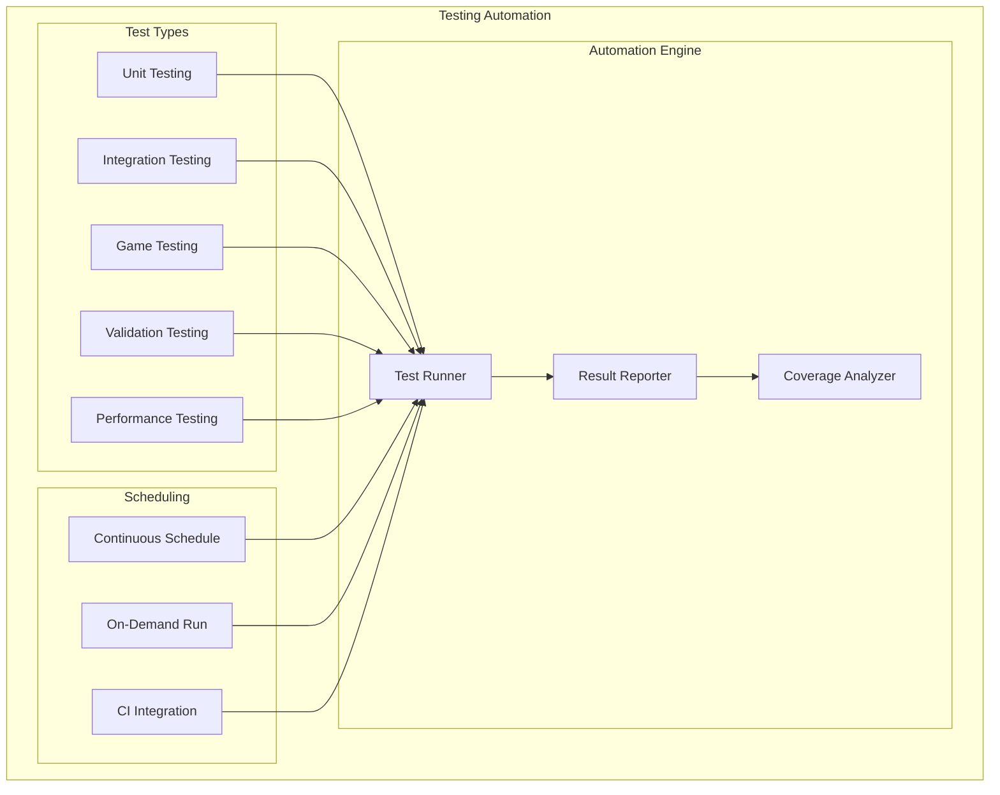
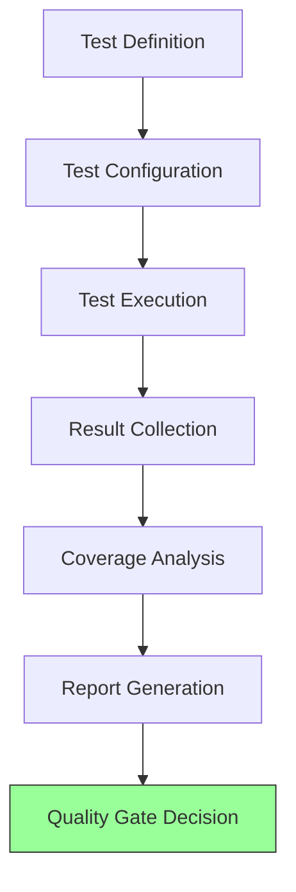
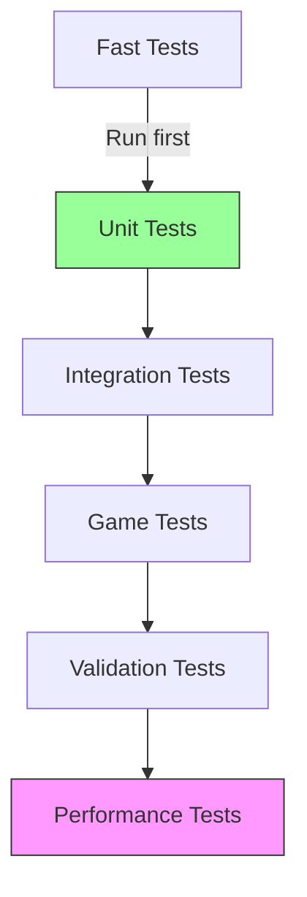
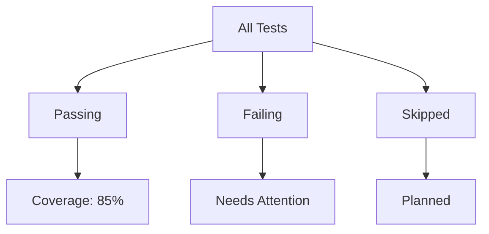
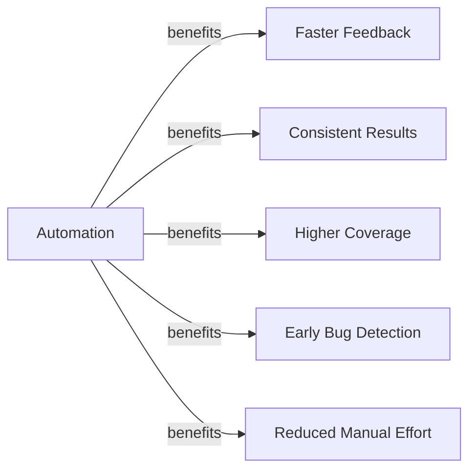
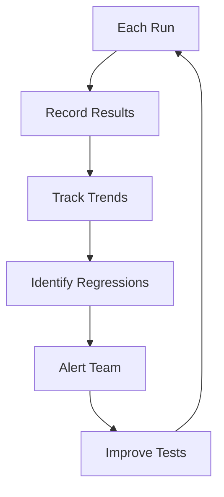

# Testing Automation

## 1. Purpose

Define automated testing procedures for the 2048 ML system.

## 2. Testing Automation Architecture



## 3. Test Automation Pipeline



## 4. Automated Test Categories

| Category | Tests | Execution Time | Frequency |
|----------|-------|---------------|-----------|
| Unit | 100+ | 30 seconds | Every commit |
| Integration | 50+ | 2 minutes | Every commit |
| Game | 20+ | 5 minutes | Every commit |
| Validation | 30+ | 3 minutes | Daily |
| Performance | 10+ | 10 minutes | Weekly |

## 5. Test Execution Strategy



## 6. Test Automation Configuration

```rust
pub struct TestAutomationConfig {
    pub test_types: Vec<TestType>,
    pub parallel_execution: bool,
    pub max_parallel_tests: usize,
    pub timeout_per_test: u64,
    pub retry_failed_tests: usize,
    pub coverage_threshold: f64,
    pub fail_fast: bool,
}
```

## 7. Test Execution Dashboard



## 8. Automated Testing Benefits



## 9. Test Results Tracking



## 10. Reporting

Automated test runs produce:
- Test pass/fail summary
- Coverage analysis
- Performance benchmarks
- Historical trend charts
- Regression alerts
