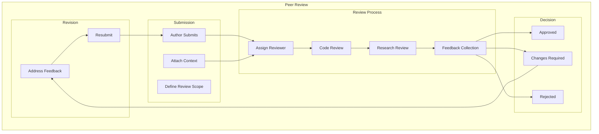
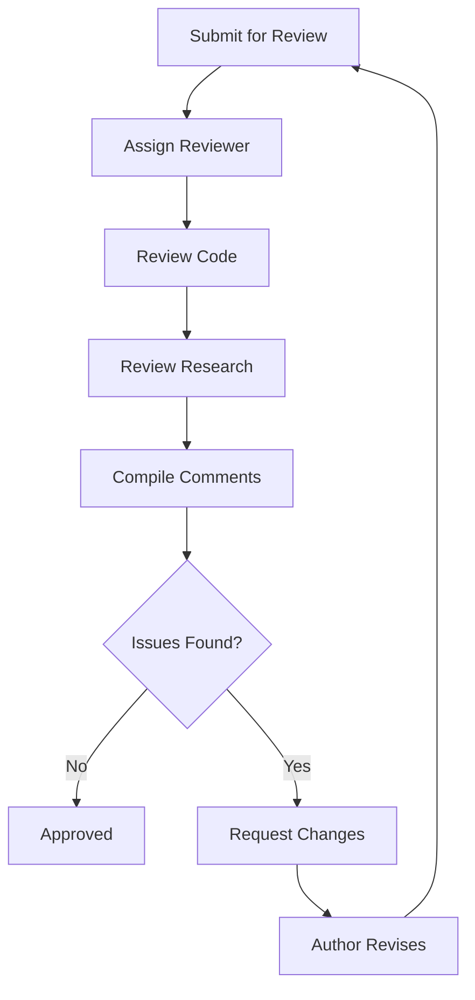
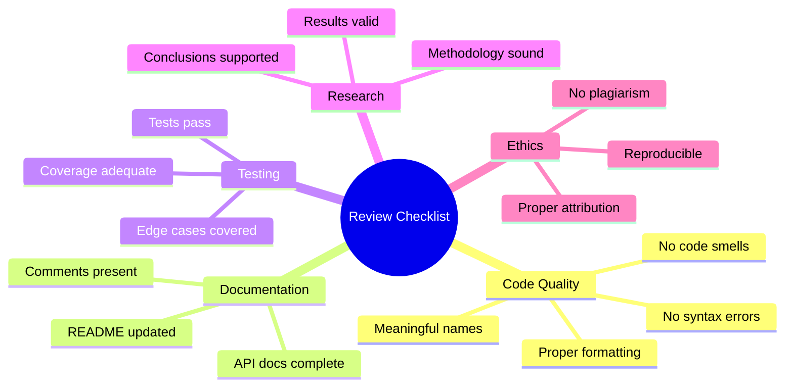
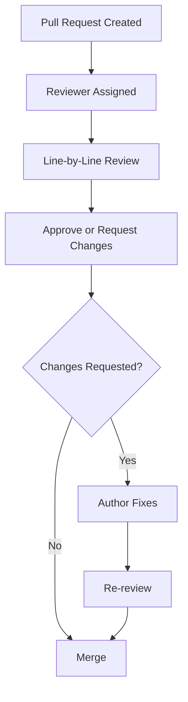
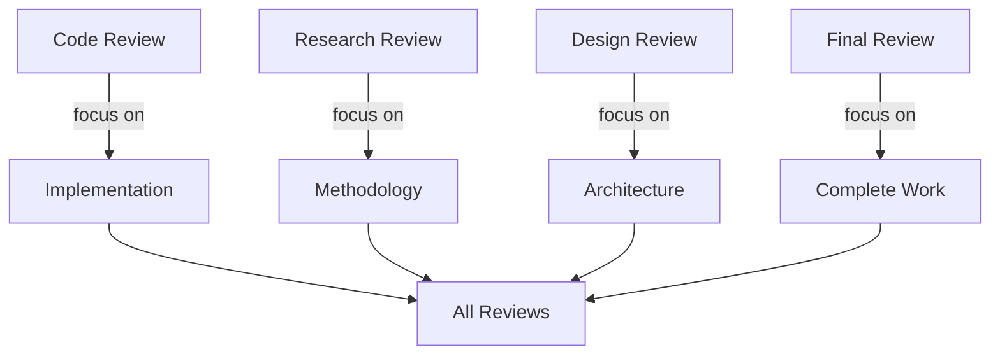
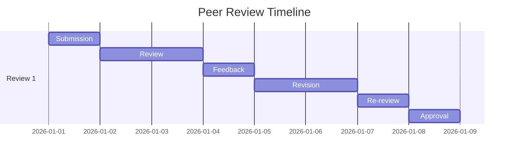

# Peer Review

## 1. Purpose

Define peer review procedures for the 2048 ML system code and research.

## 2. Peer Review Framework



## 3. Review Criteria

| Criterion | Description | Weight |
|-----------|-------------|--------|
| Correctness | Code works as intended | 30% |
| Readability | Code is clear and documented | 20% |
| Performance | Efficient execution | 20% |
| Design | Good architectural choices | 15% |
| Testing | Adequate test coverage | 15% |

## 4. Review Process



## 5. Review Checklist



## 6. Review Workflow



## 7. Review Metrics

```rust
pub struct PeerReviewResult {
    pub reviewer_name: String,
    pub review_date: DateTime<Utc>,
    pub approval_status: ApprovalStatus,
    pub issues_found: usize,
    pub issues_resolved: usize,
    pub overall_score: f64,
    pub comments: Vec<String>,
    pub recommendations: Vec<String>,
}
```

## 8. Review Types



## 9. Review Timeline



## 10. Review Approval Criteria

- All critical issues resolved
- All major issues addressed
- Test coverage ≥ 80%
- Documentation complete
- Research methodology validated
- Results reproducible
