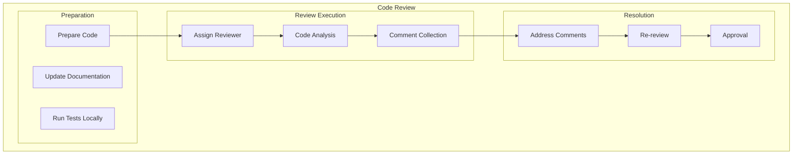
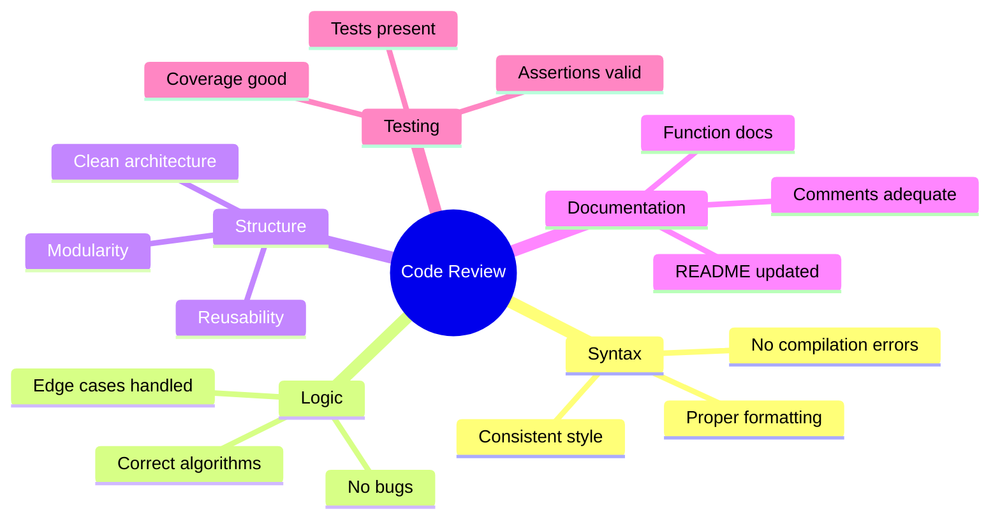
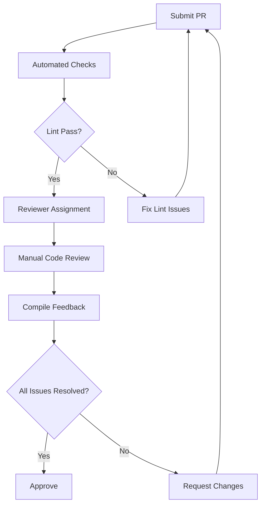
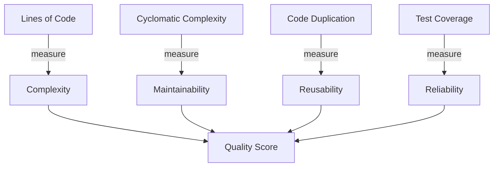
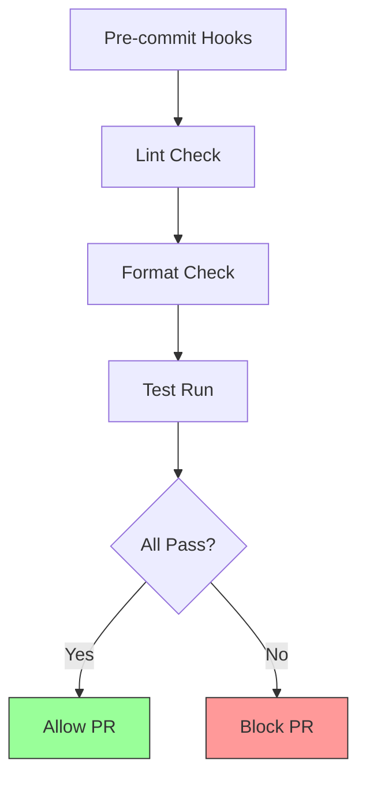
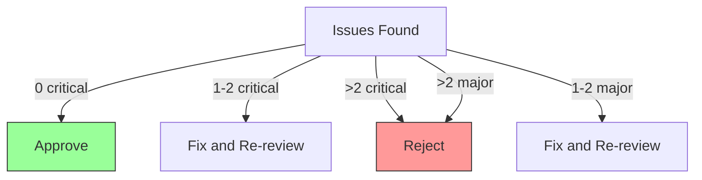

# Code Review

## 1. Purpose

Define code review procedures for the 2048 ML system source code.

## 2. Code Review Framework

## 3. Code Review Checklist

## 4. Review Categories

| Category | Focus | Tools |
|----------|-------|-------|
| Correctness | Logic accuracy | Testing |
| Readability | Code clarity | Linting |
| Maintainability | Future changes | Architecture |
| Performance | Efficiency | Profiling |
| Security | Vulnerabilities | Scanning |

## 5. Code Review Process

## 6. Code Quality Metrics

## 7. Review Automation

## 8. Code Review Tools

| Tool | Purpose | Stage |
|------|---------|-------|
| cargo clippy | Linting | Pre-review |
| cargo fmt | Formatting | Pre-review |
| cargo test | Testing | Pre-review |
| GitHub PR | Collaboration | Review |
| Coverage | Metrics | Post-review |

## 9. Code Review Decision Matrix

## 10. Review Outcomes

All code reviews result in one of:
1. **Approved** — Merge immediately
2. **Approved with suggestions** — Merge after minor changes
3. **Changes required** — Address all feedback before re-review
4. **Rejected** — Significant rework needed
