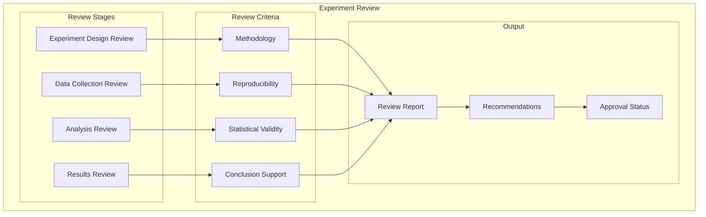
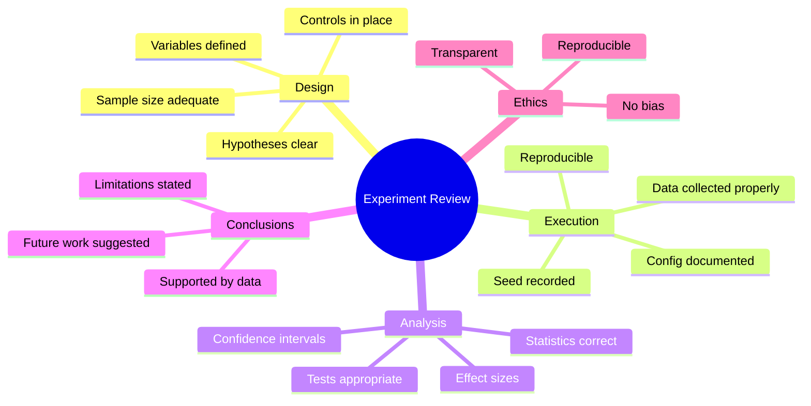
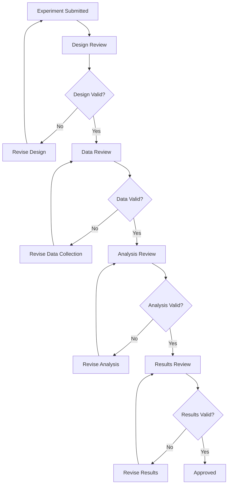
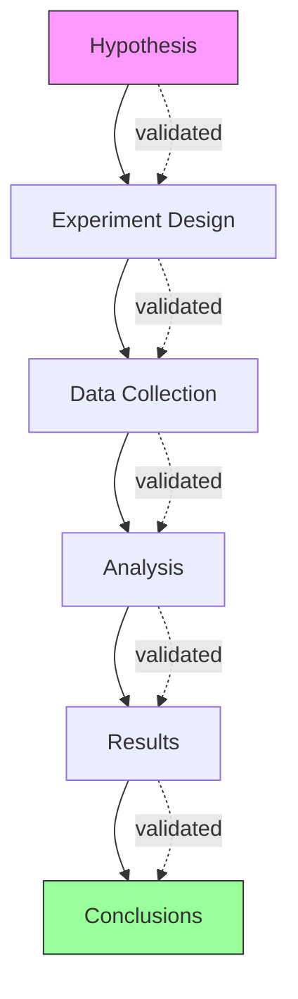
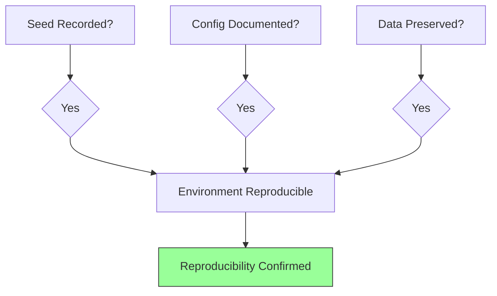
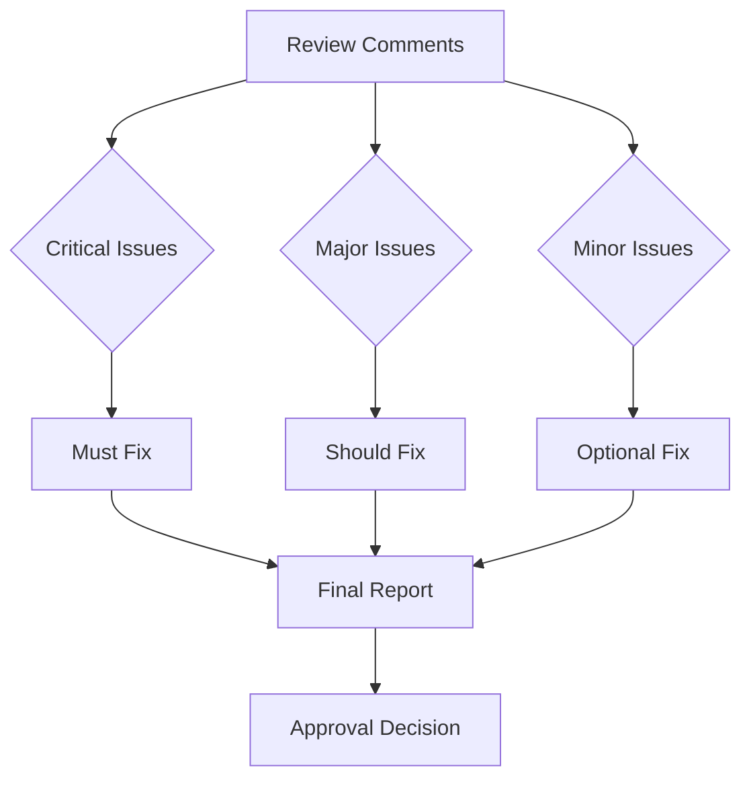
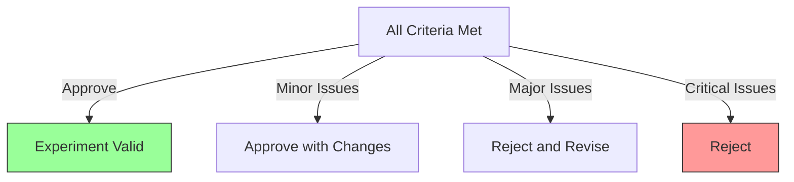

# Experiment Review

## 1. Purpose

Define experiment review procedures for validating the 2048 ML research experiments.

## 2. Experiment Review Framework

## 3. Experiment Review Checklist

## 4. Review Process

## 5. Experiment Quality Metrics

| Metric | Threshold | Assessment |
|--------|-----------|------------|
| Reproducibility | Seed verified | ✓ / ✗ |
| Statistical significance | p < 0.05 | ✓ / ✗ |
| Effect size | d ≥ 0.5 | ✓ / ✗ |
| Sample adequacy | N ≥ 1000 | ✓ / ✗ |
| Confounds | No uncontrolled variables | ✓ / ✗ |

## 6. Experiment Validation Map

## 7. Review Criteria

### 7.1 Methodology Review

- Are hypotheses clearly stated?
- Are variables properly defined?
- Are controls appropriate?
- Is the experimental design sound?

### 7.2 Reproducibility Review

### 7.3 Statistical Review

- Are appropriate tests used?
- Are assumptions verified?
- Are confidence intervals reported?
- Is effect size meaningful?

### 7.4 Conclusion Review

- Are conclusions supported by data?
- Are limitations acknowledged?
- Are future directions suggested?
- Are implications discussed?

## 8. Review Output

## 9. Review Decision

## 10. Review Documentation

All experiment reviews are documented with:
- Reviewer comments
- Quality metrics
- Approval status
- Recommendations
- Revision history
