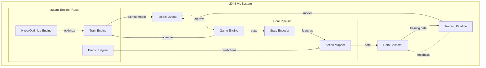

# Plan 01 — Rust-Native AutoML Framework: the repository status is explicit and evidence based

> **Status: PARTIAL.** Capability gate and verified model limits recorded; corpus, standard-dataset evaluation, and full results remain pending.

**Goal:** State the current implementation and evidence boundary for rust-native automl framework.
**Builds on:** [00](../../00-scope-and-traceability.md) — the project is supervised 4×4 2048 policy learning, and framework evaluation is a separate research track.

---

## Decision and evidence

**This plan treats its subject as partial or pending work, not as a research finding.** The rejected alternative is to infer completion from a plan title or related code alone. The ledger records this disposition: Capability gate and verified model limits recorded; corpus, standard-dataset evaluation, and full results remain pending.

> **Project:** 2048 Machine Learning System
> **Version:** 1.0.0
> **Author:** Evintkoo
> **Created:** 2026-09-22
> **Status:** In progress — initial AutoML capability gate passed for the revised five-model four-class candidate set; full research training/evaluation remains to be executed (2026-09-24).

---

## 1. Purpose

This project implements and evaluates the independently developed Evintkoo/automl framework as a Rust-native AutoML architecture. The `2048-ml` repository provides the main integration and case-study environment: a stochastic 4×4 game in which the framework trains supervised action policies.

The 2048 environment, data-generation pipeline, feature extraction, and evaluation tools are experimental infrastructure. Model training, preprocessing, model comparison, and hyperparameter optimization must be performed through the AutoML framework.

## 2. Goals

1. **Primary framework contribution:** Design, implement, and validate the Rust-native AutoML architecture.
2. **Framework evaluation:** Measure correctness, reproducibility, accuracy, efficiency, and search behavior against established baselines.
3. **2048 case study:** Demonstrate the framework in an end-to-end supervised stochastic policy-learning system.

## 3. Scope

### In Scope
- AutoML framework architecture, implementation, and capability validation on standard tabular tasks
- 2048 game environment creation and simulation
- State representation and feature engineering
- Action space definition and encoding
- Model training using automl engine
- Data collection and management
- Benchmarking and evaluation
- Research report using IMRD standard

### Out of Scope
- Using automl via frontend to run training (CLI/API only)
- Claiming the globally highest or mathematically optimal 2048 score
- Game UI development (headless simulation only)
- Model deployment as a web service
- Mobile or desktop application wrappers

## 4. Architecture Overview

## 5. Technology Stack

| Component | Technology |
|-----------|-----------|
| AutoML Framework | automl v1.0.0 (Rust) |
| Language | Rust (primary), Python (scripts) |
| Game Engine | Custom Rust implementation |
| Data Format | CSV/Parquet (via polars) |
| Training | automl TrainEngine |
| Optimization | HyperOptX (TPE, Bayesian, Grid) |
| Evaluation | Custom benchmarking suite |

## 6. Dependencies

- **automl submodule:** `https://github.com/Evintkoo/automl` pinned at `64f5edad29c9e58ee7d33abf380418d5cfbbb561` (v1.0.0-138-g64f5eda) — verify with `git submodule status automl`
  - Path: `automl/`
  - Provides: TrainEngine, TrainingConfig, ModelType, HyperOptX, InferenceEngine

### 6.1 Automl Capability Verification (MANDATORY BEFORE TRAINING)

Because this project's goal #2 is to benchmark automl's capability, and the project depends on automl as a submodule, a **capability verification gate** is required before any training begins. This resolves the circular dependency:

**Verification Checklist** (must all pass before training):

1. **API completeness**: Verify `TrainEngine`, `HyperOptX`, `ModelType` enum, and `CrossValidator` exist and are functional in the automl submodule
2. **Model coverage**: Confirm at least 4 of the planned candidate algorithms (RandomForest, GradientBoosting, XGBoost, LightGBM) are available via `ModelType`
3. **MultiClassification task**: Verify `TaskType::MultiClassification` is supported with proper loss functions
4. **Hyperparameter optimization**: Confirm `HyperOptX` with TPE sampler and `MedianPruner` are functional
5. **Cross-validation**: Verify `GroupKFold` (group-preserving, **not** temporal) or equivalent exists; for true temporal forward-chaining use `TimeSeriesSplit` — `GroupKFold` keeps each `game_id` together but does not enforce temporal order (sort chronologically, `shuffle=false`)

**If verification fails:**
- Document which automl capabilities are missing in `plans/01-Infrastructure/01-Project/01-project-overview.md`
- If a required core capability is missing, stop the training milestone, record the missing capability, and revise the experiment scope. Do **not** add a local `smartcore`/`linfa` fallback: the core constraint is automl-only training.
- The project's goal #2 then evaluates **what automl CAN do**, not what it should have done

### 6.2 Verification Record (2026-09-24)

The pinned submodule is present at `64f5edad29c9e58ee7d33abf380418d5cfbbb561`, matching the declared pin. Source inspection confirms `TrainEngine`, `HyperOptX`, `ModelType`, `TaskType::MultiClassification`, `CVStrategy::GroupKFold`, `CVStrategy::TimeSeriesSplit`, and `MedianPruner::new(minimize: bool)` exist. The focused config and cross-validation test modules pass (2 config tests and 5 CV tests).

The initial capability gate passed for the revised candidate set:

- `RandomForest`, `ExtraTrees`, `AdaBoost`, `KNN`, and `NaiveBayes` fit the four-action task and return four probability columns on the smoke dataset. `DecisionTree`, `LogisticRegression`, `SGD`, `SVM`, `GradientBoosting`, `XGBoost`, `LightGBM`, and `CatBoost` return two and are excluded from the 2048 candidate set until corrected and revalidated.
- `CrossValidator::split` supports group arrays, but `cross_val_score` always calls it with `groups=None`; therefore grouped CV cannot currently be used through that helper. `GroupKFold` sorts group IDs and assigns groups round-robin, so it preserves group separation but does not implement the plan's chronological `shuffle=false` behavior.
- `TrainEngine::fit` uses an internal train/validation split; it does not invoke `CrossValidator` or use `cv_folds`. The planned grouped validation must be performed explicitly through compatible APIs or implemented in the integration.
- The full pinned AutoML library suite passes: 709 passed, 0 failed. The AutoML CLI help smoke completed successfully.

Case-study training may use only the five verified multiclass variants above, after the dataset labeling, chronological split, and resource protocols are applied. This gate establishes API capability, not model quality or a winner.

### 6.3 Feature Protocol Decisions (2026-09-24)

The first feature encoder and randomized range checks exposed two underspecified formulas. The root implementation uses `max_tile_log = log2(max_tile)/15` for nonzero tiles (zero maps to zero), matching the documented `[0,1]` range through the planned 32768 canonical tile. It normalizes `adjacency_merge_score` as `sum_adjacent_equal_tile_values / (16 * 32768)`, because the listed `/16` alone can exceed 1. The `monotonicity` feature is currently a deterministic fraction of adjacent horizontal/vertical comparisons that are equal or contain an empty cell. This is a provisional operational definition; record it in feature plans and freeze before any training run. `score_normalized` is permitted above 1 when score exceeds one million, per the data schema.

### 6.4 Rollout Labeling Budget (2026-09-24)

A smoke collection with 2 games, 100 rollouts per valid action, and 2 fixed Rayon threads produced 213 rows in 37.24 seconds (5.72 rows/second). The observed mean was 106.5 rows/game. Linear estimates are about 52 hours for 10,000 games and 103 hours for 20,000 games at the same throughput and thread count. These are planning estimates from a small sample, not performance results; actual time depends on trajectory length, hardware, and parallel scaling. Use a pilot and record resource use before a multi-day canonical corpus run.

### 6.5 Baseline and Evaluation Tooling (2026-09-24)

The root crate now exposes seeded `benchmark baseline --agent random|heuristic`, `benchmark run`, `benchmark report`, and `benchmark compare` workflows. Game-level CSV outputs have JSON manifests. Reports include distribution summaries, tail thresholds, and bootstrap mean intervals. Comparisons check seed sequences, pair matching seeds with an exact sign test, use Mann-Whitney U for unmatched samples, apply Holm correction across pairwise tests, and report bootstrap mean-difference intervals and Cohen's d. The paired sign test is conservative, ignores ties, and is not Wilcoxon; the method is named in outputs.

A 20-game seed-987 wiring sample yielded random mean 1,046.6 and heuristic mean 7,800.6. This is an implementation smoke measurement, far below the pre-registered 10,000-game protocol, and is not used as a baseline claim or populated in the results matrix.

The framework contribution itself remains partially evaluated: the current repository has capability and API smoke evidence, but no standard-dataset results, matched external-framework comparisons, resource measurements, or independent replication. Do not treat the completed capability gate as completion of the framework contribution.

**This verification is not optional.** Without it, the project cannot distinguish between "automl is incapable" and "our integration is broken."

## 7. Key Constraints

1. Must use **only** the automl module for ML training (no external ML libraries)
2. Must not use automl via frontend (CLI/API only)
3. All training must be reproducible (seed-based)
4. System must collect data for research validation

## 8. Success Criteria

### Tier 1: Minimum Viable Milestone
- AutoML capability and correctness gate completed
- Framework benchmark protocol documented
- Determine each model's score ceiling through systematic evaluation (10,000+ games)
- Establish baseline scores for the verified four-class candidates: Random Forest, ExtraTrees, AdaBoost, KNN, and NaiveBayes
- Full data pipeline from game simulation to trained model works end-to-end
- Models are ranked by mean score

### Tier 2: Intermediate Milestone
- Framework architecture, data contracts, and design trade-offs documented
- Framework benchmarks completed on standard tabular datasets
- Rank all models by mean score across benchmark games
- Training pipeline is fully automated and reproducible
- Score-based comparison demonstrates clear differences between algorithms
- Case-study winner identified from held-out mean score with uncertainty and practical-effect reporting

### Tier 3: Advanced Milestone
- Framework results validated on standard tabular datasets
- Framework performance and reproducibility compared with established implementations
- The top-ranked model achieves mean score significantly exceeding heuristic baseline (~512)
- Benchmark results demonstrate automl capability on sequential decision-making
- Statistical tests confirm score superiority over all baselines

### Tier 4: Stretch Goal
- The framework and 2048 pipeline are independently reproduced or validated by a second implementation
- Framework architecture demonstrates a measurable advantage or clearly characterized trade-off over established alternatives
- Statistical evidence shows one algorithm significantly outperforms all others
- Results are publishable as research findings

### 2048 Case-Study Winner Determination
- **Case-study winner** = model with the highest held-out mean score under the declared evaluation protocol
- Ranking is based on mean score (primary), with median score and score consistency as tiebreakers
- The primary baseline comparison must use the pre-registered Mann-Whitney U test with Holm correction
- Bootstrap 95% CIs and effect sizes must be reported for practical interpretation
- Benchmark results demonstrate meaningful automl capability on sequential games
- Comprehensive IMRD research report published with validated findings

### Theoretical Limit Definition
The theoretical maximum score for 2048 is not used as an optimization target. **Models are ranked by mean game score under the predefined evaluation protocol, not by proximity to a theoretical limit.** The heuristic agent (~512 mean score) serves as a practical baseline reference.

### Non-Negotiable Criteria (All Tiers)
- Models are ranked by held-out game score with uncertainty and practical-effect reporting
- The case-study winner is the model with the highest held-out mean score; this does not define framework success
- Statistical comparison completed using the pre-registered Mann-Whitney U/Holm protocol
- Bootstrap 95% CI and effect size reported; neither is an automatic exclusion gate
- Best model identified and documented with strong statistical evidence
- Research findings contribute to understanding of automl on sequential decision-making

---

## Verification (definition of done)

1. `test -f plans/01-Infrastructure/01-Project/01-project-overview.md` exits 0.
2. `grep -q '^# Plan 01 — ' plans/01-Infrastructure/01-Project/01-project-overview.md` exits 0.
3. `grep -q '^> \\*\\*Status:' plans/01-Infrastructure/01-Project/01-project-overview.md` exits 0.
4. `grep -q '^\*\*Goal:' plans/01-Infrastructure/01-Project/01-project-overview.md` exits 0.
5. `grep -q '^## Decision and evidence$' plans/01-Infrastructure/01-Project/01-project-overview.md` exits 0.
6. `grep -q '^## Open questions$' plans/01-Infrastructure/01-Project/01-project-overview.md` exits 0.
7. `grep -q '^## Later$' plans/01-Infrastructure/01-Project/01-project-overview.md` exits 0.
8. `bash /Users/evintleovonzko/Documents/works/kolosal/planout2/v2-ai-express/.claude/skills/writing-planout-plans/check-plan.sh plans/01-Infrastructure/01-Project/01-project-overview.md` exits 0.

## Open questions

- **The plan-scale evidence remains bounded by current results.** Capability gate and verified model limits recorded; corpus, standard-dataset evaluation, and full results remain pending. Any larger corpus or external benchmark needs a declared resource budget and retained artifacts.

## Later

- **Complete the remaining research or implementation work recorded above.** It stays deferred until its prerequisites, compute budget, and measurable acceptance evidence are available.
