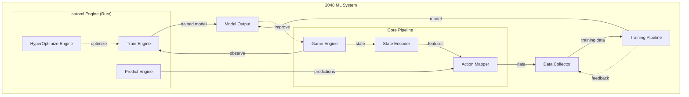

# 2048 ML System — Project Overview

> **Project:** 2048 Machine Learning System
> **Version:** 1.0.0
> **Author:** Evintkoo
> **Created:** 2026-09-22
> **Status:** Planning

---

## 1. Purpose

This project builds a machine learning system that uses the Evintkoo/automl framework (Rust-based AutoML) to maximize game score in the 2048 game. The winner is the model that achieves the highest mean score across 10,000+ games. Models are ranked by mean score, with the top performer being the winner.

## 2. Goals

1. **Primary:** Maximize mean game score across all candidate algorithms
2. **Evaluation:** Benchmark automl capability and rank models by score
3. **Research:** Identify which algorithm achieves the highest mean score

## 3. Scope

### In Scope
- 2048 game environment creation and simulation
- State representation and feature engineering
- Action space definition and encoding
- Model training using automl engine
- Data collection and management
- Benchmarking and evaluation
- Research report using IMRD standard

### Out of Scope
- Using automl via frontend to run training (CLI/API only)
- Game UI development (headless simulation only)
- Model deployment as a web service
- Mobile or desktop application wrappers

## 4. Architecture Overview

## 5. Technology Stack

| Component | Technology |
|-----------|-----------|
| AutoML Framework | automl v1.0.0 (Rust) |
| Language | Rust (primary), Python (scripts) |
| Game Engine | Custom Rust implementation |
| Data Format | CSV/Parquet (via polars) |
| Training | automl TrainEngine |
| Optimization | HyperOptX (TPE, Bayesian, Grid) |
| Evaluation | Custom benchmarking suite |

## 6. Dependencies

- **automl submodule:** `https://github.com/Evintkoo/automl`
  - Path: `automl/`
  - Provides: TrainEngine, TrainingConfig, ModelType, HyperOptX, InferenceEngine

### 6.1 Automl Capability Verification (MANDATORY BEFORE TRAINING)

Because this project's goal #2 is to benchmark automl's capability, and the project depends on automl as a submodule, a **capability verification gate** is required before any training begins. This resolves the circular dependency:

**Verification Checklist** (must all pass before training):

1. **API completeness**: Verify `TrainEngine`, `HyperOptX`, `ModelType` enum, and `CrossValidator` exist and are functional in the automl submodule
2. **Model coverage**: Confirm at least 4 of the planned candidate algorithms (RandomForest, GradientBoosting, XGBoost, LightGBM) are available via `ModelType`
3. **MultiClassification task**: Verify `TaskType::MultiClassification` is supported with proper loss functions
4. **Hyperparameter optimization**: Confirm `HyperOptX` with TPE sampler and `MedianPruner` are functional
5. **Cross-validation**: Verify `GroupKFold` (group-preserving, **not** temporal) or equivalent exists; for true temporal forward-chaining use `TimeSeriesSplit` — `GroupKFold` keeps each `game_id` together but does not enforce temporal order (sort chronologically, `shuffle=false`)

**If verification fails:**
- Document which automl capabilities are missing in `plans/01-Infrastructure/01-Project/01-project-overview.md`
- If core training capability is missing (no supervised classification models), implement a local training fallback using `smartcore`/`linfa` directly (bypassing automl's abstraction)
- The project's goal #2 then evaluates **what automl CAN do**, not what it should have done

**This verification is not optional.** Without it, the project cannot distinguish between "automl is incapable" and "our integration is broken."

## 7. Key Constraints

1. Must use **only** the automl module for ML training (no external ML libraries)
2. Must not use automl via frontend (CLI/API only)
3. All training must be reproducible (seed-based)
4. System must collect data for research validation

## 8. Success Criteria

### Tier 1: Minimum Viable Milestone
- Determine each model's score ceiling through systematic evaluation (10,000+ games)
- Establish baseline scores for Random Forest, Gradient Boosting, XGBoost, and other candidates
- Full data pipeline from game simulation to trained model works end-to-end
- Models are ranked by mean score

### Tier 2: Intermediate Milestone
- Rank all models by mean score across benchmark games
- Training pipeline is fully automated and reproducible
- Score-based comparison demonstrates clear differences between algorithms
- Winner identified as the model with the highest mean score

### Tier 3: Advanced Milestone
- The top-ranked model achieves mean score significantly exceeding heuristic baseline (~512)
- Benchmark results demonstrate automl capability on sequential decision-making
- Statistical tests confirm score superiority over all baselines

### Tier 4: Stretch Goal
- The best model achieves the highest possible mean score across all candidates
- Statistical evidence shows one algorithm significantly outperforms all others
- Results are publishable as research findings

### Winner Determination
- **Winner** = model with the highest mean score across ≥10,000 benchmark games
- Ranking is based on mean score (primary), with median score and score consistency as tiebreakers
- All results must be statistically significant (Mann-Whitney U, p < 0.05 after Bonferroni correction)
- Bootstrap 95% CI on mean difference must not include zero
- Comprehensive IMRD research report published
- Benchmark results demonstrate meaningful automl capability on sequential games
- Comprehensive IMRD research report published with validated findings

### Theoretical Limit Definition
The theoretical maximum score for 2048 is an unsolved problem in combinatorial game theory. The maximum tile value on a 4×4 board is bounded at 32768 (2^15), but the exact maximum achievable score through optimal play is unknown. **Models are ranked by mean game score, not by proximity to a theoretical limit.** The heuristic agent (~512 mean score) serves as a practical baseline reference.

### Non-Negotiable Criteria (All Tiers)
- Models are ranked by mean game score across ≥10,000 benchmark games
- The winner is the model with the highest mean score
- Statistical significance confirmed (Mann-Whitney U, p < 0.05 after Bonferroni correction)
- Bootstrap 95% CI on mean difference does not include zero
- Cohen's d ≥ 0.5 (medium effect size)
- Best model identified and documented with strong statistical evidence
- Research findings contribute to understanding of automl on sequential decision-making
