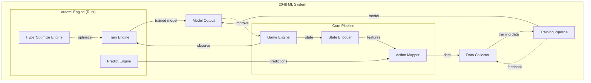

# Rust-Native AutoML Framework — 2048 ML Implementation Project

> **Project:** 2048 Machine Learning System
> **Version:** 1.0.0
> **Author:** Evintkoo
> **Created:** 2026-09-22
> **Status:** Planning

---

## 1. Purpose

This project implements and evaluates the independently developed Evintkoo/automl framework as a Rust-native AutoML architecture. The `2048-ml` repository provides the main integration and case-study environment: a stochastic 4×4 game in which the framework trains supervised action policies.

The 2048 environment, data-generation pipeline, feature extraction, and evaluation tools are experimental infrastructure. Model training, preprocessing, model comparison, and hyperparameter optimization must be performed through the AutoML framework.

## 2. Goals

1. **Primary framework contribution:** Design, implement, and validate the Rust-native AutoML architecture.
2. **Framework evaluation:** Measure correctness, reproducibility, accuracy, efficiency, and search behavior against established baselines.
3. **2048 case study:** Demonstrate the framework in an end-to-end supervised stochastic policy-learning system.

## 3. Scope

### In Scope
- AutoML framework architecture, implementation, and capability validation on standard tabular tasks
- 2048 game environment creation and simulation
- State representation and feature engineering
- Action space definition and encoding
- Model training using automl engine
- Data collection and management
- Benchmarking and evaluation
- Research report using IMRD standard

### Out of Scope
- Using automl via frontend to run training (CLI/API only)
- Claiming the globally highest or mathematically optimal 2048 score
- Game UI development (headless simulation only)
- Model deployment as a web service
- Mobile or desktop application wrappers

## 4. Architecture Overview

## 5. Technology Stack

| Component | Technology |
|-----------|-----------|
| AutoML Framework | automl v1.0.0 (Rust) |
| Language | Rust (primary), Python (scripts) |
| Game Engine | Custom Rust implementation |
| Data Format | CSV/Parquet (via polars) |
| Training | automl TrainEngine |
| Optimization | HyperOptX (TPE, Bayesian, Grid) |
| Evaluation | Custom benchmarking suite |

## 6. Dependencies

- **automl submodule:** `https://github.com/Evintkoo/automl` pinned at `64f5edad29c9e58ee7d33abf380418d5cfbbb561` (v1.0.0-138-g64f5eda) — verify with `git submodule status automl`
  - Path: `automl/`
  - Provides: TrainEngine, TrainingConfig, ModelType, HyperOptX, InferenceEngine

### 6.1 Automl Capability Verification (MANDATORY BEFORE TRAINING)

Because this project's goal #2 is to benchmark automl's capability, and the project depends on automl as a submodule, a **capability verification gate** is required before any training begins. This resolves the circular dependency:

**Verification Checklist** (must all pass before training):

1. **API completeness**: Verify `TrainEngine`, `HyperOptX`, `ModelType` enum, and `CrossValidator` exist and are functional in the automl submodule
2. **Model coverage**: Confirm at least 4 of the planned candidate algorithms (RandomForest, GradientBoosting, XGBoost, LightGBM) are available via `ModelType`
3. **MultiClassification task**: Verify `TaskType::MultiClassification` is supported with proper loss functions
4. **Hyperparameter optimization**: Confirm `HyperOptX` with TPE sampler and `MedianPruner` are functional
5. **Cross-validation**: Verify `GroupKFold` (group-preserving, **not** temporal) or equivalent exists; for true temporal forward-chaining use `TimeSeriesSplit` — `GroupKFold` keeps each `game_id` together but does not enforce temporal order (sort chronologically, `shuffle=false`)

**If verification fails:**
- Document which automl capabilities are missing in `plans/01-Infrastructure/01-Project/01-project-overview.md`
- If a required core capability is missing, stop the training milestone, record the missing capability, and revise the experiment scope. Do **not** add a local `smartcore`/`linfa` fallback: the core constraint is automl-only training.
- The project's goal #2 then evaluates **what automl CAN do**, not what it should have done

**This verification is not optional.** Without it, the project cannot distinguish between "automl is incapable" and "our integration is broken."

## 7. Key Constraints

1. Must use **only** the automl module for ML training (no external ML libraries)
2. Must not use automl via frontend (CLI/API only)
3. All training must be reproducible (seed-based)
4. System must collect data for research validation

## 8. Success Criteria

### Tier 1: Minimum Viable Milestone
- AutoML capability and correctness gate completed
- Framework benchmark protocol documented
- Determine each model's score ceiling through systematic evaluation (10,000+ games)
- Establish baseline scores for Random Forest, Gradient Boosting, XGBoost, and other candidates
- Full data pipeline from game simulation to trained model works end-to-end
- Models are ranked by mean score

### Tier 2: Intermediate Milestone
- Framework architecture, data contracts, and design trade-offs documented
- Framework benchmarks completed on standard tabular datasets
- Rank all models by mean score across benchmark games
- Training pipeline is fully automated and reproducible
- Score-based comparison demonstrates clear differences between algorithms
- Case-study winner identified from held-out mean score with uncertainty and practical-effect reporting

### Tier 3: Advanced Milestone
- Framework results validated on standard tabular datasets
- Framework performance and reproducibility compared with established implementations
- The top-ranked model achieves mean score significantly exceeding heuristic baseline (~512)
- Benchmark results demonstrate automl capability on sequential decision-making
- Statistical tests confirm score superiority over all baselines

### Tier 4: Stretch Goal
- The framework and 2048 pipeline are independently reproduced or validated by a second implementation
- Framework architecture demonstrates a measurable advantage or clearly characterized trade-off over established alternatives
- Statistical evidence shows one algorithm significantly outperforms all others
- Results are publishable as research findings

### 2048 Case-Study Winner Determination
- **Case-study winner** = model with the highest held-out mean score under the declared evaluation protocol
- Ranking is based on mean score (primary), with median score and score consistency as tiebreakers
- The primary baseline comparison must use the pre-registered Mann-Whitney U test with Holm correction
- Bootstrap 95% CIs and effect sizes must be reported for practical interpretation
- Benchmark results demonstrate meaningful automl capability on sequential games
- Comprehensive IMRD research report published with validated findings

### Theoretical Limit Definition
The theoretical maximum score for 2048 is not used as an optimization target. **Models are ranked by mean game score under the predefined evaluation protocol, not by proximity to a theoretical limit.** The heuristic agent (~512 mean score) serves as a practical baseline reference.

### Non-Negotiable Criteria (All Tiers)
- Models are ranked by held-out game score with uncertainty and practical-effect reporting
- The case-study winner is the model with the highest held-out mean score; this does not define framework success
- Statistical comparison completed using the pre-registered Mann-Whitney U/Holm protocol
- Bootstrap 95% CI and effect size reported; neither is an automatic exclusion gate
- Best model identified and documented with strong statistical evidence
- Research findings contribute to understanding of automl on sequential decision-making
