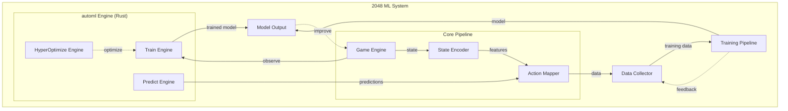

# Plan 01 — Rust-Native AutoML Framework: the repository status is explicit and evidence based

> **Status: PARTIAL (2026-09-27).** Capability checks, standard-dataset diagnostics, a 125-game throughput
> sample, and five-candidate classifier diagnostics on chronological holdouts of 391, 541, 903, and 1,137
> rows, including five fit seeds on the same 541-row holdout and five fit seeds per candidate on each of
> two 50-game corpora, are recorded. A corrected matched-grid diagnostic
> is recorded across three split seeds; its first version was withdrawn after a validation-leak audit.
> Broader matched framework evaluation,
> scale collection, and confirmatory policy results remain pending.

**Goal:** State the current implementation and evidence boundary for rust-native automl framework.
**Builds on:** [00](../../00-scope-and-traceability.md) — the project is supervised 4×4 2048 policy
learning, and framework evaluation is a separate research track.

---

## Decision and evidence

**This plan treats its subject as partial or pending work, not as a research finding.** Framework checks
cover five AutoML candidates on three standard datasets and four fixed split seeds, with exact repeated
predictions and save/load equality. A fixed-configuration scikit-learn comparison and a two-repeat,
60-process resource matrix cover the same 15 dataset/model cases, but do not compare optimizer search
behavior or isolate model memory. A corrected three-split-seed pilot matches six grid candidates and one
validation fit per candidate for AutoML and scikit-learn RandomForest/ExtraTrees on the same three UCI
datasets. The selected configurations agree in 13/18 case-seed observations; the first implementation
was withdrawn after a validation-leak audit. This matches candidate counts, not optimizer algorithms. The
2048 labeling pilots cover 125 games and support two same-size 50-game corpora with chronological
classifier-label holdouts. Five fit seeds per candidate on both corpora add fixed-corpus classifier-label
sensitivity evidence. Exploratory policy-score comparisons cover one fit on each corpus
on common evaluation seeds. Four of five new-corpus means are higher than the prior-corpus fit, while
AdaBoost is lower; all five new-corpus policy means remain below random. For the classifier diagnostics,
RandomForest and ExtraTrees show small holdout variation across five fit seeds, while AdaBoost, KNN, and
NaiveBayes predictions are invariant across those seeds within each corpus. These are case-study diagnostics,
not framework-superiority findings or confirmatory candidate selection. Scale collection, additional
independent corpora with repeated fits, broader matched-budget framework evaluation, and a predeclared
confirmatory policy evaluation remain pending. Data and analyses are retained in [the 50-game classifier
report](../../../reports/candidate_classifier_pilot/2026-09-27-50-game/README.md), [the 50-game policy
score report](../../../reports/action-frequency/50-game-disjoint-seeds/README.md), [the repeated-fit
report](../../../reports/candidate_classifier_pilot/matched-50-game-corpus-fit-seeds-2026-09-27/README.md), and [the
framework-validation report](../../../reports/framework_validation/README.md).

> **Project:** 2048 Machine Learning System
> **Version:** 1.0.0
> **Author:** Evintkoo
> **Created:** 2026-09-22
> **Status:** In progress — fixed-protocol framework diagnostics cover five candidates, three standard
  datasets, and four split seeds. A 125-game rollout-labeling sample supports three 40/10 chronological
  classifier-label diagnostics, including two same-size independent 50-game corpora. Policies fit on both
  50-game corpora and both baselines have exploratory 10,000-seed score distributions on shared seeds;
  corpus fits have paired common-seed comparisons. A six-candidate matched-grid pilot covers two tree models on three
  standard datasets. Optimizer-algorithm comparisons, scale collection, repeated fits across independent
  corpora, and confirmatory 2048 evaluation remain incomplete (updated 2026-09-27).

---

## 1. Purpose

This project implements and evaluates the independently developed Evintkoo/automl framework as a
Rust-native AutoML architecture. The `2048-ml` repository provides the main integration and case-study
environment: a stochastic 4×4 game in which the framework trains supervised action policies.

The 2048 environment, data-generation pipeline, feature extraction, and evaluation tools are experimental
infrastructure. Model training, preprocessing, model comparison, and hyperparameter optimization must be
performed through the AutoML framework.

## 2. Goals

1. **Primary framework contribution:** Design, implement, and validate the Rust-native AutoML
  architecture.
2. **Framework evaluation:** Measure correctness, reproducibility, accuracy, efficiency, and search
  behavior against established baselines.
3. **2048 case study:** Demonstrate the framework in an end-to-end supervised stochastic policy-learning
  system.

## 3. Scope

### In Scope
- AutoML framework architecture, implementation, and capability validation on standard tabular tasks
- 2048 game environment creation and simulation
- State representation and feature engineering
- Action space definition and encoding
- Model training using automl engine
- Data collection and management
- Benchmarking and evaluation
- Research report using IMRD standard

### Out of Scope
- Using automl via frontend to run training (CLI/API only)
- Claiming the globally highest or mathematically optimal 2048 score
- Game UI development (headless simulation only)
- Model deployment as a web service
- Mobile or desktop application wrappers

## 4. Architecture Overview

```mermaid
flowchart TD
    subgraph "2048 ML System"
        subgraph Core Pipeline
            GE[Game Engine] -->|state| SE[State Encoder]
            SE -->|features| AM[Action Mapper]
        end
        
        AM -->|data| DC[Data Collector]
        DC -->|training data| TP[Training Pipeline]
        TP -->|model| MO[Model Output]
        
        subgraph "automl Engine (Rust)"
            TE[Train Engine]
            PE[Predict Engine]
            HE[HyperOptimize Engine]
        end
    end
    
    TP -.->|feedback| DC
    TE -->|trained model| MO
    PE -->|predictions| AM
    HE -.->|optimize| TE
    
    GE -->|observe| TE
    MO -.->|improve| GE
```

## 5. Technology Stack

| Component | Technology |
|-----------|-----------|
| AutoML Framework | automl v1.0.0 (Rust) |
| Language | Rust (primary); external comparison scripts may use Python if adopted |
| Game Engine | Custom Rust implementation |
| Data Format | CSV training data and JSON manifests (Polars CSV loading) |
| Training | automl TrainEngine |
| Optimization | HyperOptX; the root CLI currently tunes RandomForest/ExtraTrees `n_estimators` and `max_depth` against grouped-CV accuracy |
| Evaluation | Custom benchmarking suite |

## 6. Dependencies

- **automl submodule:** `https://github.com/Evintkoo/automl` pinned at
  `82d848323eed5e2af86d046d529916c448f2442c` (`v1.0.0-140-g82d8483`, published on
  `fix/deterministic-tie-breaking`) — verify with `git submodule status automl`
  - Path: `automl/`
  - Provides: TrainEngine, TrainingConfig, ModelType, HyperOptX, InferenceEngine

### 6.1 Automl Capability Verification (MANDATORY BEFORE TRAINING)

Because this project's goal #2 is to benchmark automl's capability, and the project depends on automl as
a submodule, a **capability verification gate** is required before any training begins. This resolves the
circular dependency:

**Verification Checklist** (must all pass before training):

1. **API completeness**: Verify `TrainEngine`, `HyperOptX`, `ModelType` enum, and `CrossValidator` exist
  and are functional in the automl submodule
2. **Model coverage**: Confirm at least four candidate algorithms selected for the study are exposed
  by `ModelType` and return the expected four probability columns for the action task. The revised,
  verified candidate set is recorded in §6.2; the original GradientBoosting/XGBoost/LightGBM proposal
  is not the active candidate list because those variants failed the four-class probability check.
3. **MultiClassification task**: Verify `TaskType::MultiClassification` is supported with proper loss
  functions
4. **Hyperparameter optimization**: Confirm `HyperOptX` with TPE sampler and `MedianPruner` are
  functional
5. **Cross-validation**: Verify a group-preserving split is available for keeping each `game_id`
  together. Treat temporal ordering as a separate requirement: the pinned `GroupKFold` preserves group
  membership but does not provide chronological forward chaining; use an explicitly ordered procedure
  when that property is needed.

**If verification fails:**
- Document which automl capabilities are missing in
  `plans/01-Infrastructure/01-Project/01-project-overview.md`
- If a required core capability is missing, stop the training milestone, record the missing capability,
  and revise the experiment scope. Do **not** add a local `smartcore`/`linfa` fallback: the core
  constraint is automl-only training.
- The project's goal #2 then evaluates **what automl CAN do**, not what it should have done

### 6.2 Verification Record (updated 2026-09-27)

The pinned submodule is present at `82d848323eed5e2af86d046d529916c448f2442c`, containing deterministic
training/serialization fixes and deterministic tie handling for KNN and ExtraTrees. Source inspection
confirms `TrainEngine`, `HyperOptX`, `ModelType`, `TaskType::MultiClassification`,
`CVStrategy::GroupKFold`, `CVStrategy::TimeSeriesSplit`, and `MedianPruner::new(minimize: bool)` exist.
The full AutoML library suite passes 712/712 on this revision.

The initial capability gate passed for the revised candidate set:

- `RandomForest`, `ExtraTrees`, `AdaBoost`, `KNN`, and `NaiveBayes` fit the four-action task and return
  four probability columns on the smoke dataset. `DecisionTree`, `LogisticRegression`, `SGD`, `SVM`,
  `GradientBoosting`, `XGBoost`, `LightGBM`, and `CatBoost` return two and are excluded from the 2048
  candidate set until corrected and revalidated.
- `CrossValidator::split` supports group arrays, but `cross_val_score` always calls it with
  `groups=None`; therefore grouped CV cannot currently be used through that helper. `GroupKFold` sorts
  group IDs and assigns groups round-robin, so it preserves group separation but does not implement the
  plan's chronological `shuffle=false` behavior.
- `TrainEngine::fit` uses an internal train/validation split; it does not invoke `CrossValidator` or use
  `cv_folds`. The planned grouped validation must be performed explicitly through compatible APIs or
  implemented in the integration.
- The pinned AutoML library suite currently passes 712/712 tests. The AutoML CLI help smoke completed
  successfully. The earlier 709-test count is superseded by the current suite result.

Case-study training may use only the five verified multiclass variants above, after the dataset labeling,
chronological split, and resource protocols are applied. This gate establishes API capability, not model
quality or a winner.

### 6.3 Feature Protocol Decisions (2026-09-24)

The first feature encoder and randomized range checks exposed two underspecified formulas. The root
implementation uses `max_tile_log = log2(max_tile)/15` for nonzero tiles (zero maps to zero), matching
the documented `[0,1]` range through the planned 32768 canonical tile. It normalizes
`adjacency_merge_score` as `sum_adjacent_equal_tile_values / (16 * 32768)`, because the listed `/16`
alone can exceed 1. The `monotonicity` feature is currently a deterministic fraction of adjacent
horizontal/vertical comparisons that are equal or contain an empty cell. This is a provisional
operational definition; record it in feature plans and freeze before any training run. `score_normalized`
is permitted above 1 when score exceeds one million, per the data schema.

### 6.4 Rollout Labeling Budget (updated 2026-09-27)

The first two-game throughput smoke produced 285 rows and 97,300 rollout evaluations in 82.23 seconds;
its 228-hour estimate for 20,000 games was based on only two games. A subsequent 20-game pilot, retained
under `reports/collection_pilots/2026-09-27-20-game/`, used global seed 90627, 100 rollouts per valid
action, two threads, and per-game checkpoints. It produced 2,447 rows and 857,100 rollout evaluations in
857.36 seconds. Per-game rows ranged from 62 to 207 (mean 122.35, sample SD 40.74); mean elapsed time was
42.87 seconds/game. An independent five-game continuation on seeds 90647–90651 used the same settings
and produced 541 rows and 191,500 rollout evaluations in 182.09 seconds (36.42 seconds/game). Across
both runs, 25 games produced 2,988 rows and 1,048,600 rollout evaluations in 1,039.45 seconds, for a
combined mean of 41.58 seconds/game and a rough linear 20,000-game projection of 230.99 hours. This is
still a single-host, configuration-specific estimate, not a runtime guarantee or compute authorization.
The five-game run does not measure machine-to-machine variance or support a large-corpus quality claim.

A subsequent 50-game follow-up on seeds 90652–90701 used the same labeling settings under a bounded
one-hour wall-time envelope, with a checkpoint after each game. It produced 5,318 rows and 1,877,900
rollout evaluations in 1,799.88 collector seconds (35.997 seconds/game); rows/game ranged from 54 to 197
(mean 106.36, sample SD 33.35). Checkpoint chunks sum to the manifest row count, and both CSV hashes,
row identities, seed range, and manifest/checkpoint counters agree. Across all three contiguous same-host
runs, 75 games produced 8,306 rows and 2,926,500 evaluations in 2,839.33 seconds. A second independent
50-game corpus on seeds 90702–90751 produced 6,188 rows and 2,179,500 evaluations in 1,977.90 seconds.
Across all four contiguous same-host runs, 125 games produced 14,494 rows and 5,106,000 evaluations in
4,817.23 seconds; the rough linear 20,000-game projection is 214.10 hours. This bounded diagnostic is
still not a scale-quality result or authorization for the 20,000-game corpus. Its artifacts are in the
[50-game follow-up report](../../../reports/collection_pilots/2026-09-27-50-game-followup/README.md).
A second-corpus report is in
[the independent 50-game collection](../../../reports/collection_pilots/2026-09-27-50-game-independent/README.md).
A larger corpus still needs its own explicit resource envelope, protocol, and quality evaluation plan.

### 6.5 Baseline and Evaluation Tooling (2026-09-24)

The root crate now exposes seeded `benchmark baseline --agent random|heuristic`, `benchmark run`,
`benchmark report`, and `benchmark compare` workflows. Game-level CSV outputs have JSON manifests.
Reports include distribution summaries, tail thresholds, and bootstrap mean intervals. Comparisons check
seed-set equality, align matching rows by seed, and use an exact sign test, paired-difference bootstrap
intervals, and Cohen's dz for matched scores. Unmatched samples use Mann–Whitney U, independent
bootstrap intervals, and Cohen's d. Holm correction applies across pairwise tests. The paired sign test
is conservative, ignores ties, and is not Wilcoxon; the method is named in outputs.

A 20-game seed-987 wiring sample yielded random mean 1,046.6 and heuristic mean 7,800.6. This is an
implementation smoke measurement, far below the documented 10,000-game protocol, and is not used as a
baseline claim or populated in the results matrix.

The framework contribution remains partially evaluated. The [framework-validation
report](../../../reports/framework_validation/README.md) records fixed-configuration, stratified 80/20
diagnostics across Iris, Wine, and Wisconsin Diagnostic with RandomForest, ExtraTrees, AdaBoost, KNN, and
NaiveBayes. On pinned AutoML commit `82d848323eed5e2af86d046d529916c448f2442c`, seed 42 has two
independent process runs that succeeded for all 15 cases, matched predictions in 15/15, and passed model
save/load equivalence. Seeds 2026, 2027, and 2028 were each repeated in a second independent process
with identical splits, predictions in 15/15 cases, and save/load equality. Seed-2028 artifacts are
retained in the framework-validation report. Two
comparison-only scikit-learn 1.6.1 runs used the seed-42 outer split rows and AutoML's per-class trailing
10% holdback; all 15 cases succeeded and repeated exactly, while predicted labels matched AutoML on 8/15
cases. A one-process resource probe observed AutoML at 1.33 seconds/27,426,816-byte maximum RSS and
sklearn at 1.22 seconds/158,466,048 bytes on the same host. Different implementation defaults and process
startup boundaries make these descriptive only. Matched search-budget/resource profiling, broader
repeated-fit reproducibility, CLI/library equivalence, and independent replication remain open. Neither
diagnostic completes framework validation or clears the main 2048 training milestone. Two sequential
AutoML seed-42 runs with `RAYON_NUM_THREADS=1` now match the single-thread scikit-learn setting and
retain per-case fit/predict timings for the same 15 cases and split. The timing comparison is descriptive;
model-specific implementation defaults differ, optimizer search budgets are not matched, and no speed
claim follows. Per-model memory and broader hardware profiling remain open; details and artifacts are in
the [framework-validation report](../../../reports/framework_validation/README.md).

An isolated per-case process resource matrix now adds two repeats for each of the same 15 cases under
both implementations (60 processes total). Seed-42 split rows match, and all processes succeeded.
Observed process peak RSS ranged from 27,410,432–27,443,200 bytes for AutoML and
154,779,648–157,024,256 bytes for scikit-learn. These include process/runtime startup and dataset handling;
they are not model-only memory estimates or matched-budget comparisons. One-host, two-repeat measurements
remain descriptive. Matched search budgets, model-only resource profiling, and broader hardware runs
remain open; see the [framework report](../../../reports/framework_validation/README.md).

The resource matrix uses one fixed fit per model and dataset, with no optimizer trials in either runner.
Its explicit settings align 32-tree forest counts/depth, 32 AdaBoost stumps and learning rate 1.0, and
the nominal five-neighbor KNN and Gaussian Naive Bayes settings. Implementation behavior still differs:
AutoML KNN projects inputs above 16 features, and tree feature-subset counts use different rounding
rules. The matrix therefore describes process resources under one fixed configuration; it does not
compare search efficiency or model-only allocation. Full details are in the framework-validation report.

The shared-grid pilot addresses candidate-fit count for the two tree models with tuning support.
AutoML and scikit-learn each evaluated the same six `(n_estimators, max_depth)` configurations on the same
inner validation rows for RandomForest and ExtraTrees across Iris, Wine, and Wisconsin Diagnostic at
split seeds 42, 2026, and 2027. Corrected protocol-v2 runs selected the same configuration in 13/18
case-seed observations. The verifier checks the external validation and AutoML native holdback are both
excluded from fitting, along with source-row partitions and recomputed outer-test metrics. The prior
runner leaked external validation rows into fit and its results were withdrawn. This is a matched
fixed-grid budget, not a comparison of HyperOptX with a reference optimizer; three splits do not establish
performance superiority. Corrected artifacts and protocol are in the
[matched-grid report](../../../reports/framework_validation/matched-grid-search-corrected-multi-seed-2026-09-27/README.md).

### 6.6 Main-Study Readiness (updated 2026-09-27)

The root training command requires row-aligned game metadata, excludes the final chronological game
groups from fitting, and runs explicit group-preserving CV on the development groups. On a 20-game pilot,
five probability-compatible candidates used the same final three chronological groups as a 391-row
holdout and the same five-fold grouped CV on the earlier 17 groups. Grouped-CV accuracy ranged from
`0.2513` to `0.2828`; holdout accuracy ranged from `0.2506` to `0.3171`, and macro-F1 from `0.2282`
to `0.2949`. The grouped-CV leader and holdout accuracy leader differ. The report retains each model,
input digests, dependency pin, seed derivations, settings, confusion matrix, row-level predictions,
and verification output. These three held-out games are too few for policy selection or quality claims.
A separate 20-game simulator smoke completed on seeds
91927–91946 (mean score 902.40; bootstrap interval `[712.60, 1095.20]`). These checks exercise
data-to-fit-to-simulator wiring only. The final fit uses AutoML's internal row-level validation on
development rows. The three-game classifier diagnostic is too small to support a policy-quality or
generalization claim, and this is not a completed end-to-end research study.

An independent classifier-label diagnostic then fit each candidate on all 20 games from seeds
90627–90646 and reserved five later games, seeds 90647–90651, as a 541-row holdout. Five-fold GroupKFold
accuracy ranked ExtraTrees first (`0.2948`), while holdout accuracy ranked RandomForest first (`0.2828`);
holdout accuracy ranged from `0.2588` to `0.2828`, and macro-F1 from `0.2035` to `0.2748`. This is one
fit per candidate and five game groups from the same host and labeling protocol. It is classifier-label
evidence only, not a policy score, model-selection result, or confirmatory quality estimate. The joined
data, manifests, models, predictions, and verifier are retained in the
[report](../../../reports/candidate_classifier_independent_holdout/2026-09-27-25-game/README.md).

To measure fit-seed sensitivity, all five candidates were additionally trained with seeds 90627–90631
on that same 20-game corpus and evaluated on the same 541 holdout rows. RandomForest holdout accuracy
was `0.2784 ± 0.0028` and ExtraTrees was `0.2725 ± 0.0059` (mean ± sample SD over five seeds); the other
three candidates returned identical predictions across these five seeds. This describes training-seed
sensitivity on one fixed corpus and one small holdout only. It does not estimate variability across
training corpora or policy game scores, or establish a confirmatory ranking. Per-seed manifests,
predictions, verification, and summary data are retained in the independent holdout report.

A second independent classifier-label diagnostic used the 50-game corpus on seeds 90652–90701, with the
first 40 groups (4,415 rows) for development and the final 10 groups (903 rows) as a chronological holdout.
With one fit per candidate and seed 90652, RandomForest had the highest holdout accuracy (`0.3001`), while
AdaBoost had the highest macro-F1 (`0.2785`). Grouped-CV accuracy and holdout accuracy do not yield one
consistent candidate ordering. Recomputed metrics, row/group identities, and data/model/prediction hashes
pass in `scripts/verify_50_game_classifier_diagnostic.py`; models, manifests, predictions, verification,
protocol, and metric summary are retained in the
[50-game classifier report](../../../reports/candidate_classifier_pilot/2026-09-27-50-game/README.md).
This one-corpus label diagnostic is exploratory; it is not policy-score evidence or a confirmatory ranking.

The five 50-game-trained policies and two baselines were also evaluated on the same 10,000 seeds,
104024–114023. Their observed means were 808.82 (RandomForest), 711.35 (ExtraTrees), 752.29 (AdaBoost),
903.67 (KNN), and 773.10 (NaiveBayes), compared with 1,097.38 for random and 8,047.04 for heuristic.
The paired matrix retains 21 comparisons, 5,000-replicate bootstrap intervals, paired effect sizes, and
Holm adjustment. The five earlier 20-game fits were evaluated on the same seed set; paired old-versus-new
fit comparisons show lower means for four candidates and a higher KNN mean. These two corpus sizes each
have one fit per candidate. The score results are descriptive corpus-fit sensitivity evidence, not a
confirmatory ranking or a general AutoML result. Data, manifests, comparisons, and integrity evidence are
retained in the [50-game score report](../../../reports/action-frequency/50-game-disjoint-seeds/README.md).

A second same-size 50-game corpus was collected on seeds 90702–90751 under the same one-hour envelope,
rollout settings, and host as the previous 50-game sample. Five AutoML candidates were fit at five seeds
each on its first 40 game groups and evaluated as classifiers on the final 10 groups (1,137 rows). The
repeated-fit summary reports mean and sample SD across seeds; RandomForest and ExtraTrees vary modestly,
while AdaBoost, KNN, and NaiveBayes predictions are identical across seeds on this fixed corpus. In the
seed-90702 run used for policy evaluation, RandomForest led holdout accuracy (0.3008) and macro-F1 (0.3007).
Those five seed-90702 policies and random/heuristic baselines were
scored on common seeds 114024–124023. All five policy means were below random; means ranged from 710.54
(AdaBoost) to 918.63 (KNN), versus 1,087.52 for random and 8,030.51 for heuristic. The earlier 50-game-fit
policies were evaluated on the same seeds for paired corpus-fit sensitivity: new minus prior means ranged
from −54.16 (AdaBoost) to +112.83 (ExtraTrees), with one fit per corpus and candidate. These equal-size
policy corpus comparisons still use one fit per corpus and confound corpus with fit-seed effects. Repeated
classifier-label fits do not establish policy-score fit distributions. The results remain exploratory, not
confirmatory policy selection. Data, models, scores, and verification are in the
[independent classifier report](../../../reports/candidate_classifier_pilot/2026-09-27-independent-50-game/README.md),
[collection report](../../../reports/collection_pilots/2026-09-27-50-game-independent/README.md), and
[paired policy-score report](../../../reports/action-frequency/independent-50-game-seeds-2026-09-27/README.md), and
[matched-corpus fit-seed report](../../../reports/candidate_classifier_pilot/matched-50-game-corpus-fit-seeds-2026-09-27/README.md).

The earlier disjoint 10,000-game score matrix also supplies score distributions for the original five
verified policies and both baselines. Remaining prerequisites before main-study claims are optimizer-
algorithm comparisons and broader per-model resource framework comparisons, additional independent
training corpora with repeated fits, a scale-appropriate rollout-labeled corpus, adequate-sample classifier evaluation, and a
predeclared confirmatory policy evaluation. The small-corpus training/simulator diagnostics and score
matrices do not substitute for those artifacts. Pilot
collection linearly projects to about 214 hours for 20,000 games using the combined 125-game sample, with
51–251 rows per game across four same-host runs. These figures are uncertain and configuration-specific.
Declare a resource envelope and collection protocol before starting a corpus at that scale. The independent
five-game repeat and its integrity evidence are retained in the
[five-game pilot report](../../../reports/collection_pilots/2026-09-27-5-game-repeat/README.md); the larger
bounded follow-up is retained in the
[50-game follow-up report](../../../reports/collection_pilots/2026-09-27-50-game-followup/README.md).

### 6.7 Five-Candidate Policy Score Diagnostic (2026-09-27)

To check held-out game behavior for every verified candidate without reusing rollout-training seeds,
the five serialized policies and random/heuristic baselines were evaluated on the same 10,000 game seeds,
94024–104023. The 20 rollout-training seeds are 90627–90646, so the sets are disjoint. All candidate
policies were fitted once using the same 20-game corpus, 17-game development split, and AutoML pin.

The observed mean-score order among the five fitted policies was NaiveBayes (914.14), KNN (887.35),
RandomForest (864.44), ExtraTrees (837.15), and AdaBoost (765.62). Random averaged 1,086.52 and the
heuristic 8,096.70 on this seed set. All per-game outputs, run manifests, score summaries, and the
21-comparison paired analysis are retained in the
[score report](../../../reports/action-frequency/disjoint-seeds/README.md).
This is a descriptive ordering of five fixed fits from one small corpus. It is not confirmatory model
selection, an estimate across repeated training corpora, or evidence of general AutoML superiority.

**This verification is not optional.** Without it, the project cannot distinguish between "automl is
incapable" and "our integration is broken."

## 7. Key Constraints

1. Must use **only** the automl module for ML training (no external ML libraries)
2. Must not use automl via frontend (CLI/API only)
3. All training must be reproducible (seed-based)
4. System must collect data for research validation

## 8. Success Criteria

### Tier 1: Minimum Viable Milestone
- AutoML capability and correctness gate completed
- Framework benchmark protocol documented
- **Partial:** two sets of once-fitted policies and two baselines have score distributions on separate
  10,000-seed evaluation ranges, both disjoint from their training seeds. Earlier 20-game fits and newer
  50-game fits are also compared on the same 10,000 seeds. A budgeted confirmatory protocol and repeated
  fits on matched independent corpora remain open.
- **Exploratory evidence recorded:** the disjoint-seed report establishes observed scores for the
  verified four-class candidates—RandomForest, ExtraTrees, AdaBoost, KNN, and NaiveBayes—and the local
  random/heuristic baselines. It does not establish a confirmatory candidate ranking.
- **Demonstrated at pilot scale:** the data pipeline connects game simulation, rollout labeling, AutoML
  fitting, held-out classifier diagnostics, and saved-policy simulation. Scale and quality criteria
  remain open.
- Models are ranked by mean score. The two exploratory score reports order their respective fixed fits
  and baselines; neither establishes a confirmatory ranking across training fits.

### Tier 2: Intermediate Milestone
- Framework architecture, data contracts, and design trade-offs documented
- Framework benchmarks completed on standard tabular datasets
- Rank all models by mean score across benchmark games. The two 10,000-game matrices provide exploratory
  rankings of fixed fits; the common-seed comparison shows sensitivity across two corpus sizes but is not
  a ranking across repeated, matched training corpora.
- Training pipeline is fully automated and reproducible
- Score-based comparison demonstrates clear differences between algorithms
- Case-study winner identified from held-out mean score with uncertainty and practical-effect reporting

### Tier 3: Advanced Milestone
- Framework results validated on standard tabular datasets
- Framework performance and reproducibility compared with established implementations
- The top-ranked model is compared with the heuristic baseline using held-out scores and the declared
  uncertainty protocol
- Benchmark results demonstrate automl capability on sequential decision-making
- Statistical tests confirm score superiority over all baselines

### Tier 4: Stretch Goal
- The framework and 2048 pipeline are independently reproduced or validated by a second implementation
- Framework architecture demonstrates a measurable advantage or clearly characterized trade-off over
  established alternatives
- Statistical evidence shows one algorithm significantly outperforms all others
- Results are publishable as research findings

### 2048 Case-Study Winner Determination
- **Case-study winner** = model with the highest held-out mean score under the declared evaluation
  protocol
- Ranking is based on mean score (primary), with median score and score consistency as tiebreakers
- The primary comparison uses a predeclared method: exact sign test for matched seed sets or
  Mann–Whitney U for unmatched samples, with Holm correction
- Bootstrap 95% CIs and effect sizes must be reported for practical interpretation
- Benchmark results demonstrate meaningful automl capability on sequential games
- Comprehensive IMRD research report published with validated findings

### Theoretical Limit Definition
The theoretical maximum score for 2048 is not used as an optimization target. **Models are ranked by mean
game score under the predefined evaluation protocol, not by proximity to a theoretical limit.** The
heuristic agent serves as a practical baseline; its measured mean depends on the game protocol and should
be taken from retained benchmark artifacts rather than a fixed threshold.

### Non-Negotiable Criteria (All Tiers)
- The exploratory candidate policies are ranked by held-out game score with uncertainty and
  practical-effect reporting in `reports/action-frequency/disjoint-seeds/`; this is one-fit-per-model
  evidence. Confirmatory ranking across repeated fits remains pending.
- A confirmatory case-study winner has not been identified. The retained exploratory ordering must not
  be used to satisfy the winner or strong-statistical-evidence criteria until the evaluation protocol,
  training replication, and held-out analysis are declared and completed.
- The case-study winner is the model with the highest held-out mean score; this does not define framework
  success
- Statistical comparison completed using a design-matched sign-test or Mann–Whitney U/Holm protocol
- Bootstrap 95% CI and effect size reported; neither is an automatic exclusion gate
- Best model identified and documented with strong statistical evidence
- Research findings contribute to understanding of automl on sequential decision-making

---

## Verification (definition of done)

1. `test -f plans/01-Infrastructure/01-Project/01-project-overview.md` exits 0.
2. `grep -q '^# Plan 01 — ' plans/01-Infrastructure/01-Project/01-project-overview.md` exits 0.
3. `grep -q '^> \\*\\*Status:' plans/01-Infrastructure/01-Project/01-project-overview.md` exits 0.
4. `grep -q '^\*\*Goal:' plans/01-Infrastructure/01-Project/01-project-overview.md` exits 0.
5. `grep -q '^## Decision and evidence$' plans/01-Infrastructure/01-Project/01-project-overview.md` exits
  0.
6. `grep -q '^## Open questions$' plans/01-Infrastructure/01-Project/01-project-overview.md` exits 0.
7. `grep -q '^## Later$' plans/01-Infrastructure/01-Project/01-project-overview.md` exits 0.
8. Run `check-plan.sh` from the external Planout writing skill on this file; it exits 0.

## Open questions

- **The evidence remains bounded by diagnostic runs.** AutoML runs on pinned `82d8483` cover four
  standard-dataset split seeds; two processes per seed succeeded for all 15 cases, matched predictions
  15/15, and passed save/load equivalence. Two fixed-configuration sklearn runs repeated metrics and
  predictions for the seed-42 cases, with label agreement on 8/15. The isolated resource matrix covers
  all 15 cases and two repeats per implementation, but does not compare search budgets or isolate model
  memory. The 2048 rollout-labeling samples now span 125 games. Chronological classifier diagnostics use
  three-, five-, and ten-game holdouts; two equal-size 50-game corpus policies were scored on a common
  10,000-seed set. These results do not establish adequate sample size, cross-corpus fit variability, or a
  confirmatory policy winner. Five classifier fit seeds per candidate estimate only fixed-corpus label
  sensitivity; the two policy-fit corpora each still have only one fit. Larger collection still requires an explicit
  resource envelope and retained artifacts.

## Later

- **Complete the remaining research or implementation work recorded above.** It stays deferred until its
  prerequisites, compute budget, and measurable acceptance evidence are available.
