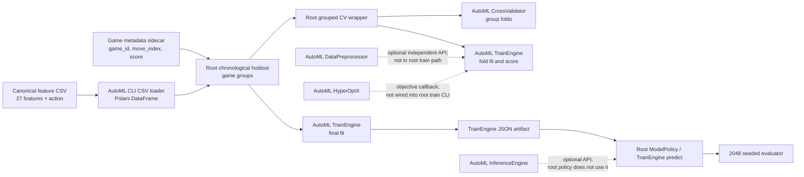

# Plan 04 — AutoML architecture audit: observed module boundaries and API limitations are explicit

> **Status: DONE (2026-09-24).** Source audit supporting ticket 005; it is not a separate execution ticket.

**Goal:** Record the framework architecture and integration contracts verified in source.
**Builds on:** [04-framework-contribution](04-framework-contribution.md) — architecture evidence supports this ticket's implementation record.

## Decision and evidence

This document records architecture observed in the pinned AutoML submodule and root integration. It is a source map, not a framework performance result.

## Revision and scope

- Root revision: `ca15cebcdf4d307126a63d4ab19e416606f50564`.
- AutoML submodule revision: `64f5edad29c9e58ee7d33abf380418d5cfbbb561` (the declared pin).
- Environment inspected: macOS 26.5, arm64; Rust/Cargo 1.96.1.
- Root crate directly depends on the path submodule `automl`; root training data is read as Polars `DataFrame` through the framework CLI loader.

## Module and data flow

The root has two parallel layers: it owns the game, feature/data protocol, game-group holdout, and case-study simulation; the AutoML submodule owns model fitting, framework preprocessing APIs, generic CV splitting, optimization primitives, inference utilities, and model serialization. The root's group-aware CV wrapper selects rows and evaluates folds around `TrainEngine::fit` because the framework's generic `cross_val_score` does not accept group labels (its implementation passes `groups=None` to `CrossValidator::split`). It checks that groups do not overlap between each fold's train and test indices.

## Data and ownership contracts

| Boundary | Observed contract | Source |
|---|---|---|
| Training table | Polars `DataFrame`; target column named `action`; root CSV schema has 27 `f64` features and one action column | `src/data_pipeline.rs`; `automl/src/training/engine.rs::prepare_data` |
| Framework model input | Numeric columns cast to `f64`, then copied into `ndarray::Array2<f64>`; target cast to `Array1<f64>`; null feature/target values are currently replaced with zero in conversion | `automl/src/training/engine.rs::columns_to_array2` |
| Game provenance | Sidecar has row index, game ID, move index, and score; the row index aligns it to training CSV; IDs are not model features | `src/data_pipeline.rs` |
| Group split | Root partitions game IDs chronologically for holdout; root CV wrapper uses AutoML `CrossValidator::split` with a group array, then materializes train/test DataFrames | `src/main.rs`; `src/training.rs` |
| Preprocessing | `DataPreprocessor` fits stateful imputer/scaler/encoder statistics and offers transform/save/load; root's canonical numeric features currently bypass it | `automl/src/preprocessing/pipeline.rs`; `src/main.rs` |
| Model output | `TrainEngine` owns config, feature names, a trained model, metrics and histories; save/load serialize the engine to JSON | `automl/src/training/engine.rs` |
| Prediction | Root game policy loads the serialized AutoML `TrainEngine` and maps four-class predictions to legal game actions; `InferenceEngine` is a separate generic inference component | `src/policy.rs`; `automl/src/inference/engine.rs` |

The framework APIs use concrete Rust structs/enums and `Result` errors at their public boundaries. `DataFrame` is borrowed for fit/predict calls; the engine extracts owned numeric arrays and stores its fitted model and feature names. CV returns row indices, while the root wrapper owns the selected fold DataFrames. The JSON model is a file artifact; no explicit schema-version field or migration policy was verified in `TrainEngine` serialization.

## Configuration and capability surfaces

- `TrainingConfig` specifies task/model/target/features, validation fraction, `cv_folds`, optional seed, metric, parallelism, and algorithm parameters. `TrainEngine::fit` extracts the data and performs its own seeded train/validation split; source inspection shows that this fit path does not call `CrossValidator` and does not consume `cv_folds`. Root integration therefore runs group CV explicitly and then fits a final engine separately.
- `PreprocessingConfig` specifies imputers, scaler, encoder, outlier and feature expansion options, jobs, and seed. A fitted `DataPreprocessor` is serializable. Leakage safety is a caller responsibility: fit only on a training partition and transform held-out data with the fitted instance.
- `OptimizationConfig` provides trials, timeout, direction, sampler, seed, parallel-worker count, pruning flag, early stopping, and metric/fold fields. In the inspected `HyperOptX::optimize` path, objective calls are sequential and errors are represented as pruned trials without retaining the error value in the result; an objective callback must perform actual fitting/CV. The generic optimizer does not itself bind to `TrainEngine` or enforce the declared metric/folds.
- `InferenceConfig` exposes batch/worker, streaming, cache, memory-budget, quantization, and probability options. `InferenceEngine` can own an optional preprocessor and a `TrainEngine`; the 2048 root policy currently predicts through the model policy path, not this engine.
- AutoML's `ModelType` is a broad enum, not a guarantee that every model works for every task or emits a consistent probability matrix. For four-action classification, the verified candidate set is recorded in `plans/01-Infrastructure/01-Project/01-project-overview.md` and rechecked by `src/framework_validation.rs`.

## Failure, seed, parallelism, and compatibility observations

- Public framework operations generally return `automl::Result`; the root CLI currently converts many workflow failures to `expect` panics after argument/schema checks. Trial objective errors are marked pruned without preserving the error text in `TrialResult`, limiting diagnostic evidence.
- Seeds are configurable in training, CV, preprocessing, optimization, and game simulation as separate values. The root CLI derives a CV seed with `seed.wrapping_add(4)` and uses the requested seed for final fit. There is no single cross-component seed manager or framework-wide determinism guarantee.
- Parallelism knobs exist in preprocessing, training configuration, optimization configuration, and inference configuration. The inspected `HyperOptX::optimize` loop evaluates trials serially; actual model-level parallelism is algorithm/config dependent and must be measured. No framework-level recovery/checkpoint policy was verified for an interrupted training/search run.
- `TrainEngine` and `DataPreprocessor` expose JSON save/load methods. This audit found no explicit artifact version negotiation or backward migration mechanism, so compatibility across framework revisions remains unverified.
- Both CLI and Rust library surfaces exist, but equivalent results for a common fixed configuration have not been measured. The root uses library APIs plus the framework CSV loader; command availability is not evidence of CLI/library equivalence.

### Follow-up source and repeatability probe

On 2026-09-24, `cargo test framework_validation::tests::planned_multiclass_model_variants_fit_and_predict -- --nocapture` was run 20 times. Nineteen passed and one failed the existing RandomForest prediction equality assertion after save/load. This is intermittent rather than a deterministic JSON-load mismatch. Source inspection found a plausible training nondeterminism: `automl/src/training/decision_tree.rs::compute_leaf_value` counts classes in a randomized `HashMap` and resolves equal counts with `into_iter().max_by_key`, so tied leaf labels can vary across model fits despite the configured seed. This is a source-level diagnosis; an isolated proof/fix and repeated-seed dataset study remain outstanding. Keep RandomForest reproducibility unverified until addressed.

## Evidence boundary

This map is based on source inspection at the revisions above. It does not measure predictive quality, memory, training/inference time, search efficiency, reproducibility across processes, external-framework trade-offs, or standard-dataset portability. Those experiments remain required by the framework-contribution and framework-validation tickets.

## Verification (definition of done)

1. `test -f plans/01-Infrastructure/01-Project/04-framework-architecture.md` exits 0.
2. `grep -q '^# Plan 04 — ' plans/01-Infrastructure/01-Project/04-framework-architecture.md` exits 0.
3. `grep -q '^> \\*\\*Status:' plans/01-Infrastructure/01-Project/04-framework-architecture.md` exits 0.
4. `grep -q '^\\*\\*Goal:' plans/01-Infrastructure/01-Project/04-framework-architecture.md` exits 0.
5. `grep -q '^## Decision and evidence$' plans/01-Infrastructure/01-Project/04-framework-architecture.md` exits 0.
6. `grep -q '^## Open questions$' plans/01-Infrastructure/01-Project/04-framework-architecture.md` exits 0.
7. `grep -q '^## Later$' plans/01-Infrastructure/01-Project/04-framework-architecture.md` exits 0.

## Open questions

- Standard-dataset performance, matched baselines, resource use, repeatability, and external replication are unmeasured.

## Later

- Use the framework-validation ticket to collect empirical evidence before drawing framework quality conclusions.
