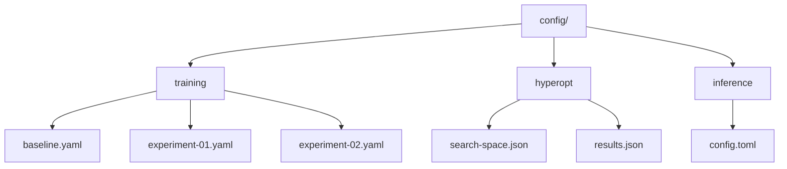

# AutoML Configuration

## 1. Overview

The automl framework provides `TrainingConfig` and `OptimizationConfig` structures that must be configured for the 2048 game training pipeline. This document defines the configurations used throughout the project.

## 2. Training Configuration

### 2.1 Base Configuration

```rust
use automl::{TrainingConfig, TaskType, ModelType};

let mut config = TrainingConfig::new(TaskType::MultiClassification, "action")
    .with_model(ModelType::Auto)  // Auto-select best classification model
    .with_cv(5)                    // 5-fold cross-validation
    .with_random_state(42)         // Reproducible
    .with_max_depth(6)             // Tree depth limit
    .with_n_estimators(100)        // Ensemble size
    .with_learning_rate(0.1);      // Boosting rate
config.validation_split = 0.2;   // 80/20 split (struct field, no builder)
```

### 2.2 Task Type for 2048

Since 2048 requires choosing one of 4 discrete directions (Up/Down/Left/Right), the task type is **MultiClassification**:

| Property | Value | Rationale |
|----------|-------|-----------|
| TaskType | `MultiClassification` | Action space is 4 discrete directions |
| Target | `action` | 0=Up, 1=Down, 2=Left, 3=Right |
| Metric | `accuracy` / `f1_macro` | Standard classification metrics |
| Validation | 5-fold CV | Robust evaluation |

Note: `ModelType::Auto` will automatically select the best classification model from the candidate set.

### 2.3 Model Type Strategy

```rust
// Phase 1: Auto-selection
ModelType::Auto

// Phase 2: Top candidates
vec![ModelType::GradientBoosting, ModelType::RandomForest, ModelType::XGBoost]

// Phase 3: Fine-tuning
ModelType::GradientBoosting  // Best for discrete action classification
```

## 3. Hyperparameter Optimization Configuration

```rust
use automl::{OptimizationConfig, SearchSpace, Parameter, ParameterType, OptimizeDirection, MedianPruner};

let opt_config = OptimizationConfig::default()
    .with_direction(OptimizeDirection::Maximize)
    .with_n_trials(100)
    .with_n_jobs(4);
// Pruner is separate; MedianPruner::new(minimize) — false = maximize (we maximize accuracy/score, so false)
// Verified in automl/src/optimizer/pruners.rs:85,93 — `minimize: bool` field, false keeps higher values
let pruner = MedianPruner::new(false); // false = maximize → prunes trials below median; true would be for minimize (loss)

let mut search_space = SearchSpace::new();
search_space.add(Parameter::new("n_estimators", ParameterType::Int(50, 300)));
search_space.add(Parameter::new("max_depth", ParameterType::Int(3, 10)));
search_space.add(Parameter::new("learning_rate", ParameterType::Float(0.01, 0.5)));
search_space.add(Parameter::new("subsample", ParameterType::Float(0.5, 1.0)));
search_space.add(Parameter::new("colsample_bytree", ParameterType::Float(0.5, 1.0)));
```

## 4. Inference Configuration

```rust
use automl::InferenceConfig;

let mut infer_config = InferenceConfig::default()
    .with_batch_size(64)
    .with_n_workers(4);
infer_config.cache_preprocessing = true; // struct field (no builder)
```

## 5. Configuration Files

All configurations will be stored in `config/` directory:



## 6. Configuration Versioning

All configuration changes will be tracked via git. Configuration files will include:

- **Version:** Semantic version of the config schema
- **Timestamp:** ISO 8601 timestamp
- **Author:** User who made the change
- **Notes:** Rationale for configuration choices
