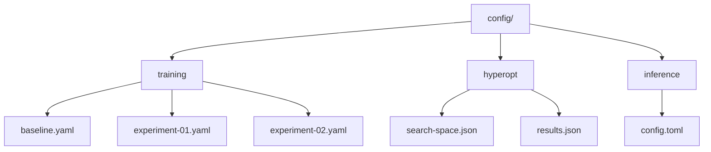

# Plan 01 — AutoML Configuration: the repository status is explicit and evidence based

> **Status: PARTIAL.** Changed example to a verified model and corrected SearchSpace builder; optimizer/pruner integration and tracked config artifacts remain pending.

**Goal:** State the current implementation and evidence boundary for automl configuration.
**Builds on:** [00](../../00-scope-and-traceability.md) — the project is supervised 4×4 2048 policy learning, and framework evaluation is a separate research track.

---

## Decision and evidence

**This plan treats its subject as partial or pending work, not as a research finding.** The rejected alternative is to infer completion from a plan title or related code alone. The ledger records this disposition: Changed example to a verified model and corrected SearchSpace builder; optimizer/pruner integration and tracked config artifacts remain pending.

## 1. Overview

The automl framework provides `TrainingConfig` and `OptimizationConfig` structures that must be configured for the 2048 game training pipeline. This document defines the configurations used throughout the project.

## 2. Training Configuration

### 2.1 Base Configuration

```rust
use automl::{TrainingConfig, TaskType, ModelType};

let mut config = TrainingConfig::new(TaskType::MultiClassification, "action")
    .with_model(ModelType::RandomForest) // Use only variants verified to return four action probabilities
    .with_cv(5)                    // 5-fold cross-validation
    .with_random_state(42)         // Reproducible
    .with_max_depth(6)             // Tree depth limit
    .with_n_estimators(100)        // Ensemble size
    .with_learning_rate(0.1);      // Boosting rate
config.validation_split = 0.2;   // 80/20 split (struct field, no builder)
```

### 2.2 Task Type for 2048

Since 2048 requires choosing one of 4 discrete directions (Up/Down/Left/Right), the task type is **MultiClassification**:

| Property | Value | Rationale |
|----------|-------|-----------|
| TaskType | `MultiClassification` | Action space is 4 discrete directions |
| Target | `action` | 0=Up, 1=Down, 2=Left, 3=Right |
| Metric | `accuracy` / `f1_macro` | Standard classification metrics |
| Validation | 5-fold CV | Robust evaluation |

Do not use `ModelType::Auto` for the four-action policy until its candidate selection is constrained and verified. On the pinned framework, supported enum variants do not all return four probability columns for `MultiClassification`; the current root CLI permits only RandomForest, ExtraTrees, AdaBoost, KNN, and NaiveBayes.

### 2.3 Model Type Strategy

```rust
// Phase 1: Auto-selection
ModelType::Auto

// Phase 2: Top candidates
vec![ModelType::RandomForest, ModelType::ExtraTrees, ModelType::AdaBoost, ModelType::KNN, ModelType::NaiveBayes]

// Phase 3: Fine-tuning
ModelType::RandomForest  // candidate remains provisional until held-out game evaluation
```

## 3. Hyperparameter Optimization Configuration

```rust
use automl::{OptimizationConfig, SearchSpace, Parameter, ParameterType, OptimizeDirection, MedianPruner};

let opt_config = OptimizationConfig::default()
    .with_direction(OptimizeDirection::Maximize)
    .with_n_trials(100)
    .with_n_jobs(4);
// Pruner is separate; MedianPruner::new(minimize) — false = maximize (we maximize accuracy/score, so false)
// Verified in automl/src/optimizer/pruners.rs:85,93 — `minimize: bool` field, false keeps higher values
let pruner = MedianPruner::new(false); // false = maximize → prunes trials below median; true would be for minimize (loss)

// Capability note: the pinned HyperOptX API does not accept this pruner in
// OptimizationConfig, and the root training CLI does not yet run model trials.
// Treat these as separate API examples, not an implemented training setup.

let search_space = SearchSpace::new()
    .int("n_estimators", 50, 300)
    .int("max_depth", 3, 10)
    .float("learning_rate", 0.01, 0.5);
// Build a model-specific space; subsample/colsample_bytree are not universal
// parameters and must not be claimed as applied unless the adapter maps them.
```

## 4. Inference Configuration

```rust
use automl::InferenceConfig;

let mut infer_config = InferenceConfig::default()
    .with_batch_size(64)
    .with_n_workers(4);
infer_config.cache_preprocessing = true; // struct field (no builder)
```

## 5. Configuration Files

All configurations will be stored in `config/` directory:



## 6. Configuration Versioning

All configuration changes will be tracked via git. Configuration files will include:

- **Version:** Semantic version of the config schema
- **Timestamp:** ISO 8601 timestamp
- **Author:** User who made the change
- **Notes:** Rationale for configuration choices

---

## Verification (definition of done)

1. `test -f plans/01-Infrastructure/02-Configuration/01-automl-config.md` exits 0.
2. `grep -q '^# Plan 01 — ' plans/01-Infrastructure/02-Configuration/01-automl-config.md` exits 0.
3. `grep -q '^> \\*\\*Status:' plans/01-Infrastructure/02-Configuration/01-automl-config.md` exits 0.
4. `grep -q '^\*\*Goal:' plans/01-Infrastructure/02-Configuration/01-automl-config.md` exits 0.
5. `grep -q '^## Decision and evidence$' plans/01-Infrastructure/02-Configuration/01-automl-config.md` exits 0.
6. `grep -q '^## Open questions$' plans/01-Infrastructure/02-Configuration/01-automl-config.md` exits 0.
7. `grep -q '^## Later$' plans/01-Infrastructure/02-Configuration/01-automl-config.md` exits 0.
8. `bash /Users/evintleovonzko/Documents/works/kolosal/planout2/v2-ai-express/.claude/skills/writing-planout-plans/check-plan.sh plans/01-Infrastructure/02-Configuration/01-automl-config.md` exits 0.

## Open questions

- **The plan-scale evidence remains bounded by current results.** Changed example to a verified model and corrected SearchSpace builder; optimizer/pruner integration and tracked config artifacts remain pending. Any larger corpus or external benchmark needs a declared resource budget and retained artifacts.

## Later

- **Complete the remaining research or implementation work recorded above.** It stays deferred until its prerequisites, compute budget, and measurable acceptance evidence are available.
