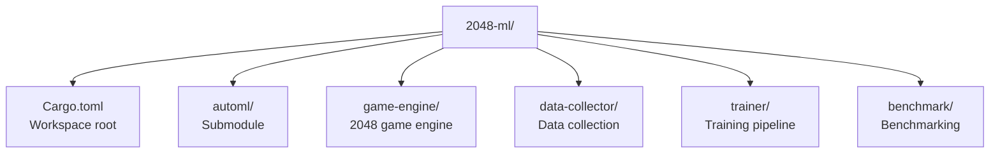

# Rust Dependencies Specification

## 1. automl Crate Dependencies

The automl submodule provides all ML dependencies. The 2048 project will re-export relevant modules:

```toml
[dependencies]
automl = { path = "automl" }
ndarray = "0.16"
polars = { version = "0.46", features = ["lazy", "csv", "json"] }
rand = "0.8"
rand_chacha = "0.3"
```

## 2. Direct Dependencies for 2048 Engine

| Crate | Version | Purpose |
|-------|---------|---------|
| `rand` | 0.8 | Random tile placement |
| `rand_chacha` | 0.3 | Deterministic RNG |
| `clap` | 4.4 | CLI for game simulation |
| `serde` | 1.0 | State serialization |
| `serde_json` | 1.0 | Data persistence |
| `ndarray` | 0.16 | Board state arrays |
| `rayon` | 1.10 | Parallel game simulation (sync batch) |
| `thiserror` | 2.0 | Error types |
| `anyhow` | 1.0 | Error handling |
| `tracing` | 0.1 | Logging |
| `tracing-subscriber` | 0.3 | Log formatting |
| `indicatif` | 0.17 | Progress bars |
| `chrono` | 0.4 | Timestamps |
| `uuid` | 1.7 | Session IDs |

> **Note:** `tokio` removed for MVP — sync batch with `rayon` only; `tokio` is future optional for async server.

## 3. Dependency Constraints

| Constraint | Rationale |
|------------|-----------|
| Rust 1.75+ | automl requires this minimum |
| No `unsafe` | Memory safety guarantee |
| Send + Sync | Thread-safe game engine |
| `#![deny(warnings)]` | Strict compilation |

## 4. Cargo Workspace Structure

> **MVP: Single crate sufficient — workspace split is future optional.** The 4-crate workspace (`game-engine` / `data-collector` / `trainer` / `benchmark`) below is **not MVP**; keep one `Cargo.toml` at root with `automl` submodule for now. `tokio` not needed for sync batch (keep `rayon` only for parallel simulation).

```
2048-ml/
├── Cargo.toml          # Single crate (MVP)
├── src/
└── automl/             # Submodule
```

<details><summary>Future optional workspace (out of scope for MVP)</summary>


</details>

## 5. Dependency Audit

Run `cargo audit` weekly to check for security vulnerabilities in dependencies.

## 6. Lock File Management

- `Cargo.lock` must be committed for reproducible builds
- `automl/Cargo.lock` must also be committed
- Update dependencies only during scheduled maintenance windows
