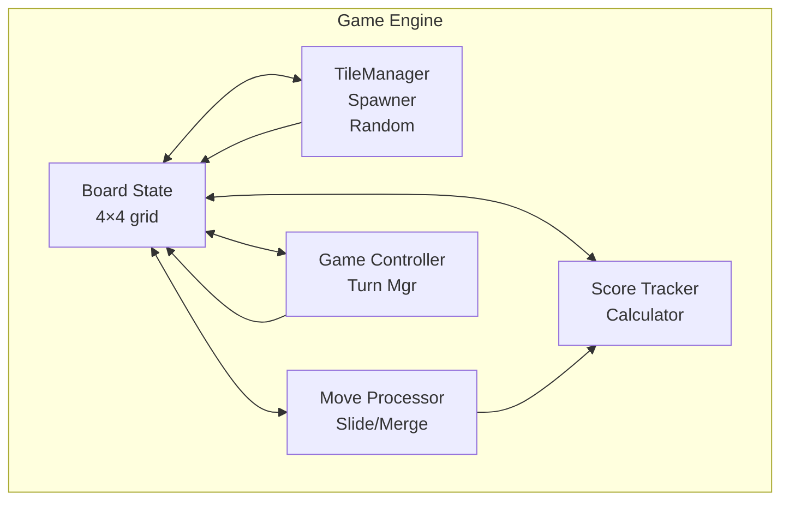

# 2048 Game Engine

## 1. Purpose

Define the game engine implementation that simulates the 2048 game for data generation and model training.

## 2. Game Rules Summary

2048 is played on a 4×4 grid. On each turn:
1. A new tile (value 2 or 4) appears in a random empty cell
2. The player slides all tiles in one direction (up/down/left/right)
3. Tiles with the same value that collide merge into one tile with the summed value
4. The game ends when the board is full and no moves are possible
5. Score = sum of all merged tile values

## 3. Engine Architecture



## 4. Board Representation

> **Canonical Board defined in `03-State/01-Board/01-board-state.md`, see there.** This section keeps a minimal description; do not duplicate the full struct.

Board is a 4×4 grid with `score`, `move_count`, `game_over` — see canonical for full definition (`RawBoardState` / `BoardStateML`). No duplicate struct here.

## 5. Core Operations

### 5.1 Move Execution

```rust
pub enum Direction { Up, Down, Left, Right }

impl Board {
    pub fn execute_move(&mut self, dir: Direction) -> MoveResult {
        // Slide and merge tiles in the given direction
        // Returns MoveResult with:
        // - whether the board changed
        // - score gained
        // - merged positions
    }
}
```

### 5.2 Tile Spawning

```rust
impl Board {
    pub fn spawn_tile(&mut self) {
        // Find all empty cells
        // Select random empty cell
        // Place 2 (90% probability) or 4 (10% probability)
    }
}
```

### 5.3 Game Over Detection

```rust
impl Board {
    pub fn is_game_over(&self) -> bool {
        // Board is full AND no valid moves exist
        // Check all four directions for possible merges
    }
}
```

## 6. Move Logic (Slide & Merge)

```rust
fn slide_row(row: [Option<u64>; 4]) -> ([Option<u64>; 4], u64) {
    // 1. Remove None values (compress)
    // 2. Merge adjacent equal values (leftward)
    // 3. Compress again
    // 4. Return new row + score gained
}
```

## 7. Simulation Engine

```rust
pub struct GameSimulator {
    board: Board,
    rng: ChaCha8Rng,  // Deterministic RNG
    config: SimulatorConfig,
}

impl GameSimulator {
    pub fn simulate(&mut self, action_sequence: &[Direction]) -> GameResult;
    pub fn simulate_random(&mut self) -> GameResult;  // Random agent
    pub fn simulate_with_model(&mut self, model: &dyn Model) -> GameResult;
}
```

## 8. Configuration

```rust
pub struct SimulatorConfig {
    pub board_size: usize,           // 4
    pub spawn_prob_4: f64,           // 0.1
    pub max_moves: u64,              // 1000
    pub initial_tiles: usize,        // 2
}
```

## 9. Performance Considerations

- Game simulation must be fast (1000+ games/second)
- Use `rayon` for parallel simulation of multiple games
- Zero-allocation board state during moves
- Pre-computed move tables for optimization
