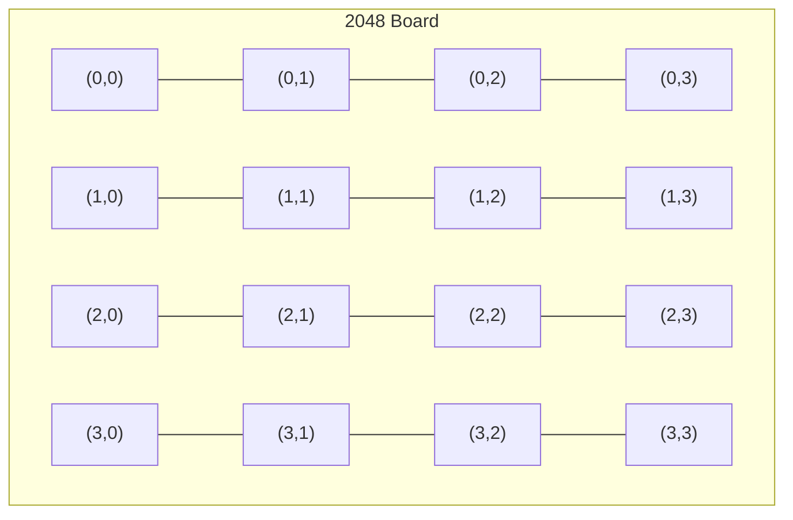

# Game UI (Optional / Not Required)

## 1. Scope

This document defines the UI layer for the 2048 game. **Note:** The project scope explicitly excludes frontend usage per the initial plan. This document covers any visualization needed for debugging and data inspection.

## 2. Terminal UI (Minimal)



> **See canonical `02-Environment/04-Visualization/01-visualization.md` — identical for debug only.** `render_board` duplicated here for historical reasons; do not maintain two copies.

```rust
// Reference only — see canonical render_board in 02-Environment/04-Visualization/01-visualization.md
fn render_board(board: &Board) -> String {
    // Identical to canonical; debug-only terminal rendering
    crate::visualization::render_board(board)
}
```

## 3. Visualization (Debug Only)

```rust
// SVG output for board states
fn render_svg(board: &Board, path: &str) -> Result<()> {
    // Generate SVG file for board visualization
}

// CSV export for game logs
fn export_game_log(result: &GameResult, path: &str) -> Result<()> {
    // Export all moves, scores, board states to CSV
}
```

## 4. Interactive Debug Mode

```rust
// Interactive game for debugging
fn debug_game() {
    loop {
        render_board(&board);
        let direction = read_direction();
        board.execute_move(direction);
        board.spawn_tile();
        if board.is_game_over() { break; }
    }
}
```

## 5. Not Required in Scope

Per the project constraints:
- No web-based frontend
- No browser-based visualization
- No mobile app interface
- All interaction via CLI and data files

The game engine runs headless, producing:
- Game state logs (JSON/CSV)
- Board snapshots (for data collection)
- Training data (for ML models)
