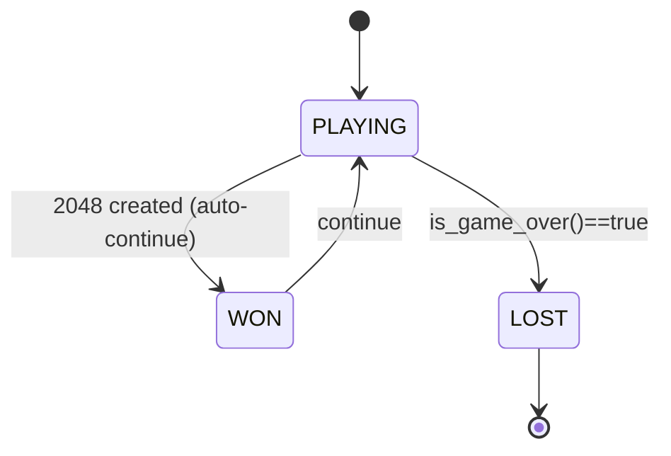

# Win / Lose Conditions — Canonical

> **Canonical terminal check: `would_change`.** Thresholds are NOT re-stated here — **See `01-Infrastructure/01-Project/01-project-overview.md` Tiers 1–3** for ranking (heuristic ~512). No 65536 speculation.

## 1. Win Condition (Non-Terminal)

- Tile `2048` created = *win* but **game does not stop** — player may continue to higher tiles.
- No upper bound asserted here. Canonical max tile is `32768` (`2^15`) per `03-State/01-Board/01-board-state.md` (`max_tile_log /15`, grid normalization `/32768`). **Delete 65536 speculation — out of scope.**
- Higher tiles (4096, 8192, ...) are strictly *continued play*, not new win variants to enumerate in `WinCondition`. Keep only:

```rust
pub enum WinCondition {
    NotWon,
    Won2048,
    Won4096,
    Won8192,
    // Not needed: Won16384/Won32768/Won65536 — delete speculation; track max_tile: u32 instead
}
```

## 2. Lose / Terminal — Canonical via `would_change`

> **Canonical:** `Board::would_change(dir)` / `get_valid_moves()` — single source in `02-Rules/03-valid-moves.md` and `01-Game/01-game-engine.md` §4.2.

```rust
impl Board {
    pub fn is_game_over(&self) -> bool {
        if !self.is_full() { return false; }
        !self.has_valid_moves()
    }
    fn is_full(&self) -> bool {
        !self.grid.contains(&0) // [u32;16], 0 = empty
    }
    fn has_valid_moves(&self) -> bool {
        Direction::ALL.iter().any(|dir| self.would_change(*dir))
    }
}
```

Terminal iff **no valid moves in any of 4 dirs** (`would_change == false` ∀ dirs). Board-full alone is insufficient — `has_valid_moves()` is the check.

## 3. State Machine



## 4. End-of-Game Data (Metadata)

```rust
pub struct GameResult {
    pub final_score: u64,              // metadata, never label — see 01-scoring-rules.md
    pub max_tile: u32,                 // max grid value (u32, not u64 speculation)
    pub move_count: u64,
    pub board: Board,                  // [u32;16] final
    pub move_history: Vec<MoveRecord>, // Vec<(action:u8, score_delta:u64)>
    pub win_condition: WinCondition,
    pub duration_ms: u64,
    // Training rows derived separately: Vec<TrainingSample { [f64;27], action:u8, score:u64 }>
}
```

## 5. Success Criteria — Reference Project Tiers (Do Not Duplicate Numbers)

> **See canonical:** `01-Infrastructure/01-Project/01-project-overview.md` §8
> - **Tier 1 (MVP):** 10k+ games, determine score ceilings, pipeline works
> - **Tier 2:** rank by mean score, automated reproducible pipeline
> - **Tier 3:** top model **mean > heuristic ~512** with statistical significance
> Case-study ranking = highest held-out mean score under the declared 2048 evaluation protocol, with uncertainty and practical-effect reporting. Do **not** interpret this as globally optimal play or as the framework's primary success criterion.

## 6. Early Stopping (Configurable, Not Hardcoded)

```rust
pub struct EarlyStopCriteria {
    pub max_moves: u64,           // e.g., 1000
    pub max_score: Option<u64>,   // configurable via config.toml — if using log-norm log10(score+1)/6.0, map: 20000 → ~0.72
    pub stagnation_limit: u64,    // moves without score increase
}
```

> `max_score` is an example threshold only — configure per run. Not a theoretical max (open problem per project-overview). Raw threshold must map to normalized feature scale `log10(score+1)/6.0`.

## 7. Edge Cases

| Case | Treatment |
|------|-----------|
| Immediate terminal | record as failed game |
| Score 0 | no merges — valid |
| Full but has_valid_moves | **not** over — `would_change` decides |
| 2048 on first moves | rare, valid |

## 8. Cross-References

- **Scoring (metadata only):** `01-scoring-rules.md`
- **Valid moves:** `03-valid-moves.md` (`would_change`, `constrained_action`)
- **Features / normalization:** `03-State/01-Board/01-board-state.md` (`/32768`, index 21 `/6.0`)
- **CV:** `05-Model/04-Evaluation/02-cross-validation.md` (`GroupKFold` vs `TimeSeriesSplit`)
- **RNG:** `03-Simulation-Engine/02-randomness.md` (`ChaCha8Rng`, `spawn_prob_4:0.1`)
