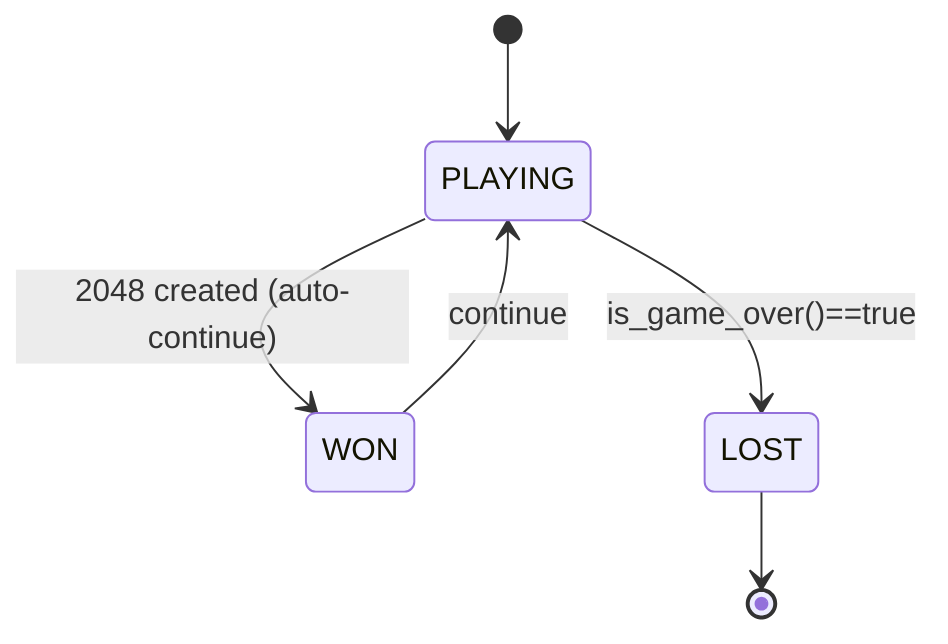

# Plan 02 — Win / Lose Conditions: the repository status is explicit and evidence based

> **Status: DONE (2026-09-24).** No-valid-move terminal rule, non-terminal 2048 threshold, and result metadata implemented and covered.

**Goal:** State the current implementation and evidence boundary for win / lose conditions.
**Builds on:** [00](../../00-scope-and-traceability.md) — the project is supervised 4×4 2048 policy learning, and framework evaluation is a separate research track.

---

## Decision and evidence

**This plan treats its subject as implemented with bounded evidence, not as a research finding.** The rejected alternative is to infer completion from a plan title or related code alone. The ledger records this disposition: No-valid-move terminal rule, non-terminal 2048 threshold, and result metadata implemented and covered.

> **Canonical terminal check: `would_change`.** Thresholds are NOT re-stated here — **See `01-Infrastructure/01-Project/01-project-overview.md` Tiers 1–3** for ranking (heuristic ~512). No 65536 speculation.

## 1. Win Condition (Non-Terminal)

- Tile `2048` created = *win* but **game does not stop** — player may continue to higher tiles.
- No game-level upper bound is asserted here. Tile normalization limits belong to the state/data protocol; the current engine accepts power-of-two values beyond 32768.
- Higher tiles (4096, 8192, ...) are strictly *continued play*, not new win variants to enumerate in `WinCondition`. Keep only:

```rust
pub enum WinCondition {
    NotWon,
    Won2048,
    Won4096,
    Won8192,
    // Additional win categories are not needed; track max_tile: u32 as result metadata.
}
```

## 2. Lose / Terminal — Canonical via `would_change`

> **Canonical:** `Board::would_change(dir)` / `get_valid_moves()` — single source in `02-Rules/03-valid-moves.md` and `01-Game/01-game-engine.md` §4.2.

```rust
impl Board {
    pub fn is_game_over(&self) -> bool {
        if !self.is_full() { return false; }
        !self.has_valid_moves()
    }
    fn is_full(&self) -> bool {
        !self.grid.contains(&0) // [u32;16], 0 = empty
    }
    fn has_valid_moves(&self) -> bool {
        Direction::ALL.iter().any(|dir| self.would_change(*dir))
    }
}
```

Terminal iff **no valid moves in any of 4 dirs** (`would_change == false` ∀ dirs). Board-full alone is insufficient — `has_valid_moves()` is the check.

## 3. State Machine



## 4. End-of-Game Data (Metadata)

```rust
pub struct GameResult {
    pub final_score: u64,              // metadata, never label — see 01-scoring-rules.md
    pub max_tile: u32,                 // max grid value (u32, not u64 speculation)
    pub move_count: u64,
    pub board: Board,                  // [u32;16] final
    pub move_history: Vec<MoveRecord>, // Vec<(action:u8, score_delta:u64)>
    pub win_condition: WinCondition,
    pub duration_ms: u64,
    // Canonical rows derived separately: Vec<TrainingSample { [f64;17], action:u8, score:u64 }>.
    // Model rows use the canonical 17-value state.
}
```

## 5. Success Criteria — Reference Project Tiers (Do Not Duplicate Numbers)

> **See canonical:** `01-Infrastructure/01-Project/01-project-overview.md` §8
> - **Tier 1 (MVP):** 10k+ games, determine score ceilings, pipeline works
> - **Tier 2:** rank by mean score, automated reproducible pipeline
> - **Tier 3:** top model **mean > heuristic ~512** with statistical significance
> Case-study ranking = highest held-out mean score under the declared 2048 evaluation protocol, with uncertainty and practical-effect reporting. Do **not** interpret this as globally optimal play or as the framework's primary success criterion.

## 6. Early Stopping (Configurable, Not Hardcoded)

```rust
pub struct EarlyStopCriteria {
    pub max_moves: u64,           // e.g., 1000
    pub max_score: Option<u64>,   // illustrative only; no max-score config is implemented
    pub stagnation_limit: u64,    // moves without score increase
}
```

> This struct is illustrative only. The current simulator implements a `max_moves` safety cap; it does not implement max-score or stagnation stopping. Score normalization is an input encoding and does not bound the game.

## 7. Edge Cases

| Case | Treatment |
|------|-----------|
| Immediate terminal | record as failed game |
| Score 0 | no merges — valid |
| Full but has_valid_moves | **not** over — `would_change` decides |
| 2048 on first moves | rare, valid |

## 8. Cross-References

- **Scoring (metadata only):** `01-scoring-rules.md`
- **Valid moves:** `03-valid-moves.md` (`would_change`, `constrained_action`)
- **Training input:** Plan 00 defines 17 values; ticket #034 implements the state and encoding.
- **CV:** `05-Model/04-Evaluation/02-cross-validation.md` (`GroupKFold` vs `TimeSeriesSplit`)
- **RNG:** `03-Simulation-Engine/02-randomness.md` (`ChaCha8Rng`, `spawn_prob_4:0.1`)

## Implementation Record

- `RawBoardState::is_game_over` checks that no direction changes the board; a full board with a merge remains playable.
- `GameResult` captures final score, maximum tile, move count, board, move history, duration, and the 2048/4096/8192 threshold classification. Reaching a threshold does not terminate play.
- Validation: root unit suite passed after adding terminal-board and threshold cases.

---

## Verification (definition of done)

1. `test -f plans/02-Environment/02-Rules/02-win-lose-conditions.md` exits 0.
2. `grep -q '^# Plan 02 — ' plans/02-Environment/02-Rules/02-win-lose-conditions.md` exits 0.
3. `grep -q '^> \\*\\*Status:' plans/02-Environment/02-Rules/02-win-lose-conditions.md` exits 0.
4. `grep -q '^\*\*Goal:' plans/02-Environment/02-Rules/02-win-lose-conditions.md` exits 0.
5. `grep -q '^## Decision and evidence$' plans/02-Environment/02-Rules/02-win-lose-conditions.md` exits 0.
6. `grep -q '^## Open questions$' plans/02-Environment/02-Rules/02-win-lose-conditions.md` exits 0.
7. `grep -q '^## Later$' plans/02-Environment/02-Rules/02-win-lose-conditions.md` exits 0.
8. `bash /Users/evintleovonzko/Documents/works/kolosal/planout2/v2-ai-express/.claude/skills/writing-planout-plans/check-plan.sh plans/02-Environment/02-Rules/02-win-lose-conditions.md` exits 0.

## Open questions

- **The plan-scale evidence remains bounded by current results.** No-valid-move terminal rule, non-terminal 2048 threshold, and result metadata implemented and covered. Any larger corpus or external benchmark needs a declared resource budget and retained artifacts.

## Later

- **Complete the remaining research or implementation work recorded above.** It stays deferred until its prerequisites, compute budget, and measurable acceptance evidence are available.
