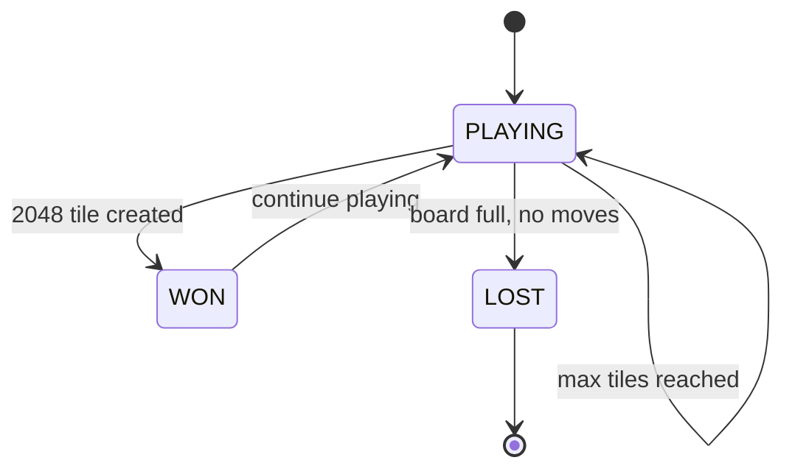

# Win/Lose Conditions

## 1. Win Condition

### 1.1 Primary Win
- A tile with value **2048** is created on the board
- The game does **not** automatically end (player can continue)
- Score continues to accumulate beyond 2048

### 1.2 Extended Win
- Any tile value beyond 2048 (e.g., 4096, 8192)
- These are "super wins" and indicate exceptional play

```rust
pub enum WinCondition {
    NotWon,
    Won2048,
    Won4096,
    Won8192,
    Won16384,
    Won32768,
    Won65536,
}
```

## 2. Lose Condition

### 2.1 Game Over
The game ends when ALL of the following are true:
1. The board is completely full (no empty cells)
2. No valid moves exist in any of the four directions
3. No adjacent tiles have the same value

```rust
impl Board {
    pub fn is_game_over(&self) -> bool {
        if !self.is_full() { return false; }
        !self.has_valid_moves()
    }
    
    fn is_full(&self) -> bool {
        self.grid.iter().all(|row| row.iter().all(|cell| cell.is_some()))
    }
    
    fn has_valid_moves(&self) -> bool {
        [Direction::Up, Direction::Down, Direction::Left, Direction::Right]
            .iter()
            .any(|dir| self.would_change(*dir))
    }
}
```

## 3. Game State Machine



## 4. End-of-Game Data

When a game ends, collect the following:

```rust
pub struct GameResult {
    pub final_score: u64,
    pub max_tile: u64,
    pub move_count: u64,
    pub board: Board,                    // Final board state
    pub move_history: Vec<MoveRecord>,   // All moves made
    pub board_history: Vec<Board>,       // Board snapshots
    pub win_condition: WinCondition,
    pub duration_ms: u64,                // Time taken
}
```

## 5. Success Criteria for ML Model

| Metric | Threshold | Description |
|--------|-----------|-------------|
| Mean Score ≥ 512 | ≥ 80% of games | Model exceeds heuristic baseline |
| Mean Score ≥ 768 | ≥ 60% of games | Model beats heuristic by 1.5x |
| Mean Score ≥ 1024 | ≥ 30% of games | Strong performance |
| Highest Score | Max across all games | Winner determination |
| Score Distribution | Percentiles | Ranking across models |

## 6. Early Stopping Criteria

For training efficiency, games can be stopped early if:
- Score exceeds a threshold (e.g., 10000)
- No progress for N moves (score hasn't increased)
- Board state is repetitive (cycle detection)

```rust
pub struct EarlyStopCriteria {
    pub max_moves: u64,           // e.g., 1000
    pub max_score: Option<u64>,   // e.g., Some(20000) — configurable; if using log-normalized score feature log10(score+1)/6.0, ensure threshold maps to same scale (20000 → ~4.3/6 ≈ 0.72). Set via config, not hardcoded.
    pub stagnation_limit: u64,    // e.g., 100 moves without score increase
}
```

> **Configurable:** `max_score` is an example threshold only — configure per run (e.g., `config.toml` `early_stop.max_score`). It is not the theoretical max (which is open); log-normalized feature uses `log10(score+1)/6.0`, so raw threshold must be mapped accordingly.

## 7. Edge Cases

| Case | Treatment |
|------|-----------|
| Game ends immediately | Record as failed game |
| Score of 0 | No merges occurred |
| Board full with moves remaining | Game continues |
| 2048 tile created on first move | Extremely rare, valid |
