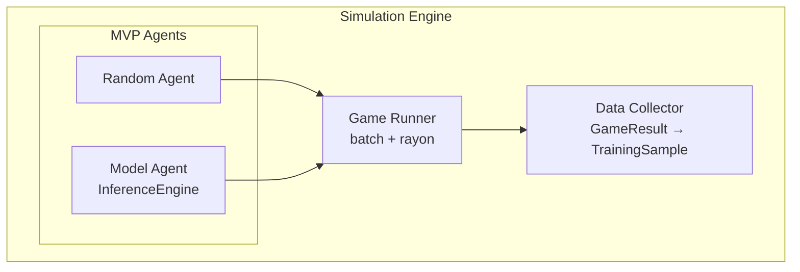

# Simulation Engine — Canonical Data Generation

> **MVP: `Random` / `Model` agents only.** Generates `TrainingSample { [f64;27], action:u8, score:u64 metadata }` for `TaskType::MultiClassification`. Headless only, no UI.

## 1. Purpose

Run thousands of 2048 games headless to generate supervised training data (`state_features → action`) for Evintkoo/automl. Batch + parallel execution; score is metadata only.

## 2. Architecture



> **MVP:** Only `Random` + `Model`. `Heuristic` / `Human` are **Appendix — reference only** (see §9). Not for automl benchmarking MVP.

## 3. Agent Types (MVP)

### 3.1 Random Agent (Baseline)

```rust
use rand_chacha::ChaCha8Rng;
pub struct RandomAgent { rng: ChaCha8Rng }
impl Agent for RandomAgent {
    fn select_move(&self, board: &Board) -> Direction {
        let valid = board.get_valid_moves(); // would_change canonical — see 02-Rules/03-valid-moves.md
        valid[self.rng.gen_range(0..valid.len())]
    }
}
```

### 3.2 Model Agent (Trained)

```rust
pub struct ModelAgent { model: InferenceEngine } // automl InferenceEngine
impl Agent for ModelAgent {
    fn select_move(&self, board: &Board) -> Direction {
        let feats = board_features(board); // [f64;27] — see 03-State/01-Board/01-board-state.md
        let logits = self.model.predict(&feats); // [f64;4]
        constrained_action(&logits, board) // via would_change — see 02-Rules/03-valid-moves.md
    }
}
```

> `board_features` → `[f64;27]` includes `score_normalized` at index 21 `log10(score+1)/6.0` — canonical grid `/32768`.

## 4. Batch Simulation

```rust
pub struct SimulationBatch {
    pub n_games: usize,           // 10000 canonical — see 03-multi-game.md
    pub agent: Box<dyn Agent>,
    pub config: BatchConfig,
}
impl SimulationBatch {
    pub fn run(&self) -> Vec<GameResult> {
        (0..self.n_games).map(|_| self.run_single_game()).collect()
    }
    pub fn run_parallel(&self) -> Vec<GameResult> {
        use rayon::prelude::*;
        (0..self.n_games).into_par_iter().map(|_| self.run_single_game()).collect()
        // NOTE: fix rayon thread count for determinism — see 02-randomness.md
    }
}
```

## 5. Game Recording

```rust
pub struct GameRecord {
    pub game_id: u64,                      // not Uuid — simple u64 for GroupKFold groups
    pub agent_type: AgentType,
    pub start_time: DateTime<Utc>,
    pub end_time: DateTime<Utc>,
    pub final_result: GameResult,
    pub move_history: Vec<MoveRecord>,     // Vec<{action:u8, score_delta:u64}>
    pub board_history: Vec<Board>,         // [u32;16] snapshots — not for training directly
    pub score_history: Vec<u64>,
}
```

## 6. Metrics (Post-Hoc on `score:u64`)

```rust
pub struct SimulationMetrics {
    pub total_games: usize,
    pub avg_score: f64,
    pub max_score: u64,
    pub median_score: u64,
    pub score_above_heuristic_rate: f64, // % > ~512 — canonical baseline
    pub percentile_50: u64,
    pub percentile_90: u64,
    pub avg_moves_per_game: f64,
    pub avg_game_duration_ms: u64,
}
/// Winner by mean score — see 01-Infrastructure/01-Project/01-project-overview.md Tiers 1–3
```

## 7. Configuration

```rust
pub struct SimulationConfig {
    pub n_games: usize,              // 10000 — canonical sample (§6 Sample Size in 03-multi-game.md)
    pub parallel: bool,              // true — rayon; fix threads via 02-randomness.md
    pub threads: usize,              // num_cpus; set to 1 for full determinism
    pub seed: u64,                   // → ChaCha8Rng; linked to TrainingConfig::with_random_state(42)
    pub agent: AgentType,            // Random | Model (MVP)
    pub output_format: OutputFormat, // Parquet | CSV
}
```

> **Seed hygiene canonical:** `02-randomness.md` — `ChaCha8Rng::seed_from_u64(seed)`, `wrapping_add` derivation, `spawn_prob_4:0.1`.

## 8. Data Output — Supervised Classification Row Only

> **Canonical:** `TaskType::MultiClassification` — row = `state_features → action`. No `reward`/`next_state`/`done`.

```rust
pub struct TrainingSample {
    pub state_features: [f64;27], // BoardStateML::to_array() — 16 grid/32768 + 11 derived, idx21 score/6.0
    pub action: u8,               // ONLY label: Direction 0–3 (Up=0,Down=1,Left=2,Right=3)
    pub score: u64,               // metadata for analysis/benchmarking ONLY, never y
}
// DataFrame: state_features:[f64;27], action:u8, score:u64, game_id:u64 (for GroupKFold groups)
// See 06-Data/02-Format/01-data-schema.md and 03-multi-game.md GameDataset { states, actions, scores }
```

> **No RL tuple.** Do not store `rewards:Vec<f64>` — violates supervised-only canonical (see `03-multi-game.md` critical fix). No `MoveSequence Vec<Board>` LSTM hint.

## 9. Appendix — Reference Only (Not MVP, Not Benchmarking Path)

> **2-line reference only.** Keep `Random`/`Model` for MVP; do not extend agents before 10k baseline.

- **HeuristicAgent** — baseline heuristic (~512) for comparison only, **not MVP benchmarking**. `HeuristicAgent { strategy: Monotonicity|Corner|Empty }` — reference only, run separately if needed.
- **HumanAgent** — `HumanAgent` interactive input — **debug-only, not for batch/benchmark**; `fn select_move(&self, _: &Board)->Direction { read_direction() }`.

## 10. Cross-References

- **Rules:** `02-Rules/01-scoring-rules.md` (score metadata), `02-win-lose-conditions.md` (would_change terminal), `03-valid-moves.md` (constrained_action)
- **State:** `03-State/01-Board/01-board-state.md` (27-dim), `03-State/01-Board/02-feature-extraction.md`
- **RNG / parallel:** `02-randomness.md` (`wrapping_add`, `TrainingConfig::with_random_state(42)`, rayon threads)
- **Dataset:** `03-multi-game.md` (`GameDataset { states:Vec<[f64;27]>, actions:Vec<u8>, scores:Vec<u64> }`)
- **Headless only:** No UI — `01-Game/04-game-ui.md` is debug stub; canonical viz `04-Visualization/01-visualization.md`
