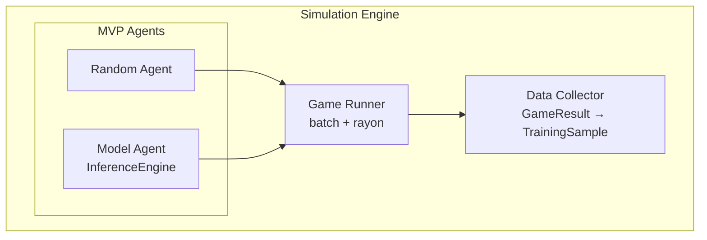

# Plan 01 — Simulation Engine: the repository status is explicit and evidence based

> **Status: PARTIAL (2026-09-26).** Reusable simulation and 10k random/heuristic score baselines are complete; the rollout-labeled training corpus remains uncollected at plan scale.

**Goal:** State the current implementation and evidence boundary for simulation engine.
**Builds on:** [00](../../00-scope-and-traceability.md) — the project is supervised 4×4 2048 policy learning, and framework evaluation is a separate research track.

---

## Decision and evidence

**This plan treats the simulator and baseline protocol as implemented, with large rollout-labeled data collection pending.** The seeded 10,000-game random and heuristic score/frequency baselines are retained in [the action-frequency report](../../../reports/action-frequency/README.md). Those runs evaluate baseline agents; they do not fulfill the separate rollout-labeled supervised corpus requirement. The collector now supports checkpoint/resume and live progress as documented by the multi-game ticket. A prior small-collection throughput estimate projects about 103 hours for the 20,000-game labeled configuration; collection remains unscheduled pending a fresh pilot and explicit compute budget.

> **Canonical supervised row:** 17 state values (16 board cells plus score) and `action:u8` for `TaskType::MultiClassification`. Ticket #034 aligns the encoder, collector, and policy with this schema. Headless only, no UI.

## 1. Purpose

Run thousands of 2048 games headless to generate supervised training data (`state_features → action`) for Evintkoo/automl. Batch + parallel execution; score is metadata only.

## 2. Architecture



> **Current paths:** Random rollout collection, model-policy benchmark games, and a separate heuristic case-study baseline are implemented. Interactive human play is out of scope; 2048 results do not validate general AutoML performance.

## 3. Agent Types

### 3.1 Random Agent (Baseline)

```rust
use rand_chacha::ChaCha8Rng;
pub struct RandomAgent { rng: ChaCha8Rng }
impl Agent for RandomAgent {
    fn select_move(&self, board: &Board) -> Direction {
        let valid = board.get_valid_moves(); // would_change canonical — see 02-Rules/03-valid-moves.md
        valid[self.rng.gen_range(0..valid.len())]
    }
}
```

### 3.2 Model Agent (Trained)

```rust
pub struct ModelAgent { model: InferenceEngine } // automl InferenceEngine
impl Agent for ModelAgent {
    fn select_move(&self, board: &Board) -> Direction {
        let feats = board_features(board); // canonical [f64;17]
        let probabilities = self.model.predict_proba(&feats); // four class probabilities
        constrained_action(&probabilities, board) // via would_change — see 02-Rules/03-valid-moves.md
    }
}
```

> The previous 27-value vector placed `score_normalized` at index 21. The canonical 17-value vector places it at index 16.

## 4. Batch Simulation

```rust
pub struct SimulationBatch {
    pub n_games: usize,           // 10000 canonical — see 03-multi-game.md
    pub agent: Box<dyn Agent>,
    pub config: BatchConfig,
}
impl SimulationBatch {
    pub fn run(&self) -> Vec<GameResult> {
        (0..self.n_games).map(|_| self.run_single_game()).collect()
    }
    pub fn run_parallel(&self) -> Vec<GameResult> {
        use rayon::prelude::*;
        (0..self.n_games).into_par_iter().map(|_| self.run_single_game()).collect()
        // NOTE: fix rayon thread count for determinism — see 02-randomness.md
    }
}
```

## 5. Game Recording

```rust
pub struct GameRecord {
    pub game_id: u64,                      // not Uuid — simple u64 for GroupKFold groups
    pub agent_type: AgentType,
    pub start_time: DateTime<Utc>,
    pub end_time: DateTime<Utc>,
    pub final_result: GameResult,
    pub move_history: Vec<MoveRecord>,     // Vec<{action:u8, score_delta:u64}>
    pub board_history: Vec<Board>,         // [u32;16] snapshots — not for training directly
    pub score_history: Vec<u64>,
}
```

## 6. Metrics (Post-Hoc on `score:u64`)

```rust
pub struct SimulationMetrics {
    pub total_games: usize,
    pub avg_score: f64,
    pub max_score: u64,
    pub median_score: u64,
    pub score_above_heuristic_rate: f64, // threshold must come from the retained comparator protocol
    pub percentile_50: u64,
    pub percentile_90: u64,
    pub avg_moves_per_game: f64,
    pub avg_game_duration_ms: u64,
}
/// Winner by mean score — see 01-Infrastructure/01-Project/01-project-overview.md Tiers 1–3
```

## 7. Configuration

```rust
pub struct SimulationConfig {
    pub n_games: usize,              // 10000 — canonical sample (§6 Sample Size in 03-multi-game.md)
    pub parallel: bool,              // true — rayon; fix threads via 02-randomness.md
    pub threads: usize,              // num_cpus; set to 1 for full determinism
    pub seed: u64,                   // → ChaCha8Rng; linked to TrainingConfig::with_random_state(42)
    pub agent: AgentType,            // Random | Model (MVP)
    pub output_format: OutputFormat, // root collector writes canonical CSV + metadata sidecar
}
```

> **Seed hygiene canonical:** `02-randomness.md` — `ChaCha8Rng::seed_from_u64(seed)`, `wrapping_add` derivation, `spawn_prob_4:0.1`.

## 8. Data Output — Supervised Classification Row Only

> **Canonical:** `TaskType::MultiClassification` — row = `state_features → action`. No `reward`/`next_state`/`done`.

```rust
pub struct TrainingSample {
    pub state_features: [f64;17], // canonical: 16 board cells plus current score; encoding is specified by state tickets
    pub action: u8,               // ONLY label: Direction 0–3 (Up=0,Down=1,Left=2,Right=3)
    pub score: u64,               // metadata for analysis/benchmarking ONLY, never y
}
// Canonical DataFrame: 17 input columns + action and provenance metadata.
// Current collector writes 27 feature columns; this is not the canonical schema.
// See 06-Data/02-Format/01-data-schema.md and 03-multi-game.md.
```

> **No RL tuple.** Do not store `rewards:Vec<f64>` — violates supervised-only canonical (see `03-multi-game.md` critical fix). No `MoveSequence Vec<Board>` LSTM hint.

## 9. Appendix — Reference Only (Not MVP, Not Benchmarking Path)

> **2-line reference only.** Keep `Random`/`Model` for MVP; do not extend agents before 10k baseline.

- **HeuristicAgent** — root heuristic policy is a measured case-study baseline. Retained scores are described in the action-frequency report; do not treat them as general AutoML evidence or a fixed threshold.
- **HumanAgent** — `HumanAgent` interactive input — **debug-only, not for batch/benchmark**; `fn select_move(&self, _: &Board)->Direction { read_direction() }`.

## 10. Cross-References

- **Rules:** `02-Rules/01-scoring-rules.md` (score metadata), `02-win-lose-conditions.md` (would_change terminal), `03-valid-moves.md` (constrained_action)
- **State:** Plan 00 defines the 17-value training input, implemented by ticket #034. The former 27-feature vector is documented separately in `03-State/01-Board/02-feature-extraction.md`.
- **RNG / parallel:** `02-randomness.md` (`wrapping_add`, `TrainingConfig::with_random_state(42)`, rayon threads)
- **Dataset:** `03-multi-game.md`; canonical state rows contain 17 values.
- **Headless only:** No UI — `01-Game/04-game-ui.md` is debug stub; canonical viz `04-Visualization/01-visualization.md`

## Implementation Record

- `src/game_engine/mod.rs` implements the seeded reusable simulator, checked policy moves, game results, deterministic game-ID batch helper, and rollout relabeler.
- `src/main.rs` collects games through a fixed-size Rayon pool, writes canonical CSV plus row-aligned metadata and a manifest, and exposes random/heuristic baseline and model benchmark paths. The root does not write Parquet and does not yet checkpoint rollout collection.
- Validation: root tests passed 30/30 during #006. The 10k random/heuristic baseline runs and manifests are retained in the linked report. Rollout-labeled corpus remains unrun at plan scale; the prior 20k configuration estimate is about 103 hours. Checkpoint/resume and live progress are implemented, but obtain a fresh pilot and declared compute budget before scheduling the corpus.

---

## Verification (definition of done)

1. `test -f plans/02-Environment/03-Simulation-Engine/01-simulation-engine.md` exits 0.
2. `grep -q '^# Plan 01 — ' plans/02-Environment/03-Simulation-Engine/01-simulation-engine.md` exits 0.
3. `grep -q '^> \\*\\*Status:' plans/02-Environment/03-Simulation-Engine/01-simulation-engine.md` exits 0.
4. `grep -q '^\*\*Goal:' plans/02-Environment/03-Simulation-Engine/01-simulation-engine.md` exits 0.
5. `grep -q '^## Decision and evidence$' plans/02-Environment/03-Simulation-Engine/01-simulation-engine.md` exits 0.
6. `grep -q '^## Open questions$' plans/02-Environment/03-Simulation-Engine/01-simulation-engine.md` exits 0.
7. `grep -q '^## Later$' plans/02-Environment/03-Simulation-Engine/01-simulation-engine.md` exits 0.
8. `bash /Users/evintleovonzko/Documents/works/kolosal/planout2/v2-ai-express/.claude/skills/writing-planout-plans/check-plan.sh plans/02-Environment/03-Simulation-Engine/01-simulation-engine.md` exits 0.

## Open questions

- **The plan-scale evidence remains bounded by current results.** Game-score baselines have 10,000 games per random/heuristic agent. Rollout-labeled data collection at the plan's sample size is still pending; the prior smoke throughput estimate projects about 103 hours for 20,000 games. Checkpoint/resume and live progress are implemented, but a fresh pilot and explicit compute budget are still required.

## Later

- **Pilot and collect the rollout-labeled corpus after a compute budget is declared.** The baseline game runs do not substitute for this data-generation deliverable.
