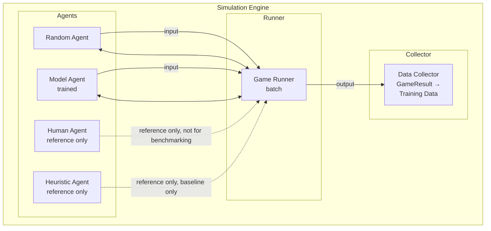

# Simulation Engine

## 1. Purpose

The simulation engine runs thousands of 2048 games to generate training data for the ML model. It supports different agent strategies for data collection.

## 2. Architecture



> **MVP: Only `Random` / `Model` agents.** `Human Agent` is **reference only, not for automl benchmarking**. `HeuristicAgent` is **reference/baseline only**, not MVP benchmarking path.

## 3. Agent Types

### 3.1 Random Agent

```rust
pub struct RandomAgent {
    rng: ChaCha8Rng,
}

impl Agent for RandomAgent {
    fn select_move(&self, board: &Board) -> Direction {
        let valid = board.get_valid_moves();
        valid[self.rng.gen_range(0..valid.len())]
    }
}
```

**Purpose:** Baseline comparison, data generation when no model is available.

### 3.2 Model Agent

```rust
pub struct ModelAgent {
    model: InferenceEngine,  // automl model
}

impl Agent for ModelAgent {
    fn select_move(&self, board: &Board) -> Direction {
        let features = board_features(board);
        let outputs = self.model.predict(&features);
        output_to_action(&outputs)
    }
}
```

**Purpose:** Trained model evaluates board states and selects moves.

### 3.3 Heuristic Agent — Reference Only (Baseline)

> **Reference only, not for automl benchmarking.** Keep `Random` / `Model` for MVP; heuristic is separate baseline agent only.

```rust
pub struct HeuristicAgent {
    strategy: HeuristicStrategy,
}

impl Agent for HeuristicAgent {
    fn select_move(&self, board: &Board) -> Direction {
        match self.strategy {
            HeuristicStrategy::Monotonicity => best_monotonic_move(board),
            HeuristicStrategy::Corner => best_corner_move(board),
            HeuristicStrategy::Empty => best_empty_tile_move(board),
        }
    }
}
```

**Purpose:** Baseline heuristic comparison — **out of scope for MVP automl pipeline**, run separately if needed.

### 3.4 Human Agent — Reference Only, Not for Benchmarking

> **Reference only, not for automl benchmarking.** Interactive human input is debug-only; not used in batch simulation or model evaluation for MVP.

```rust
// Reference only — not executed in MVP batch
pub struct HumanAgent;
impl Agent for HumanAgent {
    fn select_move(&self, board: &Board) -> Direction { read_direction() }
}
```

## 4. Batch Simulation

```rust
pub struct SimulationBatch {
    pub n_games: usize,
    pub agent: Box<dyn Agent>,
    pub config: BatchConfig,
}

impl SimulationBatch {
    pub fn run(&self) -> Vec<GameResult> {
        (0..self.n_games)
            .map(|_| self.run_single_game())
            .collect()
    }
    
    pub fn run_parallel(&self) -> Vec<GameResult> {
        use rayon::prelude::*;
        (0..self.n_games)
            .into_par_iter()
            .map(|_| self.run_single_game())
            .collect()
    }
}
```

## 5. Game Recording

Every game records the complete state history:

```rust
pub struct GameRecord {
    pub game_id: Uuid,
    pub agent_type: AgentType,
    pub start_time: DateTime<Utc>,
    pub end_time: DateTime<Utc>,
    pub final_result: GameResult,
    pub move_history: Vec<MoveRecord>,     // Each move + state
    pub board_history: Vec<BoardSnapshot>,  // Board at each step
    pub score_history: Vec<u64>,           // Score progression
}
```

## 6. Performance Metrics

```rust
pub struct SimulationMetrics {
    pub total_games: usize,
    pub games_played: usize,
    pub avg_score: f64,
    pub max_score: u64,
    pub median_score: u64,
    pub score_above_heuristic_rate: f64,     // % of games exceeding heuristic baseline (~512)
    pub percentile_50: u64,                  // 50th percentile score
    pub percentile_90: u64,                  // 90th percentile score
    pub avg_moves_per_game: f64,
    pub avg_game_duration_ms: u64,
}
```

## 7. Configuration

```rust
pub struct SimulationConfig {
    pub n_games: usize,            // Default: 10000
    pub parallel: bool,             // Default: true
    pub threads: usize,             // Default: num_cpus
    pub seed: u64,                  // For reproducibility
    pub agent: AgentType,           // Random, Model, Heuristic
    pub log_level: LogLevel,
    pub output_format: OutputFormat, // JSON, CSV, Parquet
}
```

## 8. Data Output — Supervised Classification Row (No RL Tuple)

> **Canonical paradigm:** `TaskType::MultiClassification` — each row is `state_features → action`. Score is optional metadata, never a label. No `reward` / `next_state` / `done`.

```rust
// Output structure for training data — supervised classification
pub struct TrainingSample {
    pub state_features: [f64; 27],    // Board features (27-dim, includes score feature at index 21)
    pub action: u8,                   // Supervised label: Direction (0-3) — the ONLY target
    pub score: u64,                   // Metadata for analysis/benchmarking only, NOT a training label
}
// DataFrame / CSV row: state_features: [f64;27], action: u8, score: u64 (metadata)
```

