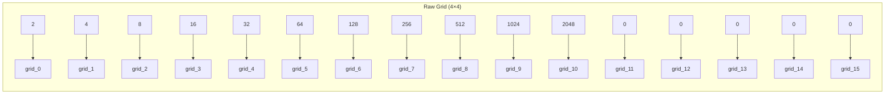

# Feature Extraction

## 1. Purpose

Extract meaningful features from the raw board state that the ML model can use to predict the best move.

## 2. Raw Features (16 dimensions)

The raw grid values flattened to a 16-dimensional vector:



## 3. Derived Features (11 additional dimensions)

### 3.1 Empty Tiles Count

```rust
fn empty_count(grid: &[u32; 16]) -> usize {
    grid.iter().filter(|&&v| v == 0).count()
}
```

**Rationale:** More empty tiles = more future options = better position.

### 3.2 Max Tile (Log)

```rust
fn max_tile_log(grid: &[u32; 16]) -> f64 {
    let max = grid.iter().copied().max().unwrap_or(0);
    if max > 0 { (max as f64).log2() / 15.0 } else { 0.0 }
}
```

**Rationale:** Normalized log-scale of the highest tile value.

### 3.3 Monotonicity

```rust
fn monotonicity(grid: &[u32; 16]) -> f64 {
    // Row monotonicity (each row sorted ascending or descending)
    // Column monotonicity (each column sorted ascending or descending)
    // Score: proportion of rows/columns that are monotonic
    let row_score = calculate_row_monotonicity(grid);
    let col_score = calculate_col_monotonicity(grid);
    (row_score + col_score) / 2.0
}
```

**Rationale:** Monotonic boards tend to perform better in 2048.

### 3.4 Smoothness

```rust
fn smoothness(grid: &[u32; 16]) -> f64 {
    // Average absolute difference between adjacent tiles
    // Lower = smoother = better
    let mut diff_sum = 0;
    for i in 0..4 {
        for j in 0..4 {
            if j < 3 { diff_sum += (grid[i*4+j] as i32 - grid[i*4+j+1] as i32).abs(); }
            if i < 3 { diff_sum += (grid[i*4+j] as i32 - grid[(i+1)*4+j] as i32).abs(); }
        }
    }
    1.0 / (1.0 + diff_sum as f64 / 100.0)  // Normalized
}
```

**Rationale:** Smoother boards have fewer merge opportunities wasted on large differences.

### 3.5 Corner Max

```rust
fn corner_max(board: &Board) -> f64 {
    // Max tile in corner (canonical: normalized by 32768)
    board.corner_tile() as f64 / 32768.0
}
```

**Rationale:** Keeping the max tile in a corner is a common optimal strategy.

### 3.6 Edge Tiles Occupied

```rust
fn edge_tiles_occupied(board: &Board) -> f64 {
    // Count occupied edge cells (12 edge positions) / 12
    board.edge_tiles_occupied() as f64 / 12.0
}
```

### 3.7 Merges Available

```rust
fn merges_available(grid: &[u32; 16]) -> usize {
    // Count pairs of adjacent equal tiles
}
```

### 3.8 Score Normalized

```rust
fn score_normalized(score: u64) -> f64 {
    (score as f64 + 1.0).log10() / 6.0
}
```

### 3.9 Adjacency Merge Score

```rust
fn adjacency_merge_score(board: &Board) -> f64 {
    // Sum of adjacent equal tile values / 16 (canonical)
    board.adjacency_merge_score()
}
```

### 3.10 Column Worst

```rust
fn col_worst(board: &Board) -> f64 {
    board.column_worst() // min column sum / 8192
}
```

### 3.11 Row Worst

```rust
fn row_worst(board: &Board) -> f64 {
    board.row_worst() // min row sum / 8192
}
```

## 4. Complete Feature Vector (27 dimensions)

```
[grid_0, grid_1, ..., grid_15, empty_count, max_tile_log,
 monotonicity, smoothness, merges_available, score_normalized,
 adjacency_merge_score, corner_max, edge_tiles_occupied,
 col_worst, row_worst]
```

## 5. Feature Importance Analysis

```rust
// After training, check which features the model found important
pub struct FeatureImportance {
    pub grid_importance: [f64; 16],      // Per-cell importance
    pub derived_importance: [f64; 11],     // Per-derived-feature importance
    pub total_importance: [f64; 27],       // Combined
}
```

## 6. Feature Engineering Strategies

| Strategy | Features | Purpose |
|----------|----------|---------|
| Raw grid | 16 | Direct board representation |
| Statistical | 5 | Board statistics |
| Strategic | 4 | Monotonicity, smoothness, etc. |
| Combined | 27 | All features together |
| Reduced | 10 | PCA-selected features |

## 7. Feature Normalization Pipeline

```rust
use automl::preprocessing::{DataPreprocessor, PreprocessingConfig, ScalerType};

let preprocessor = DataPreprocessor::new(
    PreprocessingConfig::default()
        .with_scaler(ScalerType::Standard)  // Z-score normalization (real API: with_scaler)
);
let features = preprocessor.fit_transform(&raw_features)?;
```

## 8. Feature Validation — Future Research, Not MVP

> **Future research, not MVP; expected importance TBD post-training.** Sections 8.2–8.6 (SHAP / AblationStudy / importance ranking) are **not MVP** — do not block training on invented numbers (e.g., 0.22). Validate importance after model is trained; treat numbers below as qualitative hypotheses.

### 8.1 Purpose

Validate that the extracted features are meaningful, non-redundant, and contribute to model performance. Feature validation ensures the model is not learning spurious correlations and that each feature provides genuine predictive signal.

### 8.2 Verifying Feature Importance — Future Research (Not MVP)

> **Future research, not MVP.** SHAP/consistency checks TBD post-training.

After training, verify feature importance using multiple methods to confirm consistency:

```rust
pub struct FeatureValidationResult {
    pub feature_names: Vec<String>,
    pub permutation_importance: Vec<f64>,      // Permutation-based importance
    pub impurity_importance: Vec<f64>,          // Tree-based impurity decrease
    pub shap_values: Vec<f64>,                  // SHAP values for model-agnostic importance
    pub consistency_score: f64,                 // Correlation between importance methods
}
```

**Validation methods**:
1. **Permutation importance**: Shuffle each feature's values and measure the drop in model accuracy. A good feature causes a significant accuracy drop when shuffled.
2. **Impurity importance**: For tree-based models, measure the total reduction in impurity (Gini/entropy) contributed by each feature.
3. **SHAP values**: Compute SHAP values to understand the direction and magnitude of each feature's contribution to predictions.
4. **Consistency check**: The ranking of features by permutation importance and impurity importance should correlate at least ρ ≥ 0.7.

### 8.3 What Constitutes a "Good" Feature Set

A good feature set satisfies all of the following criteria:

| Criterion | Threshold | Description |
|-----------|-----------|-------------|
| No redundancy | Pairwise correlation < 0.8 | Features should not be near-duplicates |
| Non-zero importance | Permutation importance > 0.01 | Each feature must contribute meaningfully |
| Low variance ratio | > 95% of features have variance > 0.01 | No near-constant features |
| Model performance gain | Δ accuracy > 2% | Removing any feature degrades accuracy by > 2% |
| Domain coherence | All features have interpretable meaning | No unexplained features |

**Minimum feature set for 2048** (domain-informed):

```rust
pub const REQUIRED_FEATURES: [&str; 5] = [
    "max_tile_log",         // Single most important strategic indicator
    "empty_count",          // Second most important — future mobility
    "monotonicity",         // Critical for positional play
    "smoothness",           // Important for merge efficiency
    "corner_max",           // Key heuristic for board control
];
```

### 8.4 Ablation Studies — Future Research (Not MVP)

> **Future research, not MVP.** Full ablation (27 retrains) is post-MVP research; MVP may do minimal smoke-check only.

Systematically remove features one at a time to measure their individual contribution:

```rust
pub struct AblationStudy {
    pub baseline_accuracy: f64,           // All 27 features
    pub results: Vec<AblationResult>,     // Results per feature removed
    pub critical_features: Vec<String>,   // Features whose removal causes >5% drop
    pub redundant_features: Vec<String>,  // Features whose removal causes <1% drop
}

pub struct AblationResult {
    pub feature_name: String,
    pub accuracy_without: f64,
    pub accuracy_drop: f64,               // baseline_accuracy - accuracy_without
    pub rank_impact: usize,               // Rank by impact magnitude
}
```

**Ablation procedure**:

1. Train the full model with all 27 features → record baseline accuracy
2. For each feature i (i = 1 to 27):
   - Remove feature i from the dataset
   - Retrain the model with remaining 26 features
   - Record the accuracy change
3. Rank features by the magnitude of accuracy drop
4. Identify critical features (drop > 5%) and redundant features (drop < 1%)

### 8.5 Expected Feature Importance Ranking — Hypothesis Only (TBD Post-Training)

> **Not MVP — TBD post-training.** Numbers below are qualitative hypotheses, not measured values. Do not treat as ground truth; replace with empirical importance after training.

Based on 2048 domain knowledge (hypothesis only):

```rust
// Hypothesis — to be validated post-training, not a specification
pub const EXPECTED_IMPORTANCE_RANKING: &[&str] = &[
    // Tier 1: Hypothesized critical (to be measured)
    "max_tile_log", "empty_count", "corner_max",
    // Tier 2: Hypothesized important
    "monotonicity", "smoothness", "merges_available", "edge_tiles_occupied",
    // Tier 3: Hypothesized moderate
    "score_normalized", "adjacency_merge_score", "col_worst", "row_worst",
    // Tier 4: Raw grid cells — hypothesized diminishing importance
    // Empirical values TBD post-training; avoid invented precision like 0.22/0.18
];
```

**Domain rationale**:

- **`max_tile_log`** is the strongest predictor because having a high tile is the primary objective of 2048 — boards with higher maximum tiles are objectively in better positions
- **`empty_count`** captures board capacity; more empty tiles means more future merge opportunities and lower risk of game over
- **`corner_max`** reflects the corner-positioning heuristic that top players use; the top-left corner (or another fixed corner) is where the max tile should ideally reside
- **`monotonicity`** and **`smoothness`** capture the spatial structure of the board; monotonic boards are easier to merge tiles on, and smooth boards minimize wasted merge potential
- **Raw grid cells** have lower importance individually because their signal is captured by the derived strategic features, but they still provide useful granular information about specific board positions

### 8.6 Validation Checklist

Before proceeding to model training, verify:

```rust
pub struct FeatureValidationChecklist {
    pub all_features_non_constant: bool,
    pub pairwise_correlation_below_threshold: bool,
    pub ablation_critical_features_identified: bool,
    pub importance_ranking_matches_domain_knowledge: bool,
    pub permutation_and_impurity_consistent: bool,
    pub no_leaking_features_present: bool,
}
```

**Checks**:
- [ ] All 27 features have non-zero variance
- [ ] No feature has pairwise correlation > 0.8 with another feature
- [ ] Ablation study identifies at least 3 critical features
- [ ] Feature importance ranking aligns with expected ranking (Section 8.5)
- [ ] Permutation importance and impurity importance rankings correlate ρ ≥ 0.7
- [ ] No feature is a direct label leakage (e.g., the score of the current game should not be used as a feature if it reveals the label)
- [ ] All features are computable from the raw board state without access to future game states
