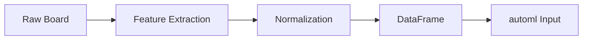

# State Encoding

## 1. Encoding Strategy

The board state must be encoded in a format compatible with the automl framework's `TrainingConfig` and `DataFrame` input.

## 2. Encoding Formats

### 2.1 CSV Format (for automl training)

```csv
# Canonical: 27 features + action (28 cols); score stored separately for analysis only
grid_0,grid_1,grid_2,grid_3,grid_4,grid_5,grid_6,grid_7,grid_8,grid_9,grid_10,grid_11,grid_12,grid_13,grid_14,grid_15,empty_count,max_tile_log,monotonicity,smoothness,merges_available,score_normalized,adjacency_merge_score,corner_max,edge_tiles_occupied,col_worst,row_worst,action
0.0,0.00006,0.00012,0.00024,0.00098,0.00195,0.0039,0.0078,0.0156,0.03125,0.0625,0.0,0.0,0.0,0.0,0.0,0.5,0.73,0.8,0.72,0.125,0.15,0.03,0.06,0.5,0.02,0.03,2
```

### 2.2 Parquet Format (for large datasets)

```rust
use polars::prelude::*;

/// 27-D feature table + action labels; scores are for analysis only, not training label
fn create_dataframe(states: &[[f64; 27]], actions: &[u8]) -> DataFrame {
    // Create polars DataFrame from collected data: 27 features + 1 label
}
```

### 2.3 JSON Format (for debugging)

```json
{
  "state": {
    "grid": [2, 4, 8, 16, 32, 64, 128, 256, 512, 1024, 2048, 0, 0, 0, 0, 0],
    "score": 4092,
    "empty_count": 5,
    "max_tile_log": 11.0,
    "monotonicity": 0.8
  },
  "action": 1,
  "score": 2048,
  "game_over": false
}
```

## 3. Encoding Pipeline



## 4. Board to Feature Conversion

```rust
pub fn board_to_encoding(board: &Board) -> [f64; 27] {
    let mut encoding = [0.0f64; 27];
    
    // Grid values (normalized to 0-1 range)
    for i in 0..16 {
        encoding[i] = board.grid[i / 4][i % 4].unwrap_or(0) as f64 / 32768.0;
    }
    
    // Derived features — canonical 11 in order: 16 empty_count ... 26 row_worst
    encoding[16] = board.empty_cells() as f64 / 16.0;
    encoding[17] = (board.max_tile() as f64 + 1.0).log2() / 15.0;
    encoding[18] = board.monotonicity();
    encoding[19] = board.smoothness();
    encoding[20] = board.possible_merges() as f64 / 16.0;
    encoding[21] = (board.score as f64 + 1.0).log10() / 6.0;
    encoding[22] = board.adjacency_merge_score();
    encoding[23] = board.corner_tile() as f64 / 32768.0;
    encoding[24] = board.edge_tiles_occupied() as f64 / 12.0;
    encoding[25] = board.column_worst();
    encoding[26] = board.row_worst();
    
    encoding
}
```

## 5. Data Type Mapping for automl — Classification Only

| Feature Type | automl Type | Range | Role |
|-------------|-------------|-------|------|
| Grid values | Float64 | 0.0 - 1.0 | Feature (indices 0–15) |
| Count features | Float64 | 0.0 - 1.0 | Feature |
| Score | Float64 | 0.0 - 1.0 | Feature (index 21, `log10(score+1)/6`) — never a target |
| Action (target) | UInt8 / Float64 | 0–3 | **ONLY supervised label** (`TaskType::MultiClassification`) |

> **No `Final score` target.** Score is metadata/benchmark only.

## 6. Target Encoding (Action → Direction) — Classification

```rust
// Action is encoded as a discrete class 0..3 for MultiClassification
pub enum ActionEncoding {
    Up = 0,
    Down = 1,
    Left = 2,
    Right = 3,
}

// Classification: 4 logits → argmax; action with highest logit is selected
// No regression — model does not predict a continuous score or direction value
```

## 7. Encoding Validation

```rust
pub fn validate_encoding(encoding: &[f64; 27]) -> Result<()> {
    // All values must be finite
    // Grid values must be in [0, 1]
    // Count features must be in [0, 1]
    // No NaN or Infinity
    encoding.iter().all(|&v| v.is_finite()).then_some(()).ok_or(...)
}
```

## 8. Encoding for Different Model Types

| Model Type | Input Format | Notes |
|------------|-------------|-------|
| Linear Models | Normalized [f64; 27] | Requires normalization |
| Tree Models | Any numeric | Handles raw values |
| Neural Networks | Normalized [f64; 27] | Strictly requires normalization |
| SVM | Normalized | Requires scaling |
| KNN | Normalized | Distance-based, needs scaling |

## 9. State Serialization

```rust
// Save encoded states for later use
pub fn save_encoded_states(states: &[BoardStateML], path: &str) -> Result<()> {
    let df = create_dataframe(states)?;
    df.write_parquet(path, &ParquetWriteOptions::default())?;
}

// Load encoded states
pub fn load_encoded_states(path: &str) -> Result<DataFrame> {
    let df = read_parquet(path)?;
    Ok(df)
}
```
