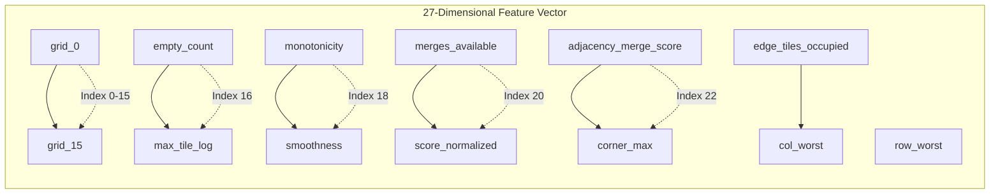

# Score as Feature

## 1. Concept

The current score provides context for the board state, helping the model understand the game progression and make better decisions.

## 2. Score Features

### 2.1 Raw Score

```rust
pub struct ScoreFeatures {
    pub current_score: f64,            // Normalized current score
    pub score_delta: f64,              // Score gained last turn
    pub avg_score_per_move: f64,       // Running average
    pub score_momentum: f64,           // Rate of score change
}
```

### 2.2 Normalized Score

```rust
fn normalize_score(score: u64) -> f64 {
    // Log10 normalization for better model performance
    (score as f64 + 1.0).log10() / 6.0  // Max theoretical ~1,300,000 → ~6.1
}
```

## 3. Score in Feature Vector

Score is one component of the 27-dimensional feature vector:



> **Note:** The feature vector is structured as follows (canonical 11 derived in order):
> - **Indices 0-15**: Grid values (raw tile values)
> - **Index 16**: Empty tile count
> - **Index 17**: Max tile (log)
> - **Index 18**: Monotonicity
> - **Index 19**: Smoothness
> - **Index 20**: Merges available
> - **Index 21**: Score (normalized) — `log10(score+1)/6.0`
> - **Index 22**: Adjacency merge score
> - **Index 23**: Corner max
> - **Index 24**: Edge tiles occupied
> - **Index 25**: Column worst
> - **Index 26**: Row worst

## 4. Score vs. Target Distinction — Score Is Never the Target

| Aspect | Score as Feature | Score as Target |
|--------|-----------------|-----------------|
| Purpose | Input context (index 21 of 27-dim vector) | **Not applicable — no score target exists** |
| When used | Current game state | Never — action `0..3` is the target |
| Direction | Input to model | N/A |
| Normalization | `log10(score+1)/6.0` for feature only | N/A |
| Training role | `X` (input feature) | **Not `y`** — `y` is `action: u8` (`TaskType::MultiClassification`) |

> **Canonical paradigm:** `27-dim features → 4 logits → argmax` to predict `action`. Score, if stored, is `score: u64` **metadata for analysis/benchmarking only** (mean score, distribution). Do not train or evaluate with regression targets.

## 5. Score Progression Features

```rust
pub struct ScoreProgression {
    pub scores: Vec<f64>,                // Score after each move
    pub deltas: Vec<f64>,                // Score change per move
    pub moving_avg: Vec<f64>,            // Moving average
    pub acceleration: Vec<f64>,          // Rate of acceleration
}
```

## 6. Score-Based Heuristics (Analysis Only — Not Training Labels)

Score may be used for **analysis/filtering only**, never as a label:

```rust
// Filter samples for analysis by game score metadata (score is not the label)
let high_score_samples: Vec<_> = all_samples
    .iter()
    .filter(|s| s.score > 2048)
    .collect();

// Weight samples by score metadata if needed — label remains `action`
let weighted_samples: Vec<_> = all_samples
    .iter()
    .map(|s| (s, s.score as f64))  // weight only, not target
    .collect();
```

## 7. Score in Model Evaluation — Game-Score Benchmark, Not Regression

The model's **action** prediction quality is evaluated with classification metrics; game score is a separate downstream benchmark:

```rust
// Classification evaluation (primary) — predicted actions vs true actions 0..3
let accuracy = accuracy_score(&predicted_actions, &true_actions);
let f1 = f1_score(&predicted_actions, &true_actions, Average::Macro);

// Game-score benchmark (separate, downstream consequence of action quality)
// Run the policy in the simulator and measure mean game score — not MSE/R² on scores
let mean_game_score = benchmark_mean_score(&model, n_games);
```

## 8. Score Distribution Analysis

```rust
pub fn analyze_score_distribution(scores: &[u64]) -> ScoreDistribution {
    ScoreDistribution {
        count: scores.len(),
        mean: scores.iter().sum::<u64>() as f64 / scores.len() as f64,
        median: median(scores),
        std_dev: std_dev(scores),
        skewness: skewness(scores),
        kurtosis: kurtosis(scores),
    }
}
```
