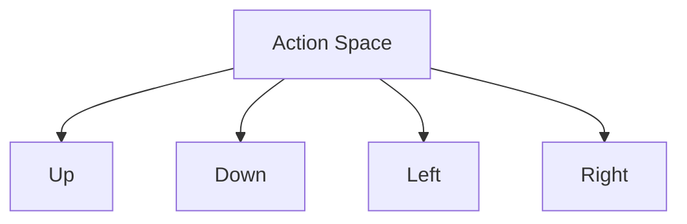

# Plan 01 — Action Space Definition: the repository status is explicit and evidence based

> **Status: COMPLETE (2026-09-27).** Four direction codes and board-dependent validity are implemented and tested.

**Goal:** State the current implementation and evidence boundary for action space definition.
**Builds on:** [00](../../00-scope-and-traceability.md) — the project is supervised 4×4 2048 policy learning, and framework evaluation is a separate research track.

---

## Decision and evidence

**This plan treats the four-action interface as implemented.** `Direction` in `src/game_engine/mod.rs` defines codes 0 through 3 and rejects other codes. `RawBoardState::get_valid_moves` derives legal actions by checking whether each direction changes the board. `src/actions.rs` masks invalid predictions, preserves action-order tie breaking, and errors when no action is available.

> **Canonical action space — single source.** `04-Actions/02-Space/01-discrete-actions.md` references this file.

## 1. Overview

The action space defines all possible moves that can be taken in the 2048 game. The ML model outputs a prediction from this space.

## 2. Discrete Actions

The 2048 game has exactly 4 possible actions:



| Action | Value | Description |
|--------|-------|-------------|
| Up | 0 | Shift all tiles upward |
| Down | 1 | Shift all tiles downward |
| Left | 2 | Shift all tiles leftward |
| Right | 3 | Shift all tiles rightward |

## 3. Action Space Properties

- **Size**: 4 discrete actions
- **Type**: Categorical / Discrete
- **Deterministic**: Each action produces a deterministic board transformation
- **Constraints**: Some actions may be invalid if they don't change the board state

## 4. Action Validity

Not all actions are valid at every state. The code uses `RawBoardState::get_valid_moves` and `valid_mask`; the snippet below is explanatory pseudocode:

```rust
pub fn valid_actions(grid: &[u32; 16]) -> Vec<u8> {
    let mut valid = Vec::new();
    for action in 0..4 {
        if would_change_board(grid, action) {
            valid.push(action);
        }
    }
    valid
}
```

## 5. Action Space for automl

The action space is encoded as a classification target for automl models:

```rust
pub struct ActionSpaceConfig {
    pub num_actions: usize,          // 4
    pub action_type: ActionType,     // Discrete
    pub encoding: EncoderType,      // automl uses EncoderType (not EncodingType) — One-hot or Label
}
```

## 6. Relationship to 04-Actions Directory

The action space definition feeds into:
- `03-State/` modules that consume action outputs
- `04-Actions/02-Space/` for constraint validation
- `04-Actions/03-Mapping/` for model-output-to-action conversion

## Implementation Record

- `Direction` is encoded exactly as `0=Up, 1=Down, 2=Left, 3=Right`; invalid integer actions return an error. `RawBoardState::get_valid_moves` and `valid_mask` compute state-dependent validity.
- `src/actions.rs` applies a validity mask to model scores, breaks ties in action order, and reports an error for terminal boards. Root tests cover those behaviors.

---

## Verification (definition of done)

1. `test -f plans/04-Actions/01-Action/01-action-space.md` exits 0.
2. `grep -q '^# Plan 01 — ' plans/04-Actions/01-Action/01-action-space.md` exits 0.
3. `grep -q '^> \\*\\*Status:' plans/04-Actions/01-Action/01-action-space.md` exits 0.
4. `grep -q '^\*\*Goal:' plans/04-Actions/01-Action/01-action-space.md` exits 0.
5. `grep -q '^## Decision and evidence$' plans/04-Actions/01-Action/01-action-space.md` exits 0.
6. `grep -q '^## Open questions$' plans/04-Actions/01-Action/01-action-space.md` exits 0.
7. `grep -q '^## Later$' plans/04-Actions/01-Action/01-action-space.md` exits 0.
8. `bash /Users/evintleovonzko/Documents/works/kolosal/planout2/v2-ai-express/.claude/skills/writing-planout-plans/check-plan.sh plans/04-Actions/01-Action/01-action-space.md` exits 0.

## Open questions

- No action-space implementation gap remains in this ticket. Action frequency and policy quality are empirical evaluation questions covered by later evaluation tickets.

## Later

- **Complete the remaining research or implementation work recorded above.** It stays deferred until its prerequisites, compute budget, and measurable acceptance evidence are available.
