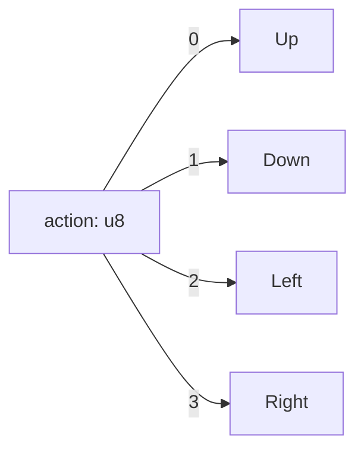

# Plan 02 — Action Encoding: the repository status is explicit and evidence based

> **Status: COMPLETE (2026-09-27).** Integer direction labels and CSV label validation are implemented.

**Goal:** State the current implementation and evidence boundary for action encoding.
**Builds on:** [00](../../00-scope-and-traceability.md) — the project is supervised 4×4 2048 policy learning, and framework evaluation is a separate research track.

---

## Decision and evidence

**This plan treats integer action encoding as implemented.** `Direction` has stable `repr(u8)` values 0 through 3, `try_from_action` rejects other values, and the data pipeline validates action labels in the same range. Training uses the integer `action` classification target; the root data path does not manually one-hot encode it.

> **Canonical:** `01-action-space.md` — 4 discrete actions. This file = label encoding. **No one-hot / binary / multi-output.**
> **automl handles encoding internally** via `EncoderType` — do not manually expand `action` to 4 dims.

## 1. Integer Encoding — The Only Encoding

| Integer `u8` | Direction |
|--------------|-----------|
| 0 | Up |
| 1 | Down |
| 2 | Left |
| 3 | Right |



```rust
pub fn encode_action(dir: Direction) -> u8 { dir as u8 } // 0..3
pub fn decode_action(a: u8) -> Option<Direction> {
    match a { 0=>Some(Up),1=>Some(Down),2=>Some(Left),3=>Some(Right), _=>None }
}
```

## 2. Why No One-Hot / Binary

> **Deleted:** §2.2 One-Hot 4-dim and §2.3 Binary 2-dim were hallucinated multi-output — task is `TaskType::MultiClassification` with **integer label** `0..3`, not 4 regression heads. automl's `EncoderType` / classifier handles internal encoding; user code stays `u8`.

If a model needs one-hot internally, automl applies `EncoderType::OneHot` via `PreprocessingConfig` — not in user `TrainingSample`.

## 3. automl Target

```rust
let config = TrainingConfig::new(TaskType::MultiClassification, "action")
    .with_model(ModelType::RandomForest);
// action column is UInt8 0..3 — automl treats as categorical label
```

## 4. Decoding Model Output

```rust
// Four class probabilities → checked argmax over valid action IDs.
pub fn decode_action(
    probabilities: &[f64; 4],
    valid: &[u8],
) -> Result<u8, ActionError> {
    masked_argmax(probabilities, valid)
}
```
Canonical `masked_argmax` in `03-Mapping/01-model-output-to-action.md`.

## 5. Path References

- `01-action-space.md` — action definitions.
- `03-Mapping/01-model-output-to-action.md` — class probabilities → action.
- `automl/src/training/config.rs:11` `TaskType::MultiClassification`.

## Implementation Record

- `Direction::try_from_action` and `Direction as u8` implement the integer label mapping without a one-hot user-data encoding. `data_pipeline.rs` validates parsed CSV labels and in-memory samples in `0..=3`; `main.rs` trains the action classification target.

---

## Verification (definition of done)

1. `test -f plans/04-Actions/01-Action/02-action-encoding.md` exits 0.
2. `grep -q '^# Plan 02 — ' plans/04-Actions/01-Action/02-action-encoding.md` exits 0.
3. `grep -q '^> \\*\\*Status:' plans/04-Actions/01-Action/02-action-encoding.md` exits 0.
4. `grep -q '^\*\*Goal:' plans/04-Actions/01-Action/02-action-encoding.md` exits 0.
5. `grep -q '^## Decision and evidence$' plans/04-Actions/01-Action/02-action-encoding.md` exits 0.
6. `grep -q '^## Open questions$' plans/04-Actions/01-Action/02-action-encoding.md` exits 0.
7. `grep -q '^## Later$' plans/04-Actions/01-Action/02-action-encoding.md` exits 0.
8. `bash /Users/evintleovonzko/Documents/works/kolosal/planout2/v2-ai-express/.claude/skills/writing-planout-plans/check-plan.sh plans/04-Actions/01-Action/02-action-encoding.md` exits 0.

## Open questions

- Internal categorical encoding is handled by the model framework; this repository stores labels as integers in the four-class action space.

## Later

- **Complete the remaining research or implementation work recorded above.** It stays deferred until its prerequisites, compute budget, and measurable acceptance evidence are available.
