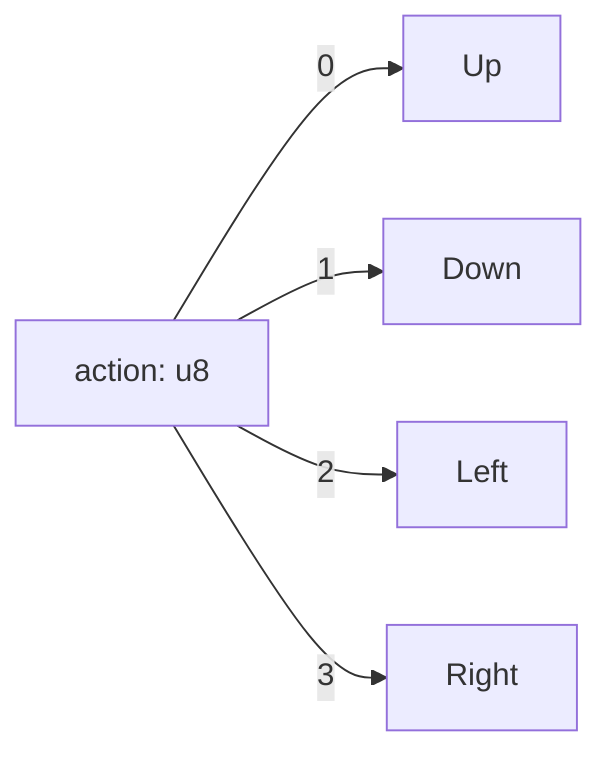

# Action Encoding — Integer 0..3 Only

> **Canonical:** `01-action-space.md` — 4 discrete actions. This file = label encoding. **No one-hot / binary / multi-output.**
> **automl handles encoding internally** via `EncoderType` — do not manually expand `action` to 4 dims.

## 1. Integer Encoding — The Only Encoding

| Integer `u8` | Direction |
|--------------|-----------|
| 0 | Up |
| 1 | Down |
| 2 | Left |
| 3 | Right |



```rust
pub fn encode_action(dir: Direction) -> u8 { dir as u8 } // 0..3
pub fn decode_action(a: u8) -> Option<Direction> {
    match a { 0=>Some(Up),1=>Some(Down),2=>Some(Left),3=>Some(Right), _=>None }
}
```

## 2. Why No One-Hot / Binary

> **Deleted:** §2.2 One-Hot 4-dim and §2.3 Binary 2-dim were hallucinated multi-output — task is `TaskType::MultiClassification` with **integer label** `0..3`, not 4 regression heads. automl's `EncoderType` / classifier handles internal encoding; user code stays `u8`.

If a model needs one-hot internally, automl applies `EncoderType::OneHot` via `PreprocessingConfig` — not in user `TrainingSample`.

## 3. automl Target

```rust
let config = TrainingConfig::new(TaskType::MultiClassification, "action")
    .with_model(ModelType::RandomForest);
// action column is UInt8 0..3 — automl treats as categorical label
```

## 4. Decoding Model Output

```rust
// 4 logits → argmax → u8 0..3, masked by valid actions
pub fn decode_action(logits: &[f64;4], valid: &[u8]) -> u8 { masked_argmax(logits, valid) }
```
Canonical `masked_argmax` in `03-Mapping/01-model-output-to-action.md`.

## 5. Path References

- `01-action-space.md` — action definitions.
- `03-Mapping/01-model-output-to-action.md` — logits → action.
- `automl/src/training/config.rs:11` `TaskType::MultiClassification`.
