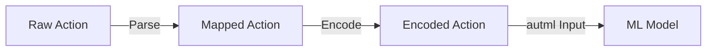

# Plan 03 — Action Mapping: the repository status is explicit and evidence based

> **Status: PLANNED.** Not yet restarted in strict sequence.

**Goal:** State the current implementation and evidence boundary for action mapping.
**Builds on:** [00](../../00-scope-and-traceability.md) — the project is supervised 4×4 2048 policy learning, and framework evaluation is a separate research track.

---

## Decision and evidence

**This plan treats its subject as partial or pending work, not as a research finding.** The rejected alternative is to infer completion from a plan title or related code alone. The ledger records this disposition: Not yet restarted in strict sequence.

## 1. Overview

Map between raw action representations and the internal action space used by the ML model.

## 2. Mapping Structure



## 3. Direction to Action Mapping

```rust
pub enum Direction {
    Up,
    Down,
    Left,
    Right,
}

impl Direction {
    pub fn to_action(&self) -> u8 {
        match self {
            Direction::Up => 0,
            Direction::Down => 1,
            Direction::Left => 2,
            Direction::Right => 3,
        }
    }

    pub fn from_action(action: u8) -> Option<Direction> {
        match action {
            0 => Some(Direction::Up),
            1 => Some(Direction::Down),
            2 => Some(Direction::Left),
            3 => Some(Direction::Right),
            _ => None,
        }
    }
}
```

## 4. Model Output to Action

> **Canonical:** `04-Actions/03-Mapping/01-model-output-to-action.md` — `masked_argmax` — see there. This section is a reference stub.

The automl model outputs raw predictions that must be mapped to valid actions — use canonical `masked_argmax(&logits, valid)` (filters invalid moves before argmax). Minimal illustration only:

```rust
// Reference only — use canonical masked_argmax from 04-Actions/03-Mapping/01-model-output-to-action.md
pub fn map_model_output(outputs: &[f64; 4], valid: &[u8]) -> u8 {
    masked_argmax(outputs, valid)
}
```

## 5. Mapping Validation

```rust
pub fn validate_mapping(action: u8) -> Result<()> {
    if action > 3 {
        return Err(format!("Invalid action: {}", action).into());
    }
    Ok(())
}
```

## 6. Integration with 03-State and 04-Actions

- `03-State/` modules provide the state context for action decisions
- `04-Actions/02-Space/` defines constraints on valid actions
- `04-Actions/03-Mapping/` handles the final policy mapping

## Implementation Record

- Enum-to-integer mapping uses the `Direction` discriminants, and decoding is fallible through `try_from_action`. Model scores are selected through the shared validity-masked action helper.

---

## Verification (definition of done)

1. `test -f plans/04-Actions/01-Action/03-action-mapping.md` exits 0.
2. `grep -q '^# Plan 03 — ' plans/04-Actions/01-Action/03-action-mapping.md` exits 0.
3. `grep -q '^> \\*\\*Status:' plans/04-Actions/01-Action/03-action-mapping.md` exits 0.
4. `grep -q '^\*\*Goal:' plans/04-Actions/01-Action/03-action-mapping.md` exits 0.
5. `grep -q '^## Decision and evidence$' plans/04-Actions/01-Action/03-action-mapping.md` exits 0.
6. `grep -q '^## Open questions$' plans/04-Actions/01-Action/03-action-mapping.md` exits 0.
7. `grep -q '^## Later$' plans/04-Actions/01-Action/03-action-mapping.md` exits 0.
8. `bash /Users/evintleovonzko/Documents/works/kolosal/planout2/v2-ai-express/.claude/skills/writing-planout-plans/check-plan.sh plans/04-Actions/01-Action/03-action-mapping.md` exits 0.

## Open questions

- **The plan-scale evidence remains bounded by current results.** Not yet restarted in strict sequence. Any larger corpus or external benchmark needs a declared resource budget and retained artifacts.

## Later

- **Complete the remaining research or implementation work recorded above.** It stays deferred until its prerequisites, compute budget, and measurable acceptance evidence are available.
