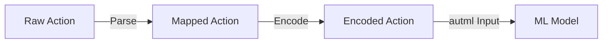

# Action Mapping

## 1. Overview

Map between raw action representations and the internal action space used by the ML model.

## 2. Mapping Structure



## 3. Direction to Action Mapping

```rust
pub enum Direction {
    Up,
    Down,
    Left,
    Right,
}

impl Direction {
    pub fn to_action(&self) -> u8 {
        match self {
            Direction::Up => 0,
            Direction::Down => 1,
            Direction::Left => 2,
            Direction::Right => 3,
        }
    }

    pub fn from_action(action: u8) -> Option<Direction> {
        match action {
            0 => Some(Direction::Up),
            1 => Some(Direction::Down),
            2 => Some(Direction::Left),
            3 => Some(Direction::Right),
            _ => None,
        }
    }
}
```

## 4. Model Output to Action

> **Canonical:** `04-Actions/03-Mapping/01-model-output-to-action.md` — `masked_argmax` — see there. This section is a reference stub.

The automl model outputs raw predictions that must be mapped to valid actions — use canonical `masked_argmax(&logits, valid)` (filters invalid moves before argmax). Minimal illustration only:

```rust
// Reference only — use canonical masked_argmax from 04-Actions/03-Mapping/01-model-output-to-action.md
pub fn map_model_output(outputs: &[f64; 4], valid: &[u8]) -> u8 {
    masked_argmax(outputs, valid)
}
```

## 5. Mapping Validation

```rust
pub fn validate_mapping(action: u8) -> Result<()> {
    if action > 3 {
        return Err(format!("Invalid action: {}", action).into());
    }
    Ok(())
}
```

## 6. Integration with 03-State and 04-Actions

- `03-State/` modules provide the state context for action decisions
- `04-Actions/02-Space/` defines constraints on valid actions
- `04-Actions/03-Mapping/` handles the final policy mapping
