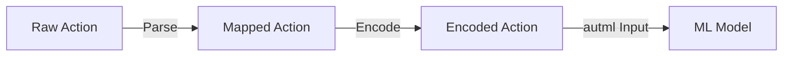

# Plan 03 — Action Mapping: the repository status is explicit and evidence based

> **Status: COMPLETE (2026-09-27).** Direction conversion and validity-masked model selection are implemented.

**Goal:** State the current implementation and evidence boundary for action mapping.
**Builds on:** [00](../../00-scope-and-traceability.md) — the project is supervised 4×4 2048 policy learning, and framework evaluation is a separate research track.

---

## Decision and evidence

**This plan treats action mapping as implemented.** `Direction` discriminants provide the stable integer mapping and `try_from_action` is fallible. `ModelPolicy` converts a 17-feature row to four class probabilities, masks invalid moves with `masked_argmax`, then decodes the selected ID. The selector errors on terminal boards and rejects invalid IDs or non-finite scores.

## 1. Overview

Map between raw action representations and the internal action space used by the ML model.

## 2. Mapping Structure



## 3. Direction to Action Mapping

`Direction` in `src/game_engine/mod.rs` uses `#[repr(u8)]` with stable
discriminants. Convert integer labels with the implemented fallible
`Direction::try_from_action(action)`; avoid duplicating a second mapping API.

## 4. Model Output to Action

> **Canonical:** `04-Actions/03-Mapping/01-model-output-to-action.md` — `masked_argmax` — see there. This section is a reference stub.

The current AutoML inference path returns four class probabilities, not logits. It maps them to a legal direction with `masked_argmax`; scores are compared directly, so softmax probabilities preserve the same argmax. Minimal illustration only:

```rust
// Current selector returns Result<u8, ActionError>.
pub fn map_model_output(outputs: &[f64; 4], valid: &[u8]) -> Result<u8, ActionError> {
    masked_argmax(outputs, valid)
}
```

## 5. Mapping Validation

```rust
pub fn validate_mapping(action: u8) -> Result<()> {
    if action > 3 {
        return Err(format!("Invalid action: {}", action).into());
    }
    Ok(())
}
```

## 6. Integration with 03-State and 04-Actions

- `03-State/` modules provide the state context for action decisions
- `04-Actions/02-Space/` defines constraints on valid actions
- `04-Actions/03-Mapping/` handles the final policy mapping

## Implementation Record

- Enum-to-integer mapping uses `Direction` discriminants, and decoding is fallible through `try_from_action`. `ModelPolicy` gets four class probabilities from `predict_proba_array`, masks invalid directions through `masked_argmax`, and decodes the selected class.

---

## Verification (definition of done)

1. `test -f plans/04-Actions/01-Action/03-action-mapping.md` exits 0.
2. `grep -q '^# Plan 03 — ' plans/04-Actions/01-Action/03-action-mapping.md` exits 0.
3. `grep -q '^> \\*\\*Status:' plans/04-Actions/01-Action/03-action-mapping.md` exits 0.
4. `grep -q '^\*\*Goal:' plans/04-Actions/01-Action/03-action-mapping.md` exits 0.
5. `grep -q '^## Decision and evidence$' plans/04-Actions/01-Action/03-action-mapping.md` exits 0.
6. `grep -q '^## Open questions$' plans/04-Actions/01-Action/03-action-mapping.md` exits 0.
7. `grep -q '^## Later$' plans/04-Actions/01-Action/03-action-mapping.md` exits 0.
8. `bash /Users/evintleovonzko/Documents/works/kolosal/planout2/v2-ai-express/.claude/skills/writing-planout-plans/check-plan.sh plans/04-Actions/01-Action/03-action-mapping.md` exits 0.

## Open questions

- This ticket covers deterministic action mapping. Policy quality and action frequency are measured by the later evaluation tickets.

## Later

- **Complete the remaining research or implementation work recorded above.** It stays deferred until its prerequisites, compute budget, and measurable acceptance evidence are available.
