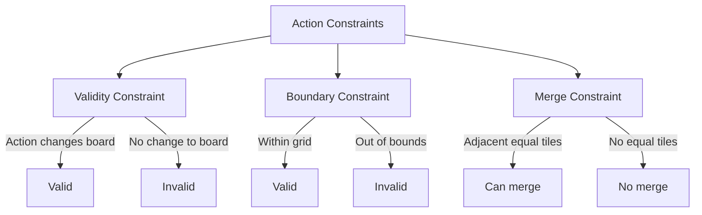

# Action Constraints

## 1. Overview

Define constraints on valid actions in the 2048 game. Not all actions are valid at every board state.

## 2. Constraint Types



## 3. Validity Constraints

> **Canonical:** see `02-Environment/02-Rules/03-valid-moves.md` — `board.would_change(dir)` / `get_valid_moves`. Do not duplicate logic here.

An action is valid only if it changes the board state — use canonical `board.would_change(dir)` (cheaper than clone+execute). The snippet below is kept as minimal illustration only; prefer canonical.

```rust
// Reference only — use board.would_change(dir) from canonical
pub fn is_valid_action(board: &Board, dir: Direction) -> bool {
    board.would_change(dir)
}
```

## 4. Boundary Constraints

```rust
pub fn check_boundary_constraints(grid: &[u32; 16], action: u8) -> bool {
    // Actions must not push tiles out of the 4x4 grid
    // All tile positions must remain within [0, 3] x [0, 3]
    match action {
        0 => check_up_boundary(grid),
        1 => check_down_boundary(grid),
        2 => check_left_boundary(grid),
        3 => check_right_boundary(grid),
        _ => false,
    }
}
```

## 5. Merge Constraints

```rust
pub fn can_merge(grid: &[u32; 16], action: u8) -> bool {
    // Check if the action would result in any tile merges
    // Merges require adjacent equal tiles in the merge direction
    match action {
        0 => has_adjacent_equal_vertical(grid, Direction::Up),
        1 => has_adjacent_equal_vertical(grid, Direction::Down),
        2 => has_adjacent_equal_horizontal(grid, Direction::Left),
        3 => has_adjacent_equal_horizontal(grid, Direction::Right),
        _ => false,
    }
}
```

## 6. Constraint Validation Pipeline

```rust
pub struct ActionConstraints {
    pub validity: ValidityChecker,
    pub boundary: BoundaryChecker,
    pub merge: MergeChecker,
}

impl ActionConstraints {
    pub fn validate(&self, grid: &[u32; 16], action: u8) -> ConstraintResult {
        let validity = self.is_valid_action(grid, action);
        let boundary = self.check_boundary(grid, action);
        let merge = self.can_merge(grid, action);
        ConstraintResult { validity, boundary, merge }
    }
}
```

## 7. Path References

- `03-State/01-Board/` - Board state validation
- `04-Actions/01-Action/` - Action encoding and mapping
- `04-Actions/03-Mapping/` - Decision policies that respect constraints
