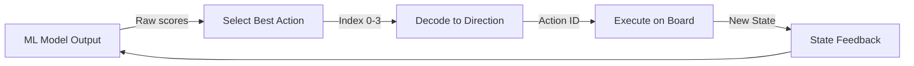
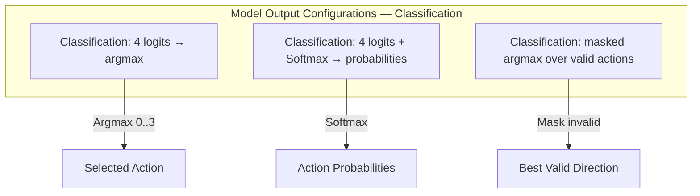

# Model Output to Action Mapping

## 1. Overview

Convert automl model outputs into valid 2048 game actions.

## 2. Mapping Flow



## 3. Output Interpretation

The automl model outputs a vector of scores for each action:

```rust
pub struct ModelOutput {
    pub scores: [f64; 4],          // Score for each direction
    pub probabilities: [f64; 4],   // Softmax probabilities
    pub best_action: u8,           // Index of highest score
}
```

## 4. Argmax Selection — Canonical `masked_argmax`

> **Canonical `masked_argmax` — single source.** `04-Actions/01-Action/03-action-mapping.md` references this.

```rust
pub fn select_action(outputs: &[f64; 4]) -> u8 {
    outputs
        .iter()
        .enumerate()
        .max_by(|a, b| a.1.partial_cmp(b.1).unwrap())
        .map(|(idx, _)| idx as u8)
        .unwrap_or(0)
}

/// Canonical: argmax over valid actions only (masks invalid moves)
pub fn masked_argmax(logits: &[f64; 4], valid: &[u8]) -> u8 {
    valid.iter()
        .max_by(|a, b| logits[**a as usize].partial_cmp(&logits[**b as usize]).unwrap())
        .copied()
        .unwrap_or(valid[0])
}
```

## 5. Probabilistic Selection

For exploration, actions can be sampled from the probability distribution:

```rust
pub fn sample_action(probabilities: &[f64; 4], temperature: f64) -> u8 {
    // Temperature-scaled softmax sampling
    // Lower temperature = more deterministic
    let scaled: Vec<f64> = probabilities.iter().map(|&p| p / temperature).collect();
    let exp_vals: Vec<f64> = scaled.iter().map(|&s| s.exp()).collect();
    let sum: f64 = exp_vals.iter().sum();
    let normalized: Vec<f64> = exp_vals.iter().map(|&e| e / sum).collect();
    // Sample from normalized distribution
    sample_from_distribution(&normalized) as u8
}
```

## 6. Output Layer Configurations — Classification Only



> **No regression head.** Task is `TaskType::MultiClassification` — 27-dim → 4 logits → `argmax`.

## 7. Integration Path

- Input from `03-State/` modules provides board state features
- `04-Actions/02-Space/` defines valid action constraints
- `04-Actions/03-Mapping/02-action-decision-policy.md` handles policy-level decisions
