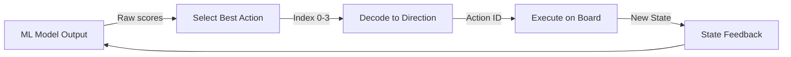
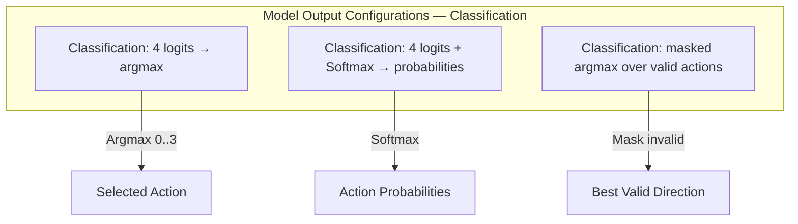

# Plan 01 — Model Output to Action Mapping: the repository status is explicit and evidence based

> **Status: COMPLETE (2026-09-27).** AutoML probabilities are masked to valid moves and decoded to the action enum.

**Goal:** State the current implementation and evidence boundary for model output to action mapping.
**Builds on:** [00](../../00-scope-and-traceability.md) — the project is supervised 4×4 2048 policy learning, and framework evaluation is a separate research track.

---

## Decision and evidence

**This plan treats model-output mapping as implemented.** `ModelPolicy` builds the canonical 17-value input, obtains four class probabilities through AutoML inference, masks invalid actions with `masked_argmax`, and converts the chosen ID to `Direction`. The selector returns errors for terminal boards, invalid IDs, and non-finite scores.

## 1. Overview

Convert automl model outputs into valid 2048 game actions.

## 2. Mapping Flow



## 3. Output Interpretation

The current inference adapter returns four class probabilities. It does not expose the illustrative `ModelOutput` struct below:

```rust
pub struct ModelOutput {
    pub scores: [f64; 4],          // Score for each direction
    pub probabilities: [f64; 4],   // Softmax probabilities
    pub best_action: u8,           // Index of highest score
}
```

## 4. Argmax Selection — Canonical `masked_argmax`

> **Canonical `masked_argmax` — single source.** The shared implementation lives in `src/actions.rs`; `ModelPolicy` calls it.

```rust
/// Canonical: checked argmax over valid actions only.
/// AutoML supplies class probabilities in the current inference adapter.
pub fn select_action(
    probabilities: &[f64; 4],
    valid: &[u8],
) -> Result<u8, ActionError> {
    masked_argmax(probabilities, valid)
}
```

## 5. Probabilistic Selection

For exploration, actions can be sampled from the probability distribution:

```rust
pub fn sample_action(probabilities: &[f64; 4], temperature: f64) -> u8 {
    // Temperature-scaled softmax sampling
    // Lower temperature = more deterministic
    let scaled: Vec<f64> = probabilities.iter().map(|&p| p / temperature).collect();
    let exp_vals: Vec<f64> = scaled.iter().map(|&s| s.exp()).collect();
    let sum: f64 = exp_vals.iter().sum();
    let normalized: Vec<f64> = exp_vals.iter().map(|&e| e / sum).collect();
    // Sample from normalized distribution
    sample_from_distribution(&normalized) as u8
}
```

## 6. Output Layer Configurations — Classification Only



> **No regression head.** Task is `TaskType::MultiClassification` — 17 features produce four class probabilities, then validity-masked selection chooses an action.

## 7. Integration Path

- Input from `03-State/` modules provides board state features
- `04-Actions/02-Space/` defines valid action constraints
- `04-Actions/03-Mapping/02-action-decision-policy.md` handles policy-level decisions

## Implementation Record

- `masked_argmax` rejects empty valid sets, invalid IDs, and non-finite scores; ties use stable action order. `ModelPolicy` loads AutoML inference, encodes one 17-feature row, checks the four-class output, and masks invalid directions.
- The inference path uses `predict_proba_array`, not raw logits; probabilities are compared directly for greedy selection.

---

## Verification (definition of done)

1. `test -f plans/04-Actions/03-Mapping/01-model-output-to-action.md` exits 0.
2. `grep -q '^# Plan 01 — ' plans/04-Actions/03-Mapping/01-model-output-to-action.md` exits 0.
3. `grep -q '^> \\*\\*Status:' plans/04-Actions/03-Mapping/01-model-output-to-action.md` exits 0.
4. `grep -q '^\*\*Goal:' plans/04-Actions/03-Mapping/01-model-output-to-action.md` exits 0.
5. `grep -q '^## Decision and evidence$' plans/04-Actions/03-Mapping/01-model-output-to-action.md` exits 0.
6. `grep -q '^## Open questions$' plans/04-Actions/03-Mapping/01-model-output-to-action.md` exits 0.
7. `grep -q '^## Later$' plans/04-Actions/03-Mapping/01-model-output-to-action.md` exits 0.
8. `bash /Users/evintleovonzko/Documents/works/kolosal/planout2/v2-ai-express/.claude/skills/writing-planout-plans/check-plan.sh plans/04-Actions/03-Mapping/01-model-output-to-action.md` exits 0.

## Open questions

- The selector mapping is deterministic for a fixed probability vector and board; game-level policy quality is a separate measured outcome.

## Later

- **Complete the remaining research or implementation work recorded above.** It stays deferred until its prerequisites, compute budget, and measurable acceptance evidence are available.
