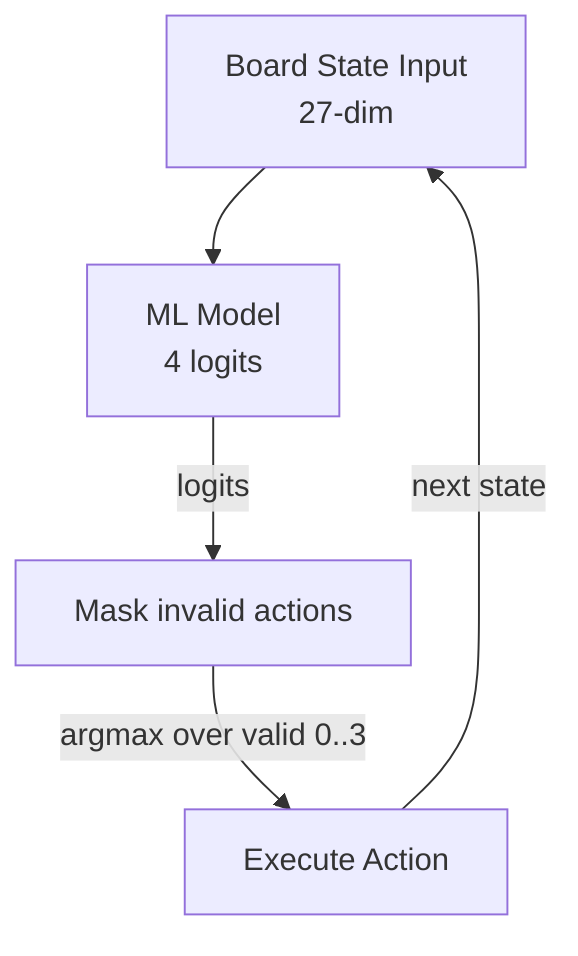
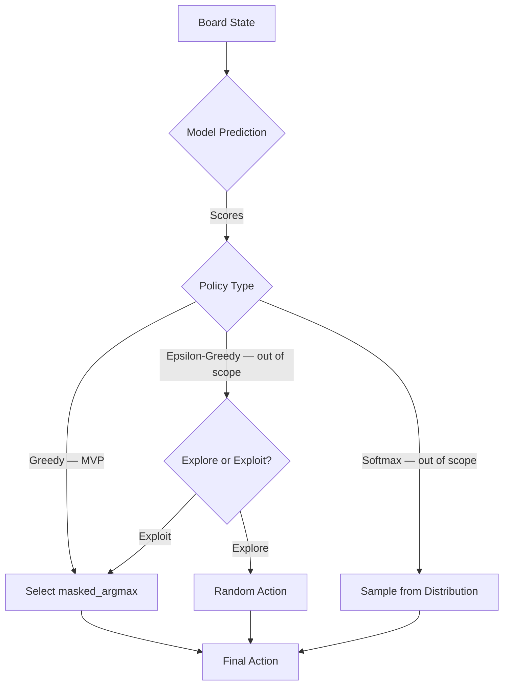

# Action Decision Policy

## 1. Overview

Define the policy that maps board states to actions, combining model predictions with strategic heuristics.

## 2. Policy Architecture — Canonical (Model Only)



> **No heuristic blending, no reward update.** Supervised automl only. Heuristic is a separate baseline agent (see `02-Environment/03-Simulation-Engine/`).

## 3. Policy Types

### 3.1 Greedy Policy

Always select the action with the highest predicted score:

```rust
pub struct GreedyPolicy {
    pub model: MLModel,
}

impl GreedyPolicy {
    pub fn decide(&self, state: &[f64; 27]) -> u8 {
        let scores = self.model.predict(state);
        select_action(&scores)
    }
}
```

### 3.2 Epsilon-Greedy Policy — Out of Scope for Supervised MVP

> **Out of scope for MVP.** Exploration (ε-greedy) is for RL / online learning; supervised automl uses Greedy + `masked_argmax` only. Kept for reference.

Balance exploration and exploitation:

```rust
pub struct EpsilonGreedyPolicy {
    pub model: MLModel,
    pub epsilon: f64,
}

impl EpsilonGreedyPolicy {
    pub fn decide(&self, state: &[f64; 27]) -> u8 {
        if fast_rand() < self.epsilon {
            // Explore: random action
            rand::random::<u8>() % 4
        } else {
            // Exploit: best predicted action
            let scores = self.model.predict(state);
            select_action(&scores)
        }
    }
}
```

### 3.3 Softmax Policy — Out of Scope for MVP

> **Out of scope for MVP.** Temperature sampling is RL exploration; MVP uses deterministic `masked_argmax`. Reference only.

Sample actions from a probability distribution:

```rust
pub struct SoftmaxPolicy {
    pub model: MLModel,
    pub temperature: f64,
}

impl SoftmaxPolicy {
    pub fn decide(&self, state: &[f64; 27]) -> u8 {
        let scores = self.model.predict(state);
        sample_action(&scores, self.temperature)
    }
}
```

## 4. Policy Decision Flow — MVP Uses Greedy Only

> **MVP: Greedy + masked_argmax only.** Epsilon-Greedy / Softmax / Composite (heuristic weighting) are out-of-scope reference paths.



## 5. Composite Policy — Out of Scope for Supervised automl (Reference Only)

> **Not used for training/inference.** The canonical policy is **automl model only**: `27-dim features → 4 logits → argmax` over **valid actions** (invalid moves masked). Heuristic weighting is **out of scope** and retained below only for historical reference — do not blend heuristic scores with model logits in the automl pipeline.

```rust
// NOT USED — for reference only, not for supervised automl
// If heuristic comparison is needed, run heuristic agent separately as a baseline
pub struct CompositePolicy {
    pub model_policy: MLPolicy,
    pub heuristic_policy: HeuristicPolicy,
    pub weights: [f64; 2],         // Model vs heuristic weight — out of scope
}

impl CompositePolicy {
    pub fn decide(&self, state: &[f64; 27]) -> u8 {
        let model_score = self.model_policy.score(state);
        let heuristic_score = self.heuristic_policy.score(state);
        let combined = self.weights[0] * model_score + self.weights[1] * heuristic_score;
        select_best_action(&combined)
    }
}
```

**Canonical inference (use this):**

```rust
pub fn decide_action(state: &[f64; 27], model: &InferenceEngine, valid: &[u8]) -> u8 {
    let logits = model.predict(state); // 4 logits
    masked_argmax(&logits, valid)      // argmax over valid actions only
}
```

## 6. Path Integration

- `03-State/` provides the state features for policy decisions
- `04-Actions/01-Action/` defines the action space and encoding
- `04-Actions/02-Space/` provides constraint validation
- `04-Actions/03-Mapping/01-model-output-to-action.md` handles raw model output conversion
